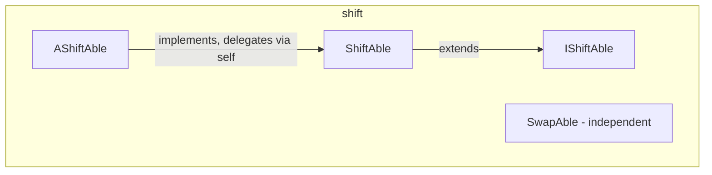

---
digest:
  local-classes:
    AShiftAble:
      mtime: '2026-09-05T16:29:09Z'
      digest: 97789ca44665bdbbf08b4128af1193ac15a40fc7c6b7ef8d3e7e490b9a74307f
    IShiftAble:
      mtime: '2026-09-05T10:13:25Z'
      digest: 24216fad89cec4f8d90be8165e08e9208a8a209aca3ee11384c0bc92a877478b
    ShiftAble:
      mtime: '2026-09-05T10:13:25Z'
      digest: 1846b6484c8acea8d8f9d2ff722bdda6c32153858ac07e48eb8050b72572bbcc
    SwapAble:
      mtime: '2026-09-05T10:13:25Z'
      digest: 8d3202c1351c5b831993a9125c695f22dc3ad192061f7396881fe18d8d59ac3d
  folders: {}
tags:
- code/bit_manipulation
- code/in_place_operation
- code/abstract_base
concepts:
- g-adic Number Representation
- Shift and Rotate
facets:
  layer: utility
  status: legacy
  complexity: medium
description: Models bit/digit-level shifting and rotation for numbers represented in a g-adic (radix-g positional) system, where one shift is equivalent to multiplying or dividing by the radix. `IShiftAble` is the minimal contract (single-position arithmetic/logical shift and rotate, plus an externalized carry so state does not have to live on the object itself); `ShiftAble` extends it with the multi-position and reversal operations built from those primitives. `AShiftAble` supplies the default multi-position and reversal logic in terms of the abstract single-position primitives, using the "delegation to self" pattern (a `self` field standing in for `this`) so a concrete numeric class can mix this behaviour in without single inheritance getting in the way. `SwapAble` is a separate, narrower contract for index-based item swapping used by random-access iterators; it is not part of the shift/rotate hierarchy.
---

# shift

Models bit/digit-level shifting and rotation for numbers represented in a g-adic
(radix-g positional) system, where one shift is equivalent to multiplying or dividing
by the radix. `IShiftAble` is the minimal contract (single-position arithmetic/logical
shift and rotate, plus an externalized carry so state does not have to live on the
object itself); `ShiftAble` extends it with the multi-position and reversal operations
built from those primitives. `AShiftAble` supplies the default multi-position and
reversal logic in terms of the abstract single-position primitives, using the
"delegation to self" pattern (a `self` field standing in for `this`) so a concrete
numeric class can mix this behaviour in without single inheritance getting in the way.
`SwapAble` is a separate, narrower contract for index-based item swapping used by
random-access iterators; it is not part of the shift/rotate hierarchy.

## Classes

| Class | Responsibility |
|---|---|
| [AShiftAble](AShiftAble.java) | Default Implementation of Shifting Positions in a g-adic Number System. |
| [IShiftAble](IShiftAble.java) | Minimum Interface for Shifting Positions in a g-adic Number System. |
| [ShiftAble](ShiftAble.java) | Interface defining (arithmetic) Shifts left and right as well as rotation left and right. |
| [SwapAble](SwapAble.java) | This Interface can be implemented by all random Access Iterators |

## Architecture

## Entry Points

| Class.Method | Description |
|---|---|
| [ShiftAble.asl()](ShiftAble.java#L27) | Arithmetic shift left by one position, returning a copy. |
| [ShiftAble.aslAt(int)](ShiftAble.java#L57) | Arithmetic shift left by several positions, in place. |
| [ShiftAble.rol(int)](ShiftAble.java#L66) | Rotate left by several positions, returning a copy. |
