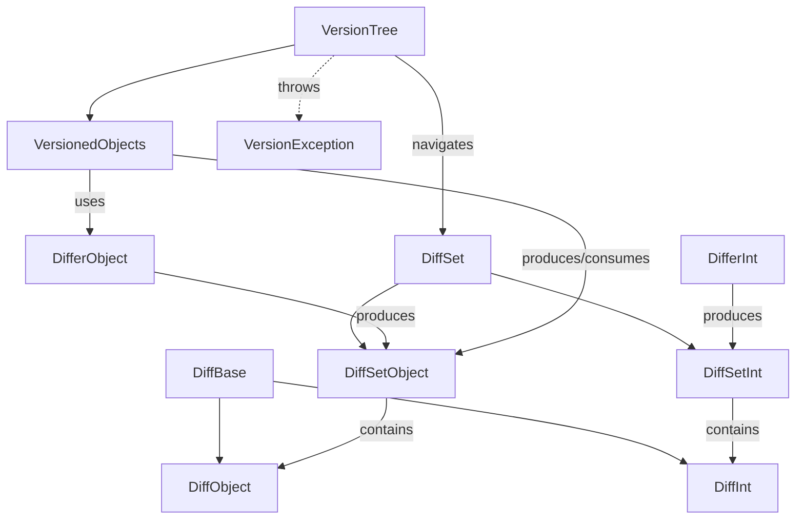

---
digest:
  local-classes:
    DiffBase:
      mtime: '2026-09-05T10:22:33Z'
      digest: 4bbde5c0895d6f5441d2a436b1057ebf3443a4520dc197da422603c74bfed22c
    DiffInt:
      mtime: '2026-09-05T10:22:38Z'
      digest: 720838ac986fe39be0e6bb777adf4b498e31e4d65a3cc1e0f9700d3bd42f2ab9
    DiffObject:
      mtime: '2026-09-05T10:22:47Z'
      digest: 2ac3374cf13562f32f66d5c341b943a702cb72587d57bfb26b07ff4c1e7e7ce3
    DiffSet:
      mtime: '2026-09-05T10:23:06Z'
      digest: 74ee0c002aded97f6288925088661769ee09952d12af6a18d3321735da03470b
    DiffSetInt:
      mtime: '2026-09-05T10:23:17Z'
      digest: 9d763b7c778d311ae89262bceede83659e69dcde1dedf13632de02ab33bb90d8
    DiffSetObject:
      mtime: '2026-09-05T10:23:26Z'
      digest: da5a858a8d9d9c644a449912adb53c3719f9d8522ffd5cb17cfc3830d48289f9
    DifferInt:
      mtime: '2026-09-05T10:23:34Z'
      digest: edbce27832b4a3f024dbb9424591aaf05e42034e42317ca5c95777a8256818af
    DifferObject:
      mtime: '2026-09-05T10:23:39Z'
      digest: 21e3ddcdc873466ab4b4d302ca4f4ce92d34f286bbebae8357136b7776d4a02c
    VersionException:
      mtime: '2026-09-05T10:23:50Z'
      digest: 074809ab548fbc1f8727add7b657b73424cfaf82e9bdb069715272255e9ac121
    VersionTree:
      mtime: '2026-09-05T10:25:05Z'
      digest: 4c9b7a5181a752753eaa4721513128d2ffe85cfebc6929e88102534de886d133
    VersionedObjects:
      mtime: '2026-09-05T10:25:10Z'
      digest: 56479849697aad9b204d2944558e57c49bf117008e8d0e3dfdb1f42f7e61d2af
  folders: {}
tags:
- code/diff_patch
- code/version_tree
- code/lcs_algorithm
concepts:
- Versioning
- Diffing
facets:
  layer: domain
  status: legacy
  complexity: high
description: 'This folder implements a Git/CVS-like versioning system for in-memory `int[]` and `Object[]` streams (e.g. the Lines of a File). `DifferInt`/`DifferObject` compute a Longest-Common-Subsequence-based Diff between two Arrays and package it as a `DiffSetInt`/`DiffSetObject` - a Set of positional `DiffInt`/`DiffObject` Changes (both extend the shared `DiffBase`). `DiffSet`s form a Tree: each Version, except the Root, has exactly one Parent and can be regenerated from any other Version by walking up to their common Ancestor and back down, applying the (optionally inverted) Diffs along the way. `DiffSet`s can also be applied to one another to detect and collect merge Conflicts. `VersionTree` is the abstract, Value-Type-agnostic Tree Manager: it keeps the Map of named Versions (Tags, Branch Heads, IDs), navigates the Tree, and finds common Ancestors; `VersionedObjects` is its one concrete Subclass, specializing the Tree to `Object[]` Streams and adding the `update`/`addVersion`/`merge` Workflow used by clients. `VersionException` signals illegal Branch operations, such as adding a second direct Child to a Version that already has one without naming a new Branch.'
---

# diffPatch

This folder implements a Git/CVS-like versioning system for in-memory `int[]` and `Object[]` streams (e.g. the Lines
of a File). `DifferInt`/`DifferObject` compute a Longest-Common-Subsequence-based Diff between two Arrays and
package it as a `DiffSetInt`/`DiffSetObject` - a Set of positional `DiffInt`/`DiffObject` Changes (both extend the
shared `DiffBase`). `DiffSet`s form a Tree: each Version, except the Root, has exactly one Parent and can be
regenerated from any other Version by walking up to their common Ancestor and back down, applying the (optionally
inverted) Diffs along the way. `DiffSet`s can also be applied to one another to detect and collect merge Conflicts.
`VersionTree` is the abstract, Value-Type-agnostic Tree Manager: it keeps the Map of named Versions (Tags, Branch
Heads, IDs), navigates the Tree, and finds common Ancestors; `VersionedObjects` is its one concrete Subclass,
specializing the Tree to `Object[]` Streams and adding the `update`/`addVersion`/`merge` Workflow used by clients.
`VersionException` signals illegal Branch operations, such as adding a second direct Child to a Version that
already has one without naming a new Branch.

## Architecture

## Entry Points

| Class.Method | Description |
|---|---|
| `DifferObject.DIFF(Object[], Object[])` | One-shot static convenience Diff between two Object Arrays, no Version Tree involved. |
| `VersionedObjects.addVersion(Object[], String, String)` | Appends a new Version (optionally on a new Branch) after the given Version, diffing it against the current Values. |
| `VersionedObjects.update(Object[], String)` | Merges Changes made to a checked-out Array back onto the Leaf of its Branch, returning Conflicts and the merged Values. |
| `VersionTree.moveToVersion(String)` / `VersionTree.merge(String)` | Navigates to, or merges Changes from, a named Version/Tag/Branch. |

## Classes

| Class | Responsibility |
|---|---|
| [DiffBase](DiffBase.java) | Title: Description: Purpose: Base Class for Value Objects to hold the Position and the actual Change. |
| [DiffInt](DiffInt.java) | Title: Description: Purpose: Diff Implementation for integer Values. |
| [DiffObject](DiffObject.java) | Title: Description: Generic single Difference Object with a Reference to the actual Object Value changed. |
| [DiffSet](DiffSet.java) | Title: Description: Purpose: This Class collects all Differences between two consecutive Versions and can merge Versions up and down. |
| [DiffSetInt](DiffSetInt.java) | Title: Description: Purpose: Concrete Implementation of a DiffSet for generic int Lists or Streams. |
| [DiffSetObject](DiffSetObject.java) | Title: Description: Purpose: Concrete Implementation of a DiffSet for generic Object Lists or Streams. |
| [DifferInt](DifferInt.java) | Title: Description: Purpose: Creates the Difference of two Streams. |
| [DifferObject](DifferObject.java) | Title: Description: Purpose: Creates the Difference of two Streams. |
| [VersionException](VersionException.java) | Title: Description: Purpose: Signals an illegal Operation on a VersionTree, in particular attempting to add a direct Child Version onto a Branch that already has one, without naming a new Branch. |
| [VersionTree](VersionTree.java) | Title: Description: Purpose: Model Structure to manage a Tree of tagged Versions. |
| [VersionedObjects](VersionedObjects.java) | Title: Description: Purpose: This Object represents a single versioned Object Stream or List. |
