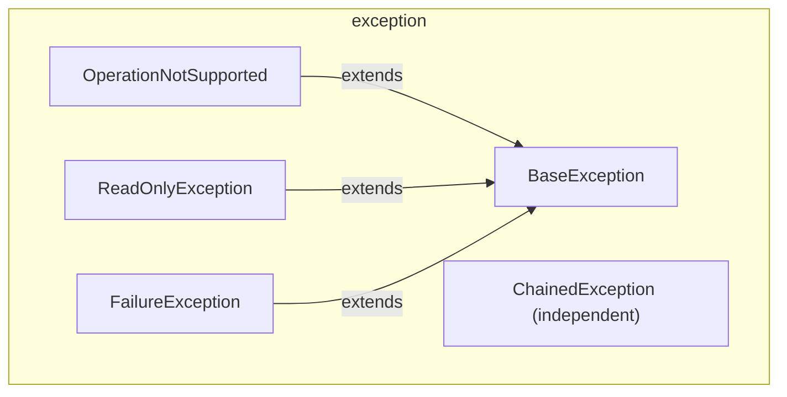

---
digest:
  local-classes:
    BaseException:
      mtime: '2026-09-05T09:27:21Z'
      digest: 9770483bd989e8e4ec48f076f13965278f6bca37d2df308ddcfe9829fcb06e2f
    ChainedException:
      mtime: '2026-09-05T09:27:54Z'
      digest: 188c5f35f22b891125d0dcd6d0d271ea516fffc5ec8794919a5e63d4cac07b4e
    FailureException:
      mtime: '2026-09-05T09:28:04Z'
      digest: 0e7dad8609df69d5479422467a6b6e776ffff62ca0a85975bb39fe066baa46bb
    OperationNotSupported:
      mtime: '2026-09-05T09:28:14Z'
      digest: 584dc44d30f083f784c353ffba46b944a0d0f560d5515ef550f35058ddef44b8
    ReadOnlyException:
      mtime: '2026-09-05T09:28:19Z'
      digest: d5057f85bd7a9d5285bad22f19b4cdee356ca39db4893f2b86e7a97bda7ca9d9
  folders: {}
tags:
- code/custom_exception
- code/exception_wrapping
concepts:
- Error Handling
facets:
  layer: infrastructure
  status: broken
  complexity: low
description: 'Unchecked-exception base classes for this codebase, predating `Throwable.getCause()` (Java 1.4): `BaseException` and the largely redundant `ChainedException` both wrap an inner Throwable by hand and print it after their own trace, with local variables also collectable on `BaseException` for post-mortem debugging. `OperationNotSupported`, `ReadOnlyException` and `FailureException` are domain-specific subclasses of `BaseException` for, respectively, optional interface methods, mutation attempts on a read-only object, and the Assert class''s failed-assertion signal.'
---

# exception

Unchecked-exception base classes for this codebase, predating `Throwable.getCause()`
(Java 1.4): `BaseException` and the largely redundant `ChainedException` both wrap an
inner Throwable by hand and print it after their own trace, with local variables also
collectable on `BaseException` for post-mortem debugging. `OperationNotSupported`,
`ReadOnlyException` and `FailureException` are domain-specific subclasses of
`BaseException` for, respectively, optional interface methods, mutation attempts on a
read-only object, and the Assert class's failed-assertion signal.

**Known defect** (see `## Bugs Found` in the repository root `HANDOFF.md`):
`ChainedException.printStackTrace(PrintStream)` never flushes or closes the `PrintWriter`
it wraps the stream in, unlike its otherwise identical sibling in `BaseException`, which
explicitly does so "important to flush!".

## Classes

| Class | Responsibility |
|---|---|
| [BaseException](BaseException.java) | Keeps Track of an original wrapped Exception and its Origin, with Space to collect local Variables and Parameters to aid Post Mortem Debugging. |
| [ChainedException](ChainedException.java) | Unchecked Error Class to contain a nested Exception, used to tunnel fatal Errors (that should never happen) through Method Declarations. |
| [FailureException](FailureException.java) | Unchecked Runtime Exception solely for the Purpose of the Assert Class Thrown wenn an Assertion fails. |
| [OperationNotSupported](OperationNotSupported.java) | Exception thrown in Methods that may or may not be implemented. |
| [ReadOnlyException](ReadOnlyException.java) | This Exception Type is thrown when a modifying Operation is applied to a read only Object. |

## Architecture

## Entry Points

| Class.Method | Description |
|---|---|
| [BaseException.getBaseException()](BaseException.java#L101) | Returns the original Exception. |
| [ChainedException.getInnerException()](ChainedException.java#L120) | Returns the original Exception. |
| [FailureException.FailureException(String)](FailureException.java#L35) | Wraps a failed Assertion's Description. |
