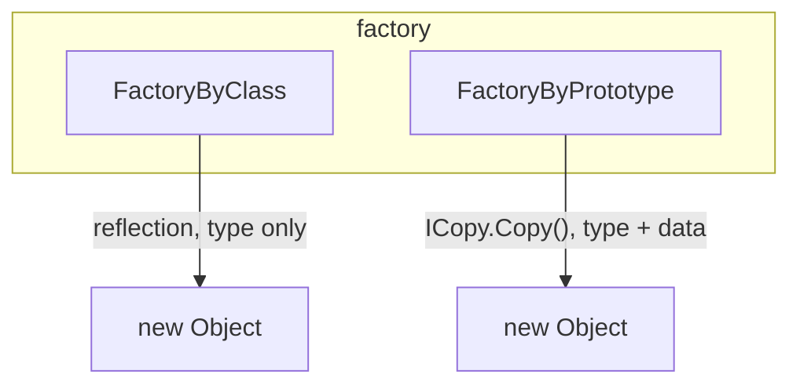

---
digest:
  local-classes:
    FactoryByClass:
      mtime: '2026-09-05T09:06:15Z'
      digest: 0e3e8c5748ccde039fcbefef77c261c8fa507b364a7cdf104c9dd28c2b099b80
    FactoryByPrototype:
      mtime: '2026-09-05T09:06:26Z'
      digest: 7c5a248552a32f2ecf0d2b79051f4e31047176293281134fc09db2bd28cc332f
  folders: {}
tags:
- code/factory_pattern
- code/reflection
- code/cloneable_pattern
concepts:
- Object Instantiation
- Prototype Pattern
facets:
  layer: infrastructure
  status: stable
  complexity: low
description: 'Two `IFactory` implementations that create a new Object from an existing one, differing only in how faithfully the new instance reproduces the original: `FactoryByClass` copies only the type, via reflection, while `FactoryByPrototype` copies the data too, via an explicit `ICopy` contract that stands in for Java''s protected `clone()`.'
---

# factory

Two `IFactory` implementations that create a new Object from an existing one, differing
only in how faithfully the new instance reproduces the original: `FactoryByClass` copies
only the type, via reflection, while `FactoryByPrototype` copies the data too, via an
explicit `ICopy` contract that stands in for Java's protected `clone()`.

## Classes

| Class | Responsibility |
|---|---|
| [FactoryByClass](FactoryByClass.java) | Creates a new, uninitialized instance of the same Class as a given prototype Object, using reflection rather than copying. |
| [FactoryByPrototype](FactoryByPrototype.java) | Creates a new Object by copying a prototype Object's data, not only its Class. |

## Architecture

## Entry Points

| Class.Method | Description |
|---|---|
| [FactoryByClass.nextItem()](FactoryByClass.java#L87) | Creates a new instance of the captured Class via reflection. |
| [FactoryByPrototype.nextItem()](FactoryByPrototype.java#L69) | Creates a new Object by copying the prototype. |
