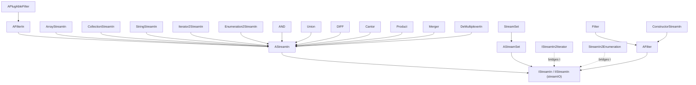

---
digest:
  local-classes:
    AFilter:
      mtime: '2026-09-05T16:28:41Z'
      digest: b9672b93b4433980f9965fb384344e031581c691bec9a38c181447debabe8ef0
    AFilterIn:
      mtime: '2026-09-05T16:29:28Z'
      digest: 6dded80cbc0c761f478d3a018ae45baf2f0c0292abcd132c27bae4671008e840
    AND:
      mtime: '2026-09-05T16:29:57Z'
      digest: 3bacffe138cb55d58ead36faa83f4d5062b82594e32f0fcd2df60af5d232f2c6
    AParserIn:
      mtime: '2026-09-05T10:13:31Z'
      digest: c7e1eeb02b864c8788ef76889a8416e1a39e32a4092538df75c2b9eee7a5145c
    APlugAbleFilter:
      mtime: '2026-09-05T16:30:02Z'
      digest: 2b696bef2127950a76d2fcb4b0f0040cd8667994ba74d4158631af356be29c8c
    AStreamIn:
      mtime: '2026-09-05T16:32:18Z'
      digest: c9aca17b6134ec52cbd175fb397263843e0dd552aa7044ae4d3e9498543253f6
    AStreamSet:
      mtime: '2026-09-05T16:33:23Z'
      digest: 46862b34b0c1c2d7309e70789e26fabc6bcfa46f80d4e6841c32d6afb6812af3
    ArrayStreamIn:
      mtime: '2026-09-05T16:34:06Z'
      digest: b8f21ac2f8137c0a9595f194f998aec4feb8a96f4c0f0088e15ba01d5b96899e
    Cantor:
      mtime: '2026-09-05T16:34:10Z'
      digest: 10a4219c053b7d2f6ceb656275fa04302c7e670660a0cf92184f1c8f6eb44de3
    CollectionStreamIn:
      mtime: '2026-09-05T16:34:07Z'
      digest: 7c3f30f804056e481153fd8706a39703446046e0f36a1fac858cc51393f92ac1
    ConstructorStreamIn:
      mtime: '2026-09-05T16:35:24Z'
      digest: 8fa2b1840f2aa0c96f25cf9cd4ef8059608540977b4e2dcd5aeebd275c8f37fc
    CopyStreamIn:
      mtime: '2026-09-05T10:13:31Z'
      digest: c93610be16ddd4f20a7ebdf9d776c372b22354002ba848a2697d222ea1121eff
    CopyStreamOut:
      mtime: '2026-09-05T16:35:26Z'
      digest: f723f5e7599893e72d9cc9f5746f1af052386867ded2808e96ddfd38a21c5293
    DIFF:
      mtime: '2026-09-05T16:39:15Z'
      digest: a24a9a35a6a2c22745360d8653c0ef58b29ab57f5b6f5e6aee94507a8c14e377
    DblAt:
      mtime: '2026-09-05T20:31:29Z'
      digest: 92bcbdf71ffcb75e84d1b9cdf42b26a6bad75d7160f67e9119dd912957ec241c
    DeMultiplexerIn:
      mtime: '2026-09-05T16:39:21Z'
      digest: f181290f999117af47287d21b71d100a20272e9c6e347bf2bcb592323013271f
    DevNullIn:
      mtime: '2026-09-05T16:41:26Z'
      digest: d76e2500b8478ee788f3ea54de2e3cdb410f025b8642e26c4368825c76f9a511
    Enumeration2StreamIn:
      mtime: '2026-09-05T16:39:29Z'
      digest: 2b5b9a0c10006585437b0fef267967ac4883325a861e0355b9c729343e95e11e
    Filter:
      mtime: '2026-09-05T16:40:03Z'
      digest: e60b7c4cd294eb8b2458d7980126e71e44e9f933a24163802153c5c141bd9df8
    FilterIn:
      mtime: '2026-09-05T10:13:31Z'
      digest: f00125257fb7f4a6bda541396cdffd5dfcd6b23f526ff215ae0bf9a06b7c18d7
    IPipe:
      mtime: '2026-09-05T10:13:31Z'
      digest: e3b0c44298fc1c149afbf4c8996fb92427ae41e4649b934ca495991b7852b855
    IStreamIn:
      mtime: '2026-09-05T16:41:26Z'
      digest: f275ebcbf94e1a62aef5bcdc071d973aaceea6b522f87bc7b0b01fc2df4d3913
    IStreamIn2Iterator:
      mtime: '2026-09-05T16:42:11Z'
      digest: 1639d9ec5ae60d801e511e2093f71ed2666c9672595dd83662dca1a407b5780f
    IStreamSet:
      mtime: '2026-09-05T10:13:31Z'
      digest: e3b0c44298fc1c149afbf4c8996fb92427ae41e4649b934ca495991b7852b855
    Iterator2StreamIn:
      mtime: '2026-09-05T16:42:18Z'
      digest: 808d472163372a04244a8b376b37f36b90fc71c95a8e1162add59f0ea4c39420
    JoinStreamByCols:
      mtime: '2026-09-05T10:13:31Z'
      digest: 1aa8a2573e2f544f048165f5c0cafeca4eec93f131025b8cdb95699630172569
    JoinStreamByTest:
      mtime: '2026-09-05T10:13:31Z'
      digest: 384a601195181893c4be1ab0ea9725352fd993f1eb5001e1d863431cdd935a81
    Merger:
      mtime: '2026-09-05T10:13:31Z'
      digest: c807fd8c8ebd7e0ec06e6629d8e0bc27c533125f7afaca1bac52c736a517735a
    ModificationException:
      mtime: '2026-09-05T10:13:31Z'
      digest: 7ccf5bbc3964e6471857b40746d58b7f68e7c1dbcbab825d7fb54cca3ab7c8bc
    MultiplexerOut:
      mtime: '2026-09-05T10:13:31Z'
      digest: 8a8b4396472f832d180e7dbe1fefe1269a7de939299eb99389985bb33c46d270
    NullFilterIn:
      mtime: '2026-09-05T10:13:31Z'
      digest: 90841bd07045a94325fa848b18f70cab09e8210611cafadb84c30c70b7cd4a63
    NullFilterOut:
      mtime: '2026-09-05T16:43:22Z'
      digest: 08bb1925920bbe1de957e7a8668d54e9575cc023dd73740447238a030878f4bf
    NullWhenDivisible:
      mtime: '2026-09-05T20:44:04Z'
      digest: d05c5aa9999eafe61ddb2cc611e90ebefb8419683e77a7073ac9fbb56c50dba2
    Product:
      mtime: '2026-09-05T10:13:31Z'
      digest: 046c2ba99d800599ae254c98e93e70f93495d31a1af1f330b88ac1ef31b869b1
    StreamIn2Enumeration:
      mtime: '2026-09-05T16:44:10Z'
      digest: 8cb6d987495a833b91c806a1882b44afb3540b5a1eea784dbf8a8f79d05272bd
    StreamIterator:
      mtime: '2026-09-05T16:44:11Z'
      digest: 44a54f0d17f1bee0a8a91accbdb7d491b13370448981592f43d45c03361d378b
    StreamParser:
      mtime: '2026-09-05T16:44:22Z'
      digest: a7e20998e1ffbe85bc094aa6f5d3dab741e4564490c0e5be6a5513b9cb97e0af
    StreamSet:
      mtime: '2026-09-05T20:31:29Z'
      digest: 4cf4a5e4b7f97d7a95d068f3d691ba91704ed5226fe1dc1a12edc324ae242ee2
    StringStreamIn:
      mtime: '2026-09-05T20:42:30Z'
      digest: 5b8773c9104e40a817a94cbbf2e824e51b791f68c53a77b72bdafbf7e60c01ff
    Union:
      mtime: '2026-09-05T20:42:48Z'
      digest: 88eda9c4803c7899c9f66d69204d55238b87677afdbeca42add3c022c676bd10
  folders: {}
tags:
- code/stream_processing
- code/iterator
concepts:
- Object Stream Pipeline
facets:
  layer: utility
  status: legacy
  complexity: medium
description: 'This folder is the core of an object-stream framework: `IStreamIn`/`IIStreamIn` and `IStreamSet` (defined in the parent `streamIO` package) describe a pull-based stream of arbitrary `Object`s, and the types here supply adapters, filters and set-algebraic combinators over that abstraction. `AStreamIn` hoists the generic streaming algorithms (searching, ordering, containment) so a concrete source only has to implement `nextItem()`/`currItem()`/`availAble()`; `AFilter`/`AFilterIn`/`APlugAbleFilter` do the same for filters that wrap another stream. Bridges connect this abstraction to standard Java iteration (`Iterator2StreamIn`, `Enumeration2StreamIn` and their inverses), to plain arrays/Collections (`ArrayStreamIn`, `CollectionStreamIn`), and to strings (`StringStreamIn`). `AStreamSet`/`StreamSet` layer boolean-ring semantics (AND/OR/NOT/DIFF) on top of a stream, implemented by dedicated combinator classes (`AND`, `Union`, `DIFF`, `Cantor`, `Product`, `Merger`) that stream the result of a set operation rather than materializing it. `StreamParser`/`StreamIterator` are an older, separate string/structure tokenizer, unrelated to the stream-set algebra.'
---

# object

This folder is the core of an object-stream framework: `IStreamIn`/`IIStreamIn` and `IStreamSet` (defined
in the parent `streamIO` package) describe a pull-based stream of arbitrary `Object`s, and the types here
supply adapters, filters and set-algebraic combinators over that abstraction. `AStreamIn` hoists the
generic streaming algorithms (searching, ordering, containment) so a concrete source only has to implement
`nextItem()`/`currItem()`/`availAble()`; `AFilter`/`AFilterIn`/`APlugAbleFilter` do the same for filters
that wrap another stream. Bridges connect this abstraction to standard Java iteration (`Iterator2StreamIn`,
`Enumeration2StreamIn` and their inverses), to plain arrays/Collections (`ArrayStreamIn`,
`CollectionStreamIn`), and to strings (`StringStreamIn`). `AStreamSet`/`StreamSet` layer boolean-ring
semantics (AND/OR/NOT/DIFF) on top of a stream, implemented by dedicated combinator classes (`AND`, `Union`,
`DIFF`, `Cantor`, `Product`, `Merger`) that stream the result of a set operation rather than materializing
it. `StreamParser`/`StreamIterator` are an older, separate string/structure tokenizer, unrelated to the
stream-set algebra.

Sibling subfolders not yet documented in this pass: `enumer`, `parser` (reserved for a later batch).

## Architecture

## Entry Points

- `AStreamIn` / `IStreamIn` - the abstract base and interface every stream source or filter implements.
- `AStreamSet` / `StreamSet` - the boolean-ring layer combining streams with AND/OR/NOT/DIFF.
- `ArrayStreamIn`, `CollectionStreamIn`, `StringStreamIn` - the usual starting points for wrapping existing data as a stream.
- `Iterator2StreamIn` / `IStreamIn2Iterator` and `Enumeration2StreamIn` / `StreamIn2Enumeration` - bridges to/from standard Java iteration.

## Classes

| Class | Responsibility |
|---|---|
| [AFilter](AFilter.java) | Bidirectional filter base class that implements the IStreamOut write side once so subclasses only need to supply their own filtering logic. |
| [AFilterIn](AFilterIn.java) | Abstract base class for a IStreamIn filter that wraps a delegate stream and forwards every optional capability (IMarkAble, IReSetAble, IAvailAble) to it. |
| [AND](AND.java) | Streams only the items of the wrapped input that also occur in a second input stream, implementing set intersection over object streams. |
| [AParserIn](AParserIn.java) | Title: AParserIn.java Description: Partially implements the Interface for Parsing an InPut streamIO into Objects This is the Partner for FormatterOut, which formats Objects into Output Streams. |
| [APlugAbleFilter](APlugAbleFilter.java) | Abstract base for a IPlugAbleFilter whose upstream or downstream leg can be swapped out after construction, passing the substitution through any nested pluggable filter chain. |
| [AStreamIn](AStreamIn.java) | Abstract base for a IStreamIn implementation, hoisting every generic streaming algorithm (find, forEach, ordering, containment) into reusable static helper methods so a concrete subclass only has to supply #nextItem(), #availAble(), #getMaxMarkSize(), #currItem() and #getPosition(). |
| [AStreamSet](AStreamSet.java) | Abstract base merging the IStreamSet streaming contract with the boolean-ring operations of ABoolRing, shared by both StreamSet and AContainer. |
| [ArrayStreamIn](ArrayStreamIn.java) | Lightweight read-only IStreamIn over an Object[], recursing into a nested array by wrapping it in a fresh ArrayStreamIn rather than flattening it. |
| [Cantor](Cantor.java) | Streams the full cross product of two input streams as a stream of Pairs, using Cantor's diagonal enumeration so both inputs may be infinite. |
| [CollectionStreamIn](CollectionStreamIn.java) | Lightweight read-only IStreamIn over a Collection or Iterator, recursing into a nested collection or iterator by wrapping it in a fresh instance rather than flattening it. |
| [ConstructorStreamIn](ConstructorStreamIn.java) | Filter that converts each incoming item into a new instance of a target class by invoking that class's single-argument constructor reflectively. |
| [CopyStreamIn](CopyStreamIn.java) | Creates Copies of the given Depth of the Objects returned by the appended OutputStream, if possible. |
| [CopyStreamOut](CopyStreamOut.java) | Creates Copies of the given Depth of the Objects returned by the appended OutputStream, if possible. |
| [DIFF](DIFF.java) | Streams only the items of the wrapped (possibly infinite) input that do not occur in a second, finite input stream, implementing set difference over object streams. |
| [DblAt](StreamSet.java) | Stateless Function Class (Singleton) to double the Input Value of a ByRefLong. |
| [DeMultiplexerIn](DeMultiplexerIn.java) | Interleaves a fixed array of input streams in round-robin order, s[0][0], s[1][0], ..., s[n][0], s[0][1], ... |
| [DevNullIn](IStreamIn.java) | Instance of a Null Device that gives no Input Simple Helper Class to avoid complicated Workarounds Always symbolizes an empty Input streamIO. |
| [Enumeration2StreamIn](Enumeration2StreamIn.java) | Bridges a legacy Enumeration into a read-only IStreamIn. |
| [Filter](Filter.java) | Concrete identity filter that passes every item through unchanged on both the input and output side. |
| [FilterIn](FilterIn.java) | FilterStreamIn.java NOP-Stream, hands the Elements through unchanged. |
| [IPipe](IPipe.java) | This Class models a Pipe which implements both Interfaces: StreamIn and StreamOut. |
| [IStreamIn](IStreamIn.java) | Extends IIStreamIn with the full iterator contract: ordering, marking, searching and bulk-read convenience operations. |
| [IStreamIn2Iterator](IStreamIn2Iterator.java) | Bridges a IIStreamIn into the standard Iterator contract. |
| [IStreamSet](IStreamSet.java) | Merges the StreamIn Interface with the Boolean and IntegrityRing Interfaces to work on (possibly streaming) individual and integer Objects. |
| [Iterator2StreamIn](Iterator2StreamIn.java) | Bridges a standard Iterator into a read-only IStreamIn. |
| [JoinStreamByCols](JoinStreamByCols.java) | Joins a Table with another and the Criterion given by the |
| [JoinStreamByTest](JoinStreamByTest.java) | Joins a Table with another and the Criterion given by the |
| [Merger](Merger.java) | Merges two similarly sorted Streams into a new sorted streamIO. |
| [ModificationException](ModificationException.java) | This Exception Type is thrown when a structurally modifying Operation is applied to a read only Object. |
| [MultiplexerOut](MultiplexerOut.java) | MultiplexerOut.java The MultiplexerOut is derived from the abstract Base Class AStreamOut and multiplexes this Output StreamIO to a List of Output Streams in a Round Robin Fashion (RAID0, Striping), which can be used to speed up Processing in parallel Processors. |
| [NullFilterIn](NullFilterIn.java) | Title: NullFilterIn.java Description: Filters any 'null's from the Input Object streamIO Can be plugged anywhere into any Object streamIO. |
| [NullFilterOut](NullFilterOut.java) | Filter that silently discards null items, forwarding every other item unchanged to the wrapped output. |
| [NullWhenDivisible](StreamSet.java) | Stateless Function Class (Singleton) to double the Input Value of a ByRefLong. |
| [Product](Product.java) | This Class creates a simple rectangular full Cross Product streamIO of two possibly infinite Input Streams into a streamIO of Pairs. |
| [StreamIn2Enumeration](StreamIn2Enumeration.java) | Bridges a IIStreamIn into the legacy Enumeration contract. |
| [StreamIterator](StreamIterator.java) | This is a thin Wrapper around StreamTokenizer (StreamParser), so it can be used like an Enumerator. |
| [StreamParser](StreamParser.java) | Outdated Parser! Recursively parses a Structured streamIO (can also be from a String by using StringBufferInputStream) into a Hierarchy of String Arrays. |
| [StreamSet](StreamSet.java) | Represents a (possibly infinite) set as a boolean-algebra filter over an object stream, mirroring set operations (AND, OR, DIFF, NOT) onto stream composition. |
| [StringStreamIn](StringStreamIn.java) | Lightweight read-only stream over a String or StringBuffer, yielding each character in sequence. |
| [Union](Union.java) | Streams the concatenated union of a (possibly infinite) sequence of finite input streams, appending each one's elements in turn. |
