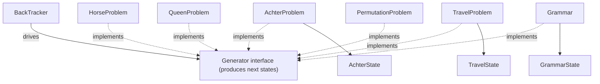

---
digest:
  local-classes:
    AchterProblem:
      mtime: '2026-09-05T20:45:17Z'
      digest: 7e5c10137ce44c5e78b110e6dd34ed8e96fa329a0156d3650f0f3741a2520f3c
    AchterState:
      mtime: '2026-09-05T20:45:17Z'
      digest: 07085c9fec7c6f16eb74940828dd22fb696a7dac2cad2caf4ee7e2099123838d
    BackTracker:
      mtime: '2026-09-05T20:44:23Z'
      digest: 095bc892654bdad84f357a9dae9b3de3e481dbd10a7a51250313d09c30e963b6
    Grammar:
      mtime: '2026-09-05T20:45:01Z'
      digest: b1afe77d3a240312290ba924f9a504f4a24be63a680fe16c723264357fecf6b8
    GrammarState:
      mtime: '2026-09-05T20:45:01Z'
      digest: 7f4bf02c74c98246b83eb2a4629a5b6fd8df20065ef888015de2f00fffdbe651
    HorseProblem:
      mtime: '2026-09-05T20:45:41Z'
      digest: 78ad7661dc59fb5b53780016a04511592b106601acb99e8a59d337f2d4450021
    PermutationProblem:
      mtime: '2026-09-05T20:45:46Z'
      digest: fe44ecdf44f0d491359ae4f5e134fa795ba9cb893264cb4cabc231b314ec7941
    QueenProblem:
      mtime: '2026-09-05T20:45:44Z'
      digest: f1d3e570f543ff84df9076343fdbae22da2b982a7ca39526e49a974c91ea2e83
    TravelProblem:
      mtime: '2026-09-05T20:45:53Z'
      digest: b642be87e20ce7dc7d9dc8f1491445ac13e1121d3d2e4d6f7dbe084e0c60246e
    TravelState:
      mtime: '2026-09-05T20:45:53Z'
      digest: 4ab17536460f2984ce66768b39e042e2bd98bc7fe5b3bc5d79c7aa34e1407b42
  folders: {}
tags:
- code/backtracking
- code/algorithm
concepts:
- Backtracking Search
facets:
  layer: utility
  status: legacy
  complexity: medium
description: '`BackTracker` is a generic backtracking/genetic-search engine: it streams successive solutions out of a search whose exploration order (breadth-first, depth-first, or priority/branch-and-bound) is determined purely by the `IPipe` implementation used to store pending candidates (FIFO, LIFO, or a priority queue). The other classes in this folder are problem-specific generator/tester pairs plugged into `BackTracker` for five classic search problems: the 8-puzzle (`AchterProblem`/`AchterState`), the Knight''s Tour (`HorseProblem`), N-Queens (`QueenProblem`), exhaustive string permutations (`PermutationProblem`), the Travelling Salesman Problem (`TravelProblem`/`TravelState`), plus a grammar-based sentence generator (`Grammar`/`GrammarState`). Each generator supplies candidate next-states from a given state; `BackTracker` does not know or care what the states represent.'
---

# backTrack

`BackTracker` is a generic backtracking/genetic-search engine: it streams successive solutions out of a
search whose exploration order (breadth-first, depth-first, or priority/branch-and-bound) is determined
purely by the `IPipe` implementation used to store pending candidates (FIFO, LIFO, or a priority queue).
The other classes in this folder are problem-specific generator/tester pairs plugged into `BackTracker` for
five classic search problems: the 8-puzzle (`AchterProblem`/`AchterState`), the Knight's Tour
(`HorseProblem`), N-Queens (`QueenProblem`), exhaustive string permutations (`PermutationProblem`), the
Travelling Salesman Problem (`TravelProblem`/`TravelState`), plus a grammar-based sentence generator
(`Grammar`/`GrammarState`). Each generator supplies candidate next-states from a given state; `BackTracker`
does not know or care what the states represent.

## Architecture

## Entry Points

- `BackTracker` - the generic search engine; construct it with an `IPipe` and a problem-specific generator.
- One of `AchterProblem`, `HorseProblem`, `QueenProblem`, `PermutationProblem`, `TravelProblem`, `Grammar` - pick the problem to solve.

## Classes

| Class | Responsibility |
|---|---|
| [AchterProblem](AchterProblem.java) | Generator and success tester for the 8-puzzle (Achter Problem) sliding-tile search, for use with BackTracker. |
| [AchterState](AchterProblem.java) | One board configuration of the 8-puzzle search, tracking the move sequence that reached it. |
| [BackTracker](BackTracker.java) | Streams successive solutions of a backtracking/genetic search, where the IPipe store's discipline (FIFO, LIFO, priority queue) determines whether the search is breadth-first, depth-first, or a priority (branch-and-bound) search. |
| [Grammar](Grammar.java) | Generates candidate sentence phenotypes from grammar-rule genotypes for use as a BackTracker generator. |
| [GrammarState](Grammar.java) | This Representation of a State for a Problem is quite redundant. |
| [HorseProblem](HorseProblem.java) | Generator for the Knight's Tour (Horse Problem) search, for use with BackTracker. |
| [PermutationProblem](PermutationProblem.java) | Generator for exhaustive string permutations, for use with BackTracker. |
| [QueenProblem](QueenProblem.java) | Generator for the N-Queens placement search, for use with BackTracker. |
| [TravelProblem](TravelProblem.java) | Generator and success tester for the Travelling Salesman Problem, solvable either via BackTracker priority search or simulated annealing. |
| [TravelState](TravelProblem.java) | This Representation of a State for the Travel Problem is quite redundant. |
