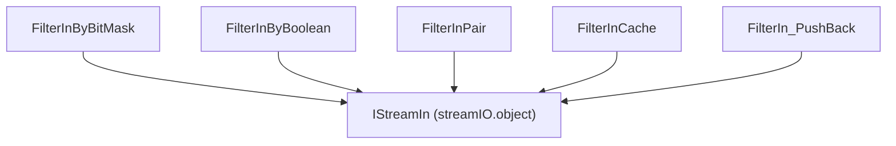

---
digest:
  local-classes:
    FilterInByBitMask:
      mtime: '2026-09-05T20:46:43Z'
      digest: 208df024899ed7c631c62f736dbb7258a361516e50287c42172f0535dacb0bc4
    FilterInByBoolean:
      mtime: '2026-09-05T20:46:45Z'
      digest: c9ce2ac927bff19a345edbdee040bb3ea46af211833ce047d368cb3613a976b0
    FilterInCache:
      mtime: '2026-09-05T20:47:03Z'
      digest: 2b7a22dbde3721bc1abf0a5edc03056e5feec6f0291b492cb0df7a17da376574
    FilterInPair:
      mtime: '2026-09-05T20:47:10Z'
      digest: a547be18d4e8c4039d32c3405a709c9c5447f1b78f89183a34ac290e528c5a6c
    FilterIn_PushBack:
      mtime: '2026-09-05T20:47:17Z'
      digest: e841a0db365e857fe1dbc90608a07af77bc56ac3572b84539f56eb65925b1b4a
  folders: {}
tags:
- code/stream_filter
- code/decorator_pattern
concepts:
- Stream Filter (Input)
facets:
  layer: utility
  status: legacy
  complexity: medium
description: 'Small, focused read-side filters that wrap another `IStreamIn` and change which/what items come out: `FilterInByBitMask`/`FilterInByBoolean` select items by position against a mask or boolean array, `FilterInPair` projects a stream of key/value pairs down to just one side, `FilterInCache` adds a bounded replay buffer so `mark()`/`reset()` work over a sliding window, and `FilterIn_PushBack` lets a single item be pushed back for the next read. Each is a thin, single-purpose decorator meant to be composed with other stream filters from `streamIO.object`.'
---

# filterIn

Small, focused read-side filters that wrap another `IStreamIn` and change which/what items come out:
`FilterInByBitMask`/`FilterInByBoolean` select items by position against a mask or boolean array,
`FilterInPair` projects a stream of key/value pairs down to just one side, `FilterInCache` adds a bounded
replay buffer so `mark()`/`reset()` work over a sliding window, and `FilterIn_PushBack` lets a single item
be pushed back for the next read. Each is a thin, single-purpose decorator meant to be composed with other
stream filters from `streamIO.object`.

## Architecture

## Entry Points

- Pick the filter matching the desired selection/replay behavior and wrap it around an existing `IStreamIn`.

## Classes

| Class | Responsibility |
|---|---|
| [FilterInByBitMask](FilterInByBitMask.java) | Filter that selects stream items whose position matches a set bit in a long bit mask. |
| [FilterInByBoolean](FilterInByBoolean.java) | Filter that selects stream items whose position is marked true in a boolean array. |
| [FilterInCache](FilterInCache.java) | Fixed-capacity cache over a wrapped IStreamIn, buffering replayed items so mark()/reset() work over a bounded window. |
| [FilterInPair](FilterInPair.java) | Projects a stream of pairs (however represented) down to just their keys or just their values. |
| [FilterIn_PushBack](FilterIn_PushBack.java) | Filter supporting a single-slot push-back: the last item read can be pushed back once and will be replayed by the next nextItem() call before the wrapped stream is advanced. |
