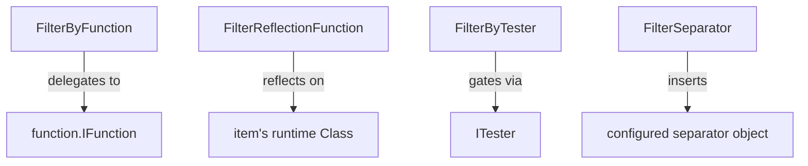

---
digest:
  local-classes:
    FilterByFunction:
      mtime: '2026-09-05T20:48:04Z'
      digest: 78197b9ec72369bd43f1b6463e9feae0f8feb155d6d62d18acf4a487079d8b92
    FilterByTester:
      mtime: '2026-09-05T20:48:15Z'
      digest: 4e7325958eef6a8f64f14316b450b9ce1dc412a13f927822b1fcbebc62686471
    FilterReflectionFunction:
      mtime: '2026-09-05T20:48:37Z'
      digest: b47caa8818441d828901257f6f544483af9211ae4e3afacf8c540aef2aa83b1b
    FilterSeparator:
      mtime: '2026-09-05T20:48:43Z'
      digest: 5a522e76626beff77ff99e5905119ab9297f1b353aa99b9e0a4a583e0e9cc38f
  folders: {}
tags:
- code/stream_filter
- code/decorator_pattern
concepts:
- Stream Filter (Input)
facets:
  layer: utility
  status: legacy
  complexity: medium
description: 'Bidirectional filters (usable on either the input or output side of a stream) that transform or gate items in flight: `FilterByFunction` maps every item through a configured `function.IFunction`, `FilterReflectionFunction` does the same but by invoking a named method via reflection on each item''s runtime class, `FilterByTester` keeps only the items an `ITester` rejects, and `FilterSeparator` inserts a configured separator object between items.'
---

# filterInOut

Bidirectional filters (usable on either the input or output side of a stream) that transform or gate items
in flight: `FilterByFunction` maps every item through a configured `function.IFunction`,
`FilterReflectionFunction` does the same but by invoking a named method via reflection on each item's
runtime class, `FilterByTester` keeps only the items an `ITester` rejects, and `FilterSeparator` inserts a
configured separator object between items.

## Architecture

## Entry Points

- `FilterByFunction` / `FilterReflectionFunction` - transform items in flight.
- `FilterByTester` - filter items in flight.
- `FilterSeparator` - inject separators between items.

## Classes

| Class | Responsibility |
|---|---|
| [FilterByFunction](FilterByFunction.java) | Projective filter that maps every item through a configured IFunction on its way through, on either the input or output side. |
| [FilterByTester](FilterByTester.java) | Filter that keeps only items rejected by a configured ITester, skipping every item the tester accepts. |
| [FilterReflectionFunction](FilterReflectionFunction.java) | Filter that applies a named method via reflection to every item passing through, resolving the Method lazily against each item's runtime class. |
| [FilterSeparator](FilterSeparator.java) | Filter that inserts a configured separator object between the items passing through. |
