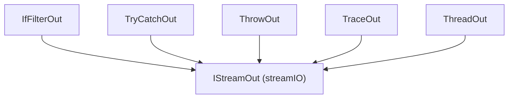

---
digest:
  local-classes:
    IfFilterOut:
      mtime: '2026-09-05T20:49:22Z'
      digest: daca5c742b1d89e677b45146a44a253e209c816f909108a76b66f068cc38ba78
    ThreadOut:
      mtime: '2026-09-05T20:49:21Z'
      digest: 008cac9523c09257208f7375a2725ccb572913b46da8478094d67a4815878bdb
    ThrowOut:
      mtime: '2026-09-05T20:49:24Z'
      digest: 27a4bf9898aaa5a6c5a9a6c1b115876326debc3f6b52ada0838c3e16c75b7dde
    TraceOut:
      mtime: '2026-09-05T20:49:26Z'
      digest: fc729f628890ff662cfa2769ef7b8bcce5f2c8f30bb761f53029deedef55ed6b
    TryCatchOut:
      mtime: '2026-09-05T20:49:28Z'
      digest: 219324289a8c514306fe97a35586c326c2d3b4bb771c21800b41719333ea3bc8
  folders: {}
tags:
- code/stream_filter
- code/decorator_pattern
concepts:
- Stream Filter (Output)
facets:
  layer: utility
  status: legacy
  complexity: medium
description: 'Write-side filters that control how an item is routed or how errors are handled on its way downstream: `IfFilterOut` branches each item to one of two outputs based on an `ITester`, `TryCatchOut` catches any downstream exception and reroutes the original item to an error output instead of letting it escalate, `ThrowOut` does the opposite (converts a message back into a thrown exception), `TraceOut` logs each item before forwarding it unchanged, and `ThreadOut` offloads each item''s forwarding onto a new thread for concurrent downstream processing (see the `ThreadOut.addItem()` bug flagged below - it currently recurses rather than looping, so under sustained load it risks unbounded thread creation/stack growth).'
---

# filterOut

Write-side filters that control how an item is routed or how errors are handled on its way downstream:
`IfFilterOut` branches each item to one of two outputs based on an `ITester`, `TryCatchOut` catches any
downstream exception and reroutes the original item to an error output instead of letting it escalate,
`ThrowOut` does the opposite (converts a message back into a thrown exception), `TraceOut` logs each item
before forwarding it unchanged, and `ThreadOut` offloads each item's forwarding onto a new thread for
concurrent downstream processing (see the `ThreadOut.addItem()` bug flagged below - it currently recurses
rather than looping, so under sustained load it risks unbounded thread creation/stack growth).

## Architecture

## Entry Points

- `TryCatchOut` / `ThrowOut` - introduce or remove an error-stream boundary in a filter chain.
- `TraceOut` - add logging to a chain.
- `IfFilterOut` - branch a chain based on a test.
- `ThreadOut` - offload downstream processing to a new thread per item (see flagged bug above).

## Classes

| Class | Responsibility |
|---|---|
| [IfFilterOut](IfFilterOut.java) | Filter that branches each item to one of two downstream outputs based on a configured ITester. |
| [ThreadOut](ThreadOut.java) | Filter that offloads each incoming item's forwarding onto a new thread for concurrent downstream processing. |
| [ThrowOut](ThrowOut.java) | Terminal output that throws a preconfigured exception for every item it receives, converting message processing back into an escalation. |
| [TraceOut](TraceOut.java) | Filter that logs each item to a Log before forwarding it unchanged. |
| [TryCatchOut](TryCatchOut.java) | Filter that forwards each item downstream, catching any exception the downstream chain throws and rerouting the original item to a configured error output instead. |
