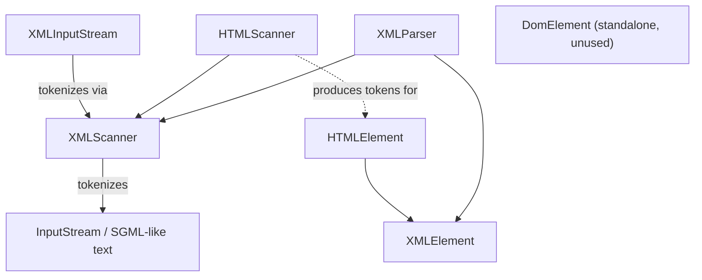

---
digest:
  local-classes:
    DomElement:
      mtime: '2026-09-05T20:49:51Z'
      digest: e55c0be9360ab230951ddf54423a67e5bfb649ea442aa6a7a0f3683b3c0b1b49
    HTMLElement:
      mtime: '2026-09-05T20:49:52Z'
      digest: b3f795bb66eecee66159b188b048e5fc399ef6a2efe10c48a9b337085a864d51
    HTMLScanner:
      mtime: '2026-09-05T20:50:36Z'
      digest: cab65b4935445d012bb3042d8d39af21df5b3caa4a96d54cc3e2bb3a14342645
    XMLElement:
      mtime: '2026-09-05T10:13:32Z'
      digest: e73c2e421856b30e9b6ccbe5575c8f41d7857b7e37e8f876bf27b4fb00c13ec9
    XMLInputStream:
      mtime: '2026-09-05T20:56:34Z'
      digest: f6b565c8a6c77a43f4312cc46e9c55313c7848efc99d6f62b55a8b56ac416259
    XMLParser:
      mtime: '2026-09-05T20:56:15Z'
      digest: 1b88fb63ae07c21e81fc71e0339be3f8e1f34cbc079849cb3ae7e5624959e992
    XMLScanner:
      mtime: '2026-09-05T20:56:21Z'
      digest: 535c4192e0a395aaae2db4c55d6ca4e24c05beb3055564edf0819fd1551849f7
  folders: {}
tags:
- code/parsing
- code/xml
concepts:
- XML/HTML Parsing
facets:
  layer: utility
  status: legacy
  complexity: medium
description: 'A small, self-contained DOM/parsing stack for XML and HTML, independent of `streamIO.object.parser`''s XML support (both are explicitly marked `@deprecated` in favor of that newer parser). `XMLScanner` is the low-level event-based tokenizer (start/stop/attribute/text tokens, SAX-like), `XMLParser` builds a tree of `XMLElement`s on top of it (or can search for a specific path without building the whole tree), and `HTMLScanner`/`HTMLElement` specialize the same tokenizer/tree for HTML''s fixed tag vocabulary. `XMLInputStream` is a separate, unrelated concern: it (de)serializes arbitrary Java objects to/from an XML representation, reusing `XMLScanner` only as its tokenizer - see the security note below about the untrusted-class-name risk this implies. `DomElement` is an unrelated, unused lightweight element record not wired into the rest of this parsing stack.'
---

# integer

A small, self-contained DOM/parsing stack for XML and HTML, independent of `streamIO.object.parser`'s XML
support (both are explicitly marked `@deprecated` in favor of that newer parser). `XMLScanner` is the
low-level event-based tokenizer (start/stop/attribute/text tokens, SAX-like), `XMLParser` builds a tree of
`XMLElement`s on top of it (or can search for a specific path without building the whole tree), and
`HTMLScanner`/`HTMLElement` specialize the same tokenizer/tree for HTML's fixed tag vocabulary.
`XMLInputStream` is a separate, unrelated concern: it (de)serializes arbitrary Java objects to/from an XML
representation, reusing `XMLScanner` only as its tokenizer - see the security note below about the
untrusted-class-name risk this implies. `DomElement` is an unrelated, unused lightweight element record not
wired into the rest of this parsing stack.

**Security note:** `XMLInputStream` instantiates classes named in the untrusted XML input via
`Class.forName(...)`/reflection with no allow-list (flagged inline). Any caller feeding it externally
supplied XML is exposed to arbitrary-class-instantiation risk. `XMLParser`/`XMLScanner`/`HTMLScanner`
recurse per nested tag/element with no depth limit, so a deeply nested or malformed document can also
exhaust the stack.

## Architecture

## Entry Points

- `XMLParser` (with `XMLScanner`) - parse XML text into an `XMLElement` tree, or search it without building the whole tree.
- `HTMLScanner` (with `HTMLElement`) - the HTML equivalent.
- `XMLInputStream` - deserialize a Java object graph from XML (deprecated; see security note above).

## Classes

| Class | Responsibility |
|---|---|
| [DomElement](DomElement.java) | lightweight XML Element with Attributes |
| [HTMLElement](HTMLElement.java) | DOM element specialized for an HTML tree, caching its tag as an HTMLScanner token. |
| [HTMLScanner](HTMLScanner.java) | HTML Parser, uses an XMLParser to read it's Elements, so it is stricter than usual Browsers. |
| [XMLElement](XMLElement.java) | Fundamental DOM Element of an XML Tree Has a Factory Method newElement() that is used to generate and initialize new Elements of the same Class, so Subclasses like HTMLElement can build the Tree with their own Elements. |
| [XMLInputStream](XMLInputStream.java) | Title: XMLInputStream Description: Methods to read Objects from an XML streamIO and static Methods to set Values in Arrays and Objects. |
| [XMLParser](XMLParser.java) | This Class is an Engine to the Event Based Interface from the XMLScanner to Streams carrying SGML. |
| [XMLScanner](XMLScanner.java) | This Class defines an Event Based Interface to SGML like Streams similar to the SAX Interface. |
