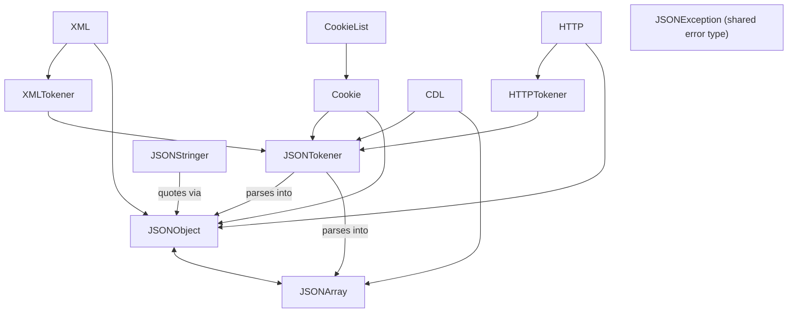

---
digest:
  local-classes:
    CDL:
      mtime: '2026-09-05T10:13:32Z'
      digest: fe784b4f42b56695c9428a02169f5dbeee9ca979649deaebb3bc26bf152b49f7
    Cookie:
      mtime: '2026-09-05T10:13:32Z'
      digest: cc7cbd98db544ace51ee9f9a22be2ebfd41f7a4301fe510f2a408ecdcfa45e6f
    CookieList:
      mtime: '2026-09-05T10:13:32Z'
      digest: bc3d4618648e0217a395d9fa77b51b074567453691f2127218733367f0546014
    HTTP:
      mtime: '2026-09-05T10:13:32Z'
      digest: 0666edcb1c2eecfc2377bef9dfeb8377b7572968f306e0f6938ad935b24f7742
    HTTPTokener:
      mtime: '2026-09-05T10:13:32Z'
      digest: e18cfccf8c9623c3dcd5670c66d94129c82f0ba85309d70bcfc21059e8ad5788
    JSONArray:
      mtime: '2026-09-05T10:13:32Z'
      digest: 79b57d39b9c01d0983796b43837d2945942cb15e0f36edf4ffb1850db201d546
    JSONException:
      mtime: '2026-09-05T10:13:32Z'
      digest: 8b6fa8245da50ef01936eba431cc0cc0303ae72a2f159b063ee4b74be52a1bfb
    JSONObject:
      mtime: '2026-09-05T10:13:32Z'
      digest: da0ba1aab0db203edb454d4839a78ffbd9b86864883b33951754b606b97994ff
    JSONStringer:
      mtime: '2026-09-05T10:13:32Z'
      digest: 89e59c717929407dd8f10354fb7a50df1aea15c88dc7efe1c9800968d4ec8073
    JSONTest:
      mtime: '2026-09-05T10:13:32Z'
      digest: 5fea9b58c1dffacfa2a16dc5e25ce5bd5b00d99cf050fe245f2899b2fa0d107e
    JSONTokener:
      mtime: '2026-09-05T20:59:12Z'
      digest: a033ed30305746c6af73afadb8c24e9e025525ca2be5da4e94bb9b091f91064a
    XML:
      mtime: '2026-09-05T10:13:32Z'
      digest: b15685914e437aab1d693a0240b476e8b54c9727492d60eaa38042a801878336
    XMLTokener:
      mtime: '2026-09-05T10:13:32Z'
      digest: df7c875fb308dd31b4b11544420cef7e122d9111e1ee09db872a0455e57d0669
  folders: {}
tags:
- code/parsing
- code/serialization
concepts:
- JSON.org Reference Implementation
facets:
  layer: utility
  status: legacy
  complexity: medium
description: 'The classic JSON.org reference implementation (`org.json`, repackaged into this project''s namespace): `JSONObject`/`JSONArray` are the in-memory value types, `JSONTokener` parses a source string into them (and is also the base tokenizer reused by `XMLTokener` and `HTTPTokener` for related mini-formats), `JSONStringer` builds JSON text incrementally with a depth-guarded cascade API, and `JSONException` is the shared parse/format error type. `XML`, `HTTP`, `Cookie`, `CookieList` and `CDL` are format-conversion adapters that reuse `JSONObject`/`JSONArray` as an intermediate representation for XML, HTTP headers, browser cookies and comma-delimited text respectively. `JSONTest` is a standalone manual test/demo program, not part of the library''s public surface.'
---

# json

The classic JSON.org reference implementation (`org.json`, repackaged into this project's namespace):
`JSONObject`/`JSONArray` are the in-memory value types, `JSONTokener` parses a source string into them
(and is also the base tokenizer reused by `XMLTokener` and `HTTPTokener` for related mini-formats),
`JSONStringer` builds JSON text incrementally with a depth-guarded cascade API, and `JSONException` is the
shared parse/format error type. `XML`, `HTTP`, `Cookie`, `CookieList` and `CDL` are format-conversion
adapters that reuse `JSONObject`/`JSONArray` as an intermediate representation for XML, HTTP headers, browser
cookies and comma-delimited text respectively. `JSONTest` is a standalone manual test/demo program, not part
of the library's public surface.

**Security note (this package parses untrusted external data formats):** `JSONTokener.nextValue()` recurses
into a new `JSONObject`/`JSONArray` for every nested `{`/`[`, with no depth limit - unlike `JSONStringer`,
which caps its own nesting at `maxdepth = 20`. A deeply nested or pathological JSON document from an
untrusted source can exhaust the call stack (flagged inline). `XML.parse()` has the same unbounded-recursion
shape for nested XML elements. A separate, unrelated off-by-one bug in `JSONTokener.next(int)` was also
flagged (see bug list).

## Architecture

## Entry Points

- `new JSONObject(string)` / `new JSONArray(string)` - parse JSON text (see stack-depth security note above).
- `JSONStringer` - build JSON text incrementally.
- `XML.toJSONObject(...)`, `HTTP.toJSONObject(...)`, `Cookie.toJSONObject(...)`, `CookieList.toJSONObject(...)`, `CDL.toJSONArray(...)` - convert other text formats to/from JSON.

## Classes

| Class | Responsibility |
|---|---|
| [CDL](CDL.java) | This provides static methods to convert comma delimited text into a JSONArray, and to covert a JSONArray into comma delimited text. |
| [Cookie](Cookie.java) | Convert a web browser cookie specification to a JSONObject and back. |
| [CookieList](CookieList.java) | Convert a web browser cookie list string to a JSONObject and back. |
| [HTTP](HTTP.java) | Convert an HTTP header to a JSONObject and back. |
| [HTTPTokener](HTTPTokener.java) | The HTTPTokener extends the JSONTokener to provide an additional method for the parsing of HTTP headers. |
| [JSONArray](JSONArray.java) | A JSONArray is an ordered sequence of values. |
| [JSONException](JSONException.java) | The JSONException is thrown by the JSON.org classes when things are amiss. |
| [JSONObject](JSONObject.java) | A JSONObject is an unordered collection of name/value pairs. |
| [JSONStringer](JSONStringer.java) | JSONStringer provides a quick and convenient way of producing JSON text. |
| [JSONTest](JSONTest.java) | Test class. |
| [JSONTokener](JSONTokener.java) | A JSONTokener takes a source string and extracts characters and tokens from it. |
| [XML](XML.java) | This provides static methods to convert an XML text into a JSONObject, and to covert a JSONObject into an XML text. |
| [XMLTokener](XMLTokener.java) | The XMLTokener extends the JSONTokener to provide additional methods for the parsing of XML texts. |
