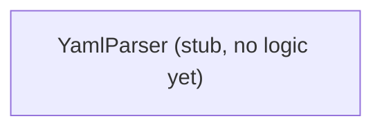

---
digest:
  local-classes:
    YamlParser:
      mtime: '2026-09-05T20:58:29Z'
      digest: 67671d46bff11be80d1b7156f6c9d99bb387d74ae0009cff80a95c961a222e9c
  folders: {}
tags:
- code/parsing
concepts:
- YAML Parsing (Planned - Unimplemented)
facets:
  layer: utility
  status: legacy
  complexity: medium
description: 'Reserved for a future YAML 1.1 parser. `YamlParser` is currently an empty stub: it carries only a detailed YAML 1.1 syntax reference card in its class comment (collection/scalar/alias indicators, tag properties, escape codes) and has no fields, no parsing logic, and an empty `main()`. There is nothing here yet to security-review, since no untrusted input is actually parsed by this class.'
---

# yaml

Reserved for a future YAML 1.1 parser. `YamlParser` is currently an empty stub: it carries only a detailed
YAML 1.1 syntax reference card in its class comment (collection/scalar/alias indicators, tag properties,
escape codes) and has no fields, no parsing logic, and an empty `main()`. There is nothing here yet to
security-review, since no untrusted input is actually parsed by this class.

## Architecture

## Entry Points

- None yet - `YamlParser` has no implemented behavior.

## Classes

| Class | Responsibility |
|---|---|
| [YamlParser](YamlParser.java) | Placeholder for a future YAML 1.1 parser: currently an empty stub (no fields, no parsing logic) carrying only the reference-card notes below for the syntax it is meant to eventually support. |
