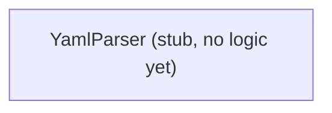

---
digest:
  local-classes:
    YamlParser:
      mtime: '2026-09-05T20:58:29Z'
      digest: 67671d46bff11be80d1b7156f6c9d99bb387d74ae0009cff80a95c961a222e9c
  folders: {}
tags:
- code/parsing
concepts:
- YAML Parsing
facets:
  layer: utility
  status: legacy
  complexity: '3'
description: 'Reserved for a future YAML 1.1 parser. `YamlParser` is currently an empty stub: it carries only a detailed YAML 1.1 syntax reference card in its class comment (collection/scalar/alias indicators, tag properties, escape codes) and has no fields, no parsing logic, and an empty `main()`. There is nothing here yet to security-review, since no untrusted input is actually parsed by this class.'
dv_has_:
  sub_:
    folders: 0
    files: 3
    units: 1
    facet_:
      layer_:
        utility: 1
      status_:
        legacy: 1
      complexity_:
        "3": 1
    tag_:
      code_:
        parsing: 1
    concept_:
      "Technology\\IT\\Data\\Data_Language\\YAML.md": 1
has_sub_folders: 0
has_sub_files: 3
has_sub_units: 1
has_sub_facet_layer_utility: 1
has_sub_facet_status_legacy: 1
has_sub_facet_complexity_3: 1
has_sub_tag_code_parsing: 1
has_sub_concept_technology_it_data_data_language_yaml_md: 1
related:
- path: ../_Matthias/Code/NET/_root/_projects/spocWeb.styledEditing/xml
  shared-tags:
  - code/parsing
- path: ../_Matthias/Code/NET/_root/_projects/xCell.engine/Expressions
  shared-tags:
  - code/parsing
- path: ../_Matthias/Code/NET/_root/Data/ArchieML
  shared-tags:
  - code/parsing
- path: ../_Matthias/Code/NET/_root/_projects/spocWeb.styledEditing/bracketing
  shared-tags:
  - code/parsing
- path: ../_Matthias/Code/NET/_root/_projects/root.base/Expressions/iBool/normalform
  shared-tags:
  - code/parsing
- path: ../_Matthias/Code/NET/_root/_projects/root.base/Expressions/iBool/rpn
  shared-tags:
  - code/parsing
- path: ../_Matthias/Code/NET/_root/_projects/db/Files
  shared-tags:
  - code/parsing
- path: ../_Matthias/Code/NET/_root/_projects/spocWeb.styledEditing/folding
  shared-tags:
  - code/parsing
- path: ../_Matthias/Code/Java/graphic/svg
  shared-tags:
  - code/parsing
- path: ../_Matthias/Code/NET/_root/_projects/spocWeb.styledEditing/indentation/CSharp
  shared-tags:
  - code/parsing
---

# yaml

Reserved for a future YAML 1.1 parser. `YamlParser` is currently an empty stub: it carries only a detailed
YAML 1.1 syntax reference card in its class comment (collection/scalar/alias indicators, tag properties,
escape codes) and has no fields, no parsing logic, and an empty `main()`. There is nothing here yet to
security-review, since no untrusted input is actually parsed by this class.

## Architecture

```mermaid
graph TD
    YamlParser["YamlParser (stub, no logic yet)"]
```

## Entry Points

- None yet - `YamlParser` has no implemented behavior.

## Classes

| Class | Responsibility |
|---|---|
| [YamlParser](YamlParser.java) | Placeholder for a future YAML 1.1 parser: currently an empty stub (no fields, no parsing logic) carrying only the reference-card notes below for the syntax it is meant to eventually support. |
