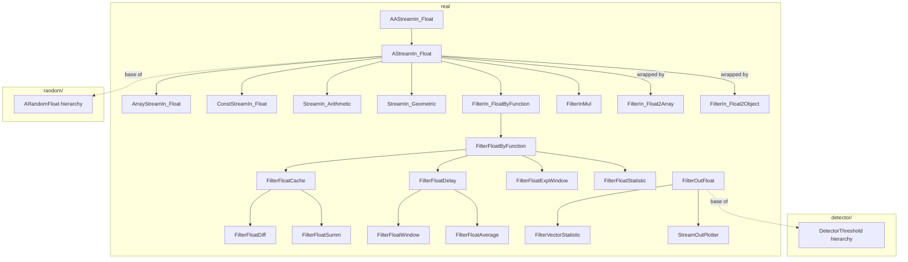

---
digest:
  local-classes:
    AAStreamIn_Float:
      mtime: '2026-09-05T11:08:37Z'
      digest: 3c63bea187c61f78b946bd31f30d92cecbeddee07fb8166a58fe271f21aa63e9
    AStreamIn_Float:
      mtime: '2026-09-05T11:09:09Z'
      digest: 36dc9a025620ce10f845341da4f4ce536b136ff10e2883a899272c53b2b5e496
    ArrayStreamIn_Float:
      mtime: '2026-09-05T11:09:43Z'
      digest: 97a28d3bd062f95096844fdb7c628a1fec1e046fbbb7aad05e389b682bfedb9e
    ConstStreamIn_Float:
      mtime: '2026-09-05T11:10:20Z'
      digest: 6c593b28e449aed39220b9f33d60684988ad8eabcd92bfdd5a524c1d57dbd6a2
    FilterFloatAverage:
      mtime: '2026-09-05T11:10:54Z'
      digest: e76c3c570d594721ac2cae008612dd0fd4aadf7e2097db0e8517be2bcc7acb40
    FilterFloatByFunction:
      mtime: '2026-09-05T11:11:12Z'
      digest: d4c95c1c41b029e92661fda6ebfbf29c6283d0024a841cfea7918e07bbb002c7
    FilterFloatCache:
      mtime: '2026-09-05T11:11:34Z'
      digest: f27b4dee74e43c0822ffb5bb862b62f4268164c243071ea2dc808c0078604411
    FilterFloatDelay:
      mtime: '2026-09-05T11:12:06Z'
      digest: 53271d99195a7e2dc3befdff83f357e605a8fe9fb418a9c5593cae07a5a5a488
    FilterFloatDiff:
      mtime: '2026-09-05T11:12:27Z'
      digest: bb22ea223004a048decfc1e0766ad8de03ae73a609ef0672074b4100def5a977
    FilterFloatExpWindow:
      mtime: '2026-09-05T11:12:57Z'
      digest: 203c5365de779f203b18d6e1478ee09dcf064328fd60d9a0712573aaa7b8cc81
    FilterFloatOutliers:
      mtime: '2026-09-05T11:13:33Z'
      digest: 5dd28cac687b750661025d54c4650a9877179fb797c16804bc9473eef0f215ee
    FilterFloatStatistic:
      mtime: '2026-09-05T11:14:58Z'
      digest: b1b7bd989b0f858b49297a43888540b0ec12c5d7dd0e7219ad69e052ebe9e864
    FilterFloatSumm:
      mtime: '2026-09-05T11:15:20Z'
      digest: e7d3b8c812cc6ea33362f37fd1ace11113f27b089b7feae29322f56ae439383a
    FilterFloatWindow:
      mtime: '2026-09-05T11:15:54Z'
      digest: fd4b733e8d27debda1a99e8c44d9786f5de3821d953aa433eb44ba8f6abcd4f6
    FilterInLin:
      mtime: '2026-09-05T10:13:32Z'
      digest: 8a5fc5b36109755a2419251a29b1a33f76286bd9d27ffc592b76cb5c2c5b60cf
    FilterInMul:
      mtime: '2026-09-05T11:16:49Z'
      digest: 37150eb7830d3da26f4e13e9522c9af63de57c63499a5c348d1fbd4d4a767e59
    FilterIn_Float2Array:
      mtime: '2026-09-05T11:17:23Z'
      digest: d16a43fd58163794a4f662cc313e71c40ae248bc99c7f8a7a64a22b3d6b8a37f
    FilterIn_Float2Object:
      mtime: '2026-09-05T11:17:56Z'
      digest: 2d5e133101cbd9d0dc3aadc763242591e1a86eecd7f7d2f74fbd11e4c1eb785c
    FilterIn_FloatByFunction:
      mtime: '2026-09-05T11:18:52Z'
      digest: 06ac6ca3c9d658e4c9ddba639b6eea6afa2b99418f9950d89eb96e74d5be995b
    FilterOutFloat:
      mtime: '2026-09-05T11:19:15Z'
      digest: 468f5e95a6c26ad259c21fb57c5801c781ffded68b4ea6883efa31faebd6a710
    FilterVectorStatistic:
      mtime: '2026-09-05T11:20:24Z'
      digest: 0a3abd32d9550340a8acd0bdd945f3050a47ea1a05e6d24ed1ac46597222a86d
    IStreamIn_Bound_Float:
      mtime: '2026-09-05T10:13:32Z'
      digest: 23076488ee30c35afc1f77fe3c39eb4f68b47f9bfb5124497ab1b596cadbf7ee
    IStreamIn_Float:
      mtime: '2026-09-05T11:21:21Z'
      digest: d859136f1d1b4c748bcd95abb0a05d4f88764747eb20b61ae76f23cc23f983fa
    IStreamOutFloat:
      mtime: '2026-09-05T10:13:32Z'
      digest: 2924a0a8134cccdaac73ae7934d1330d35952a49e71713ed5f1efdecc6b04d61
    StreamIn_Arithmetic:
      mtime: '2026-09-05T11:22:25Z'
      digest: 38cf95585e5de4f6c01a3bdeb1d502324ab1f9ab2b95693d02d5b9bf483ca70f
    StreamIn_Float:
      mtime: '2026-09-05T10:13:32Z'
      digest: e3b0c44298fc1c149afbf4c8996fb92427ae41e4649b934ca495991b7852b855
    StreamIn_Geometric:
      mtime: '2026-09-05T11:23:08Z'
      digest: 462be027aad6515354e49ffd84e0433f4827fda5d6c0e48594685c5c5646f544
    StreamOutPlotter:
      mtime: '2026-09-05T11:23:43Z'
      digest: e24a8a02a0be66a29e7e6ff570039b1597d6de6b62300df28c388bc583232474
  folders:
    detector/:
      mtime: '2026-09-05T11:26:11Z'
      digest: 21f695328ed1bda8ad2c89e0db1ab3257cc6ec2ca3f5d71441e271f9f00edee7
    random/:
      mtime: '2026-09-05T11:31:02Z'
      digest: a42bb909c9ac1ff9d09d685db7c0ff26348833206e985c86705c682d359e018b
tags:
- code/stream_filter
- code/statistics
concepts:
- Float Stream Filters and Statistics
facets:
  layer: infrastructure
  status: legacy
  complexity: medium
description: 'A framework for streams of `float`/`double` numbers: sources, filters and sinks that all implement `IStreamIn_Float` and/or `IStreamOutFloat`. `AAStreamIn_Float` is the abstract root, implementing `IStreamIn_Bound_Float`; `AStreamIn_Float` adds the current-value caching every concrete source and filter builds on. Sources include array- and constant-backed streams (`ArrayStreamIn_Float`, `ConstStreamIn_Float`) and progressions (`StreamIn_Arithmetic`, `StreamIn_Geometric`). Filters form two families: value-processing filters built on `FilterIn_FloatByFunction`/`FilterFloatByFunction` (averaging, windowing, delay, diff, running sums, exponential windows, outlier rejection, running statistics), and output-side filters built on `FilterOutFloat` (used as the base for the `detector/` subsystem). `FilterVectorStatistic` extends this to vector-valued streams. `StreamOutPlotter` renders incoming values as ASCII plots. The `detector/` subsystem builds statistical-process-control detectors on top of `FilterOutFloat`, and the `random/` subsystem builds distribution-specific random-number generators on top of `AStreamIn_Float`.'
---

# real

A framework for streams of `float`/`double` numbers: sources, filters and sinks that all
implement `IStreamIn_Float` and/or `IStreamOutFloat`. `AAStreamIn_Float` is the abstract root,
implementing `IStreamIn_Bound_Float`; `AStreamIn_Float` adds the current-value caching every
concrete source and filter builds on. Sources include array- and constant-backed streams
(`ArrayStreamIn_Float`, `ConstStreamIn_Float`) and progressions (`StreamIn_Arithmetic`,
`StreamIn_Geometric`). Filters form two families: value-processing filters built on
`FilterIn_FloatByFunction`/`FilterFloatByFunction` (averaging, windowing, delay, diff, running
sums, exponential windows, outlier rejection, running statistics), and output-side filters built
on `FilterOutFloat` (used as the base for the `detector/` subsystem). `FilterVectorStatistic`
extends this to vector-valued streams. `StreamOutPlotter` renders incoming values as ASCII plots.
The `detector/` subsystem builds statistical-process-control detectors on top of `FilterOutFloat`,
and the `random/` subsystem builds distribution-specific random-number generators on top of
`AStreamIn_Float`.

## Classes

| Class | Responsibility |
|---|---|
| [AAStreamIn_Float](AAStreamIn_Float.java) | Abstract Random Number Generator using a Float Point (double) Generator and emulating various Generators of other primitive Types. |
| [AStreamIn_Float](AStreamIn_Float.java) | Caches the current double/float value in a ByRefDouble so subclasses only need to implement #nextDoubleInternal(). |
| [ArrayStreamIn_Float](ArrayStreamIn_Float.java) | Presents a float[] or double[] array as a resettable IStreamIn_Float. |
| [ConstStreamIn_Float](ConstStreamIn_Float.java) | Implements an infinite stream that always returns the same constant float/double value. |
| [FilterFloatAverage](FilterFloatAverage.java) | Filters the incoming data linearly using a fixed array of convolution coefficients. |
| [FilterFloatByFunction](FilterFloatByFunction.java) | Processes the elements of either an input or an output float stream, counting them and optionally mapping them through an IFloatFunction. |
| [FilterFloatCache](FilterFloatCache.java) | Filter for Float Numbers. |
| [FilterFloatDelay](FilterFloatDelay.java) | Delays a stream by a fixed, non-negative number of read/write operations, using a ring-buffer cache. |
| [FilterFloatDiff](FilterFloatDiff.java) | Filter for Float Numbers. |
| [FilterFloatExpWindow](FilterFloatExpWindow.java) | An averaging filter with exponential window fall-off, where older values contribute exponentially less to the running average. |
| [FilterFloatOutliers](FilterFloatOutliers.java) | Continuously filters out statistical outliers beyond a given standard-deviation limit, counting how many were rejected on each side. |
| [FilterFloatStatistic](FilterFloatStatistic.java) | Bidirectional filter that accumulates running average, variance, skewness and kurtosis from a stream of values as they pass through it. |
| [FilterFloatSumm](FilterFloatSumm.java) | Filter for Float Numbers. |
| [FilterFloatWindow](FilterFloatWindow.java) | Averages the stream over a fixed-size sliding window in O(1) time per value, using the delay cache to remove values as they leave the window. |
| [FilterInLin](FilterInLin.java) | Random Number Filter Generator with a white Noise Spectrum, i.e. the Noise Power is constant with the Frequency A uniform Random Noise Generator also generates a uniform Power Spectrum (heuristic Reason: Spectrum is as Random as the Input!) Since P(0) = Infinity, the Signal Value could exceed any Bound. |
| [FilterInMul](FilterInMul.java) | Scales an integer random stream by a precomputed factor to produce bounded double values. |
| [FilterIn_Float2Array](FilterIn_Float2Array.java) | Bridges the IStreamIn_Float interface to the IStreamIn interface by converting a stream of float numbers into a stream of reused fixed-length arrays. |
| [FilterIn_Float2Object](FilterIn_Float2Object.java) | Bridges an IStreamIn_Float stream to the IStreamIn interface by boxing each value into a reused ByRefDouble. |
| [FilterIn_FloatByFunction](FilterIn_FloatByFunction.java) | Implements a filter over a float random-number stream that optionally maps each value through an IFloatFunction before delivery. |
| [FilterOutFloat](FilterOutFloat.java) | Generic pass-through filter for streams of float or double numbers, forwarding to an optional delegate. |
| [FilterVectorStatistic](FilterVectorStatistic.java) | Bidirectional filter that accumulates the running mean vector and covariance matrix of vectors passing through it. |
| [IStreamIn_Bound_Float](IStreamIn_Bound_Float.java) | Extends IStreamIn_Float with known lower and upper bounds, letting callers scale or normalize the generated numbers. |
| [IStreamIn_Float](IStreamIn_Float.java) | Interface for a streamIO of float Numbers e.g. for a Random Number Generator. |
| [IStreamOutFloat](IStreamOutFloat.java) | Interface for an Output streamIO of Float Numbers |
| [StreamIn_Arithmetic](StreamIn_Arithmetic.java) | Generates a strictly monotonous arithmetic progression of numbers. |
| [StreamIn_Float](StreamIn_Float.java) | Combines IStreamIn_Float with markability, ordering and JDK-style IStreamIn semantics into one resettable float-stream contract. |
| [StreamIn_Geometric](StreamIn_Geometric.java) | Generates a geometric progression of numbers, multiplying by a fixed factor each step. |
| [StreamOutPlotter](StreamOutPlotter.java) | Prints incoming float and double data pseudo-graphically as ASCII columns or lines to a line-based output device. |

## Subsystems

| Folder | Domain Role | Entry Point |
|---|---|---|
| `detector/` | Statistical-process-control style detectors that watch a stream of `double`/`float` values and | `BestChoice` |
| `random/` | A suite of random-number generators for statistical distributions used in simulation and Monte | `ARandomFloat` |

## Architecture

## Entry Points

| Class.Method | Description |
|---|---|
| [AAStreamIn_Float.getMinDouble()](AAStreamIn_Float.java#L46) | Abstract lower bound every concrete float stream must supply. |
| [FilterFloatAverage(IStreamIn_Float, double[])](FilterFloatAverage.java#L195) | Creates a filter that convolves the incoming stream with a fixed coefficient array. |
| [FilterFloatStatistic.getAverage()](FilterFloatStatistic.java#L167) | Returns the running average accumulated from values seen so far. |
| [FilterOutFloat.addDouble(double)](FilterOutFloat.java#L47) | Forwards a value through the pass-through filter chain; base hook for the `detector/` subsystem. |
| [StreamOutPlotter.plot(IFloatFunction,double,double,int)](StreamOutPlotter.java#L408) | Renders a function as an ASCII plot over a numeric range. |
| [StreamOutPlotter.main(String[])](StreamOutPlotter.java#L440) | Command-line entry point demonstrating the plotter. |
