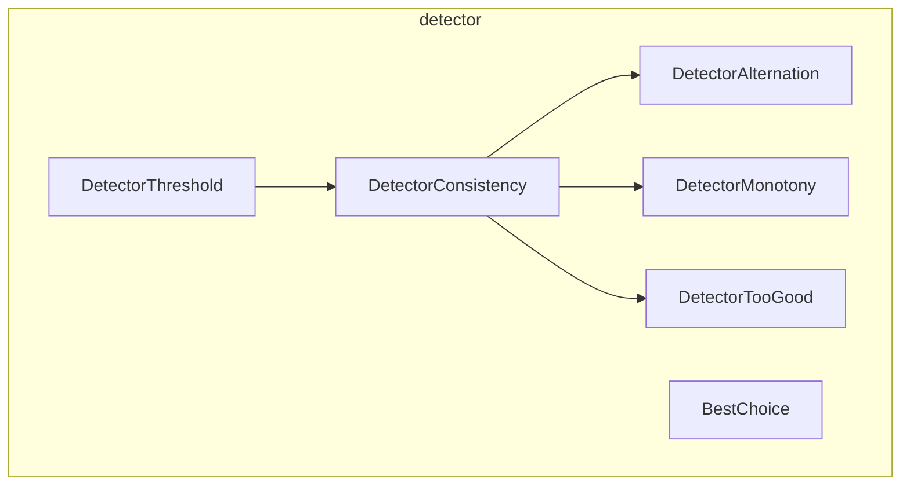

---
digest:
  local-classes:
    BestChoice:
      mtime: '2026-09-05T11:24:29Z'
      digest: b78f59f3284848b521e662f4b74da227979bb72e810b9542b20b733bb198d378
    DetectorAlternation:
      mtime: '2026-09-05T11:24:44Z'
      digest: 1fb954b7a47a5f5e15d5ba8257b8c4fd8d26d32c01ae2d07dd40c356f04d8a95
    DetectorConsistency:
      mtime: '2026-09-05T11:24:57Z'
      digest: f149e30888aad31b8374c39815e471b675b06861b92d38703064edfc183d8ab4
    DetectorMonotony:
      mtime: '2026-09-05T11:25:59Z'
      digest: a4d59d0b351f703a3f19e62aa476e7d42dc62b74584dd191762e7307b98db7dc
    DetectorThreshold:
      mtime: '2026-09-05T11:25:52Z'
      digest: e3c042bec832e913e2f064f11a8f7f3a45aa2da3d6b55e621d0815cf13963143
    DetectorTooGood:
      mtime: '2026-09-05T11:26:11Z'
      digest: 90ec02eff64a685fab285fc84e543cd153e71e14cfd12364a7f162cc278b9d2d
  folders: {}
tags:
- code/anomaly_detection
concepts:
- Statistical Process Control Detectors
facets:
  layer: domain
  status: legacy
  complexity: medium
description: 'Statistical-process-control style detectors that watch a stream of `double`/`float` values and signal (by returning `null` from `addDouble`/`addFloat` instead of `this`) when a classic production-control pattern is met: a threshold crossing, a run of consistently one-sided values, alternation, monotonous drift, or an overly consistent ("too good") process. `DetectorThreshold` is the base case; `DetectorConsistency` extends it to track a run length, and `DetectorAlternation`, `DetectorMonotony` and `DetectorTooGood` each specialize that run-tracking for one specific pattern. `BestChoice` is unrelated to the threshold hierarchy - it implements the classic "secretary problem" optimal-stopping strategy over a fixed-length stream of offers.'
---

# detector

Statistical-process-control style detectors that watch a stream of `double`/`float` values and
signal (by returning `null` from `addDouble`/`addFloat` instead of `this`) when a classic
production-control pattern is met: a threshold crossing, a run of consistently one-sided values,
alternation, monotonous drift, or an overly consistent ("too good") process. `DetectorThreshold`
is the base case; `DetectorConsistency` extends it to track a run length, and
`DetectorAlternation`, `DetectorMonotony` and `DetectorTooGood` each specialize that run-tracking
for one specific pattern. `BestChoice` is unrelated to the threshold hierarchy - it implements the
classic "secretary problem" optimal-stopping strategy over a fixed-length stream of offers.

## Classes

| Class | Responsibility |
|---|---|
| [BestChoice](BestChoice.java) | Implements the "secretary problem" strategy for choosing the best of a fixed-length sequence of offers seen one at a time. |
| [DetectorAlternation](DetectorAlternation.java) | Detects a run of values alternating above and below the target, a classic production control signal that two disagreeing sources are feeding one system. |
| [DetectorConsistency](DetectorConsistency.java) | Detects whether incoming values run consistently above or below the average for too many items in a row. |
| [DetectorMonotony](DetectorMonotony.java) | Detects a run of monotonously increasing or decreasing values, a classic production surveillance signal of slow process drift. |
| [DetectorThreshold](DetectorThreshold.java) | Detects whenever incoming values cross a fixed threshold, changing from above to below it or vice versa. |
| [DetectorTooGood](DetectorTooGood.java) | Detects an overly consistent process: too many consecutive values falling within a small tolerance of the target. |

## Architecture

## Entry Points

| Class.Method | Description |
|---|---|
| [BestChoice.addDouble(double)](BestChoice.java#L84) | Feeds one offer into the secretary-problem strategy; returns `null` once the cutoff selects a choice. |
| [DetectorThreshold.addDouble(double)](DetectorThreshold.java#L93) | Feeds one value into a threshold-crossing check. |
| [DetectorConsistency.addDouble(double)](DetectorConsistency.java#L62) | Feeds one value into a run-length-above/below-average check. |
| [DetectorAlternation.addDouble(double)](DetectorAlternation.java#L53) | Feeds one value into the alternation-run check. |
| [DetectorMonotony.addDouble(double)](DetectorMonotony.java#L56) | Feeds one value into the monotonous-drift check. |
| [DetectorTooGood.addDouble(double)](DetectorTooGood.java#L54) | Feeds one value into the overly-consistent-process check. |
