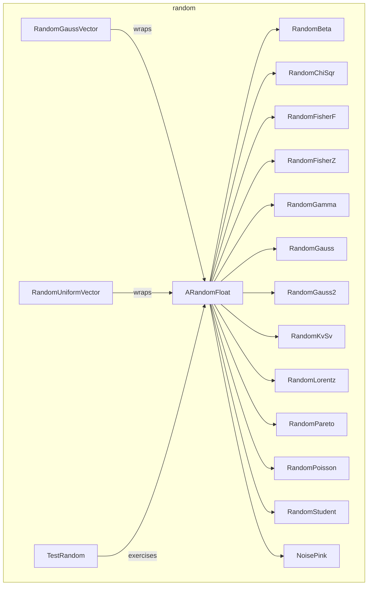

---
digest:
  local-classes:
    ARandomFloat:
      mtime: '2026-09-05T11:26:46Z'
      digest: 2dff81354ddb2f485559db3612aa44989cf948886042ae0e7e34ffbd23981ea9
    NoisePink:
      mtime: '2026-09-05T11:26:51Z'
      digest: bfe90c0b9398e56ba214857084c7ebf22ed439f0c91e9a620edcb8a07c67818c
    RandomBeta:
      mtime: '2026-09-05T11:27:14Z'
      digest: 9bc764a5943a6dd62e245c427b417b04574812d7970e8b1a3cc95f864b332ad5
    RandomChiSqr:
      mtime: '2026-09-05T11:27:23Z'
      digest: 2f4de13528755c46773f57f30eb0be8f75ce7cd613c31db8d6a5e2aaf69d3f9b
    RandomFisherF:
      mtime: '2026-09-05T11:27:32Z'
      digest: 0ada0cdcf4816872cd6c0e2a209d4ab0ce12eefe684828c0b3f5fa0cef549b97
    RandomFisherZ:
      mtime: '2026-09-05T11:27:41Z'
      digest: 34c541249dec8de0af2b648430b47079e9bf982a003710468ce54628dd9a20ee
    RandomGamma:
      mtime: '2026-09-05T11:27:50Z'
      digest: 64a2cd6e0a4aa239651d28bf9889eeb0a0154ac65d0346558dcb8cab2210c5be
    RandomGauss:
      mtime: '2026-09-05T11:28:26Z'
      digest: dcc8f810283ae6fa28524198c1876d291580824dcc74232bd23e182d93a10568
    RandomGauss2:
      mtime: '2026-09-05T11:28:39Z'
      digest: 243e1b32ce5a0701fb1715a03b9c528c7660b0d0e68dd72cbdb500ea2f998167
    RandomGaussVector:
      mtime: '2026-09-05T11:29:21Z'
      digest: ef48f5b8d514e211f5e7b1a7fc2b2db1469e7c873d70676b5dff58a436e5dd65
    RandomKvSv:
      mtime: '2026-09-05T11:29:30Z'
      digest: da6709e2c17f486730a27491aaf9c71169873f7bc196ad34c063796fa336b7f6
    RandomLorentz:
      mtime: '2026-09-05T10:13:32Z'
      digest: c316110c394739a484b2adaa3e60bee94c15641c33b26e6fc7b1f14148109d78
    RandomPareto:
      mtime: '2026-09-05T11:29:58Z'
      digest: 377965a51894c729ff655a7d4515244911bff9e2d5f091097e3c32495e07b165
    RandomPoisson:
      mtime: '2026-09-05T11:30:07Z'
      digest: 9195cff273e156c5867685b30dfd7ba84d093fc3ee519308221f3f4bd79381d6
    RandomStudent:
      mtime: '2026-09-05T11:30:26Z'
      digest: a0e27d42198e5f8b2429e76c5f4e807c36d857e1c714f4284eede2f4a3a54b85
    RandomUniformVector:
      mtime: '2026-09-05T11:30:56Z'
      digest: 42ddab2d7c504d5909a11f1324e05f93e03c542a84bc914876e7ee15c9787761
    TestRandom:
      mtime: '2026-09-05T11:31:02Z'
      digest: f8a40a52b7cf70bd21ab8eb4df60c73cd6cb6a15ca4fd6fa51173a996b751d2c
  folders: {}
tags:
- code/random_number_generator
- code/statistical_distribution
concepts:
- Random Number Generators
facets:
  layer: utility
  status: legacy
  complexity: medium
description: 'A suite of random-number generators for statistical distributions used in simulation and Monte Carlo work, plus a small test harness. `ARandomFloat` is the common abstract base: it wraps an underlying uniform `IStreamIn_Float` source and delegates stream bookkeeping (`availAble`/`getMaxMarkSize`/`getPosition`/`getOrder`) to it, leaving each subclass to implement only `nextDoubleInternal()` and `getMinDouble()` for its specific distribution - Gaussian (`RandomGauss`, `RandomGauss2`), Gamma, Beta, Chi-squared, Fisher F/Z, Student, Poisson, Pareto, Kolmogorov-Smirnov (`RandomKvSv`), Lorentz, and pink noise. `RandomGaussVector` and `RandomUniformVector` build on `IStreamIn_Float` sources to generate vector-valued streams instead of scalars. `TestRandom` exercises the package''s generators from the command line.'
---

# random

A suite of random-number generators for statistical distributions used in simulation and Monte
Carlo work, plus a small test harness. `ARandomFloat` is the common abstract base: it wraps an
underlying uniform `IStreamIn_Float` source and delegates stream bookkeeping
(`availAble`/`getMaxMarkSize`/`getPosition`/`getOrder`) to it, leaving each subclass to implement
only `nextDoubleInternal()` and `getMinDouble()` for its specific distribution - Gaussian
(`RandomGauss`, `RandomGauss2`), Gamma, Beta, Chi-squared, Fisher F/Z, Student, Poisson, Pareto,
Kolmogorov-Smirnov (`RandomKvSv`), Lorentz, and pink noise. `RandomGaussVector` and
`RandomUniformVector` build on `IStreamIn_Float` sources to generate vector-valued streams instead
of scalars. `TestRandom` exercises the package's generators from the command line.

## Classes

| Class | Responsibility |
|---|---|
| [ARandomFloat](ARandomFloat.java) | Base Class for most Float Random Number Generators. |
| [NoisePink](NoisePink.java) | Generates random Numbers with a pink Noise Spectrum, i.e. the Power falls like f^-1 = 1/f Since P(0) = Infinity, the Signal Value could exceed any Bound. |
| [RandomBeta](RandomBeta.java) | Returns random Numbers distributed in a Beta Function Shape i.e. p(x) = BetaI(x, a, b) |
| [RandomChiSqr](RandomChiSqr.java) | Returns random Numbers with Chi^2 distribution of Ny Degrees of Freedom i.e: p(2x) = Chi^2(x) Scaling by 2 is left to the ClientApplication to increase Performance! |
| [RandomFisherF](RandomFisherF.java) | Returns random Numbers distributed like the FisherF Function i.e. p(x) = FisherF(x, Ny1, Ny2) |
| [RandomFisherZ](RandomFisherZ.java) | Returns random Numbers distributed like the FisherZ Function i.e. p(x) = FisherZ(x, Ny1, Ny2) |
| [RandomGamma](RandomGamma.java) | Returns random Numbers distributed in a Gamma fashion i.e. p(x) = x^(a-1)*exp(-x)/Gamma(a) The Range of x is [0,1] It is the Waiting Time for the a-th Event of a Poisson Distribution. |
| [RandomGauss](RandomGauss.java) | Returns random Numbers distributed in a Gaussian fashion i.e. p(x) ~ exp(-x^2/2) These Values represent a Value centered around 0 with a Deviation of 1 Any other Distributions can easily be generated by affine Transformation: For Center b with Standard Deviation a: ran(a,b) = a*ran() + b => p(a,b,x) ~ exp(-((x-b)/a)^2) This Distribution is quite sharply distributed around x0. The Probability of Values lying away from Center b falls exponentially. |
| [RandomGauss2](RandomGauss2.java) | Returns random Numbers distributed in a Gaussian fashion i.e. p(x) ~ exp(-x^2/2) These Values represent a Value centered around 0 with a Deviation of 1 Any other Distributions can easily be generated by affine Transformation: For Center b with Standard Deviation a: ran(a,b) = a*ran() + b => p(a,b,x) ~ exp(-((x-b)/a)^2) This Distribution is quite sharply distributed around x0. The Probability of Values lying away from Center b falls exponentially. |
| [RandomGaussVector](RandomGaussVector.java) | Generates a stream of vectors whose components are independently Gaussian-distributed. |
| [RandomKvSv](RandomKvSv.java) | Returns random negative Numbers distributed in a Kolmogorov-Smirnov fashion, i.e. p(x) = pKvSv(x) = Processing Time rises exponentially with Exp1 |
| [RandomLorentz](RandomLorentz.java) | Returns random Numbers distributed in a Lorentz fashion i.e. p(x) = 1/Pi*(1 + x^2) These Values represent a Value centered around 0 with a Deviation of 1 Any other Distributions can easily be generated by affine Transformation: For Center b with Standard Deviation a: ran(a,b) = a*ran() + b => p(a,b,x) ~ 1/(a^2 + (x-b)^2) This Distribution is fuzzily distributed around x0. The Probability of Values lying away from Center b falls inversely: 1/x. This Distribution is e.g. used as a comparison Function for the Rejection Method. |
| [RandomPareto](RandomPareto.java) | Returns random Numbers distributed in a Pareto fashion |
| [RandomPoisson](RandomPoisson.java) | Returns random integer Numbers distributed in a Poisson fashion i.e. p(k) = EW^k/(k!*exp(EW)) = ProbFuncs.pPoisson() This is the Probability of k Poisson Events happening within a Time Interval EW given the (fractional) Average Event Rate EW. |
| [RandomStudent](RandomStudent.java) | Returns random Numbers distributed like the Student Function i.e. p(x) = Student(x, Ny1, Ny2) |
| [RandomUniformVector](RandomUniformVector.java) | Generates a stream of vectors whose components are independently uniformly distributed. |
| [TestRandom](TestRandom.java) | Tests all Methods of this Package |

## Architecture

## Entry Points

| Class.Method | Description |
|---|---|
| [ARandomFloat.nextDoubleInternal()](ARandomFloat.java#L29) | Abstract hook every distribution subclass implements to produce its next raw value. |
| [RandomGauss.nextDoubleInternal()](RandomGauss.java#L80) | Generates the next Gaussian-distributed value (Box-Muller style). |
| [RandomGaussVector.nextItem()](RandomGaussVector.java#L98) | Produces the next vector whose components are independently Gaussian-distributed. |
| [RandomUniformVector.nextItem()](RandomUniformVector.java#L101) | Produces the next vector whose components are independently uniformly distributed. |
| [TestRandom.main(String[])](TestRandom.java#L179) | Command-line entry point exercising all generators in this package. |
