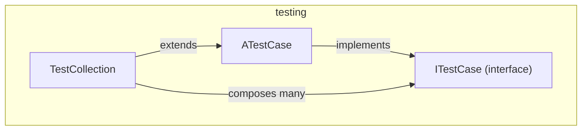

---
digest:
  local-classes:
    ATestCase:
      mtime: '2026-09-05T09:19:35Z'
      digest: e5b7732d0250b9556bba1a79d4509a41d72c3a11e269372a2e5c260cee9611ad
    ITestCase:
      mtime: '2026-09-05T09:19:21Z'
      digest: d39834cc28b3803e82cedccd6046e9a8b5d4b0180129c7354539528e3499d2f8
    TestCollection:
      mtime: '2026-09-05T09:19:40Z'
      digest: 88dee787283c86215e596233f8c60efcab7e72958aba601b05e96a34b542e516
  folders: {}
tags:
- code/test_harness
- code/composite_pattern
- code/reflection_based_dispatch
concepts:
- Testing
- Reflection
facets:
  layer: test
  status: broken
  complexity: medium
description: A small, dependency-free test harness predating JUnit's presence in this codebase. `ITestCase` defines the composite contract (`setUp`/`tearDown`/`runTest`); `ATestCase` implements it by reflectively discovering and invoking every public no-argument `test...()` method on a Class or Object, so a subclass need only write plain `testXxx()` methods; and `TestCollection` composes multiple `ITestCase`s into one, running them depth-first before its own reflective tests.
---

# testing

A small, dependency-free test harness predating JUnit's presence in this codebase.
`ITestCase` defines the composite contract (`setUp`/`tearDown`/`runTest`); `ATestCase`
implements it by reflectively discovering and invoking every public no-argument
`test...()` method on a Class or Object, so a subclass need only write plain `testXxx()`
methods; and `TestCollection` composes multiple `ITestCase`s into one, running them
depth-first before its own reflective tests.

**Known defect** (see `## Bugs Found` in the repository root `HANDOFF.md`):
`ATestCase`'s reflective test runner logs the wrapping `InvocationTargetException`
instead of the test method's actual thrown exception, obscuring the real failure cause.

## Classes

| Class | Responsibility |
|---|---|
| [ATestCase](ATestCase.java) | Abstract Test Case, defaults the setUp() and tearDown() Methods to empty Methods, and drives Tests either directly, or reflectively over every public no-argument test...() Method of a Class or Object. |
| [ITestCase](ITestCase.java) | Defines the Interface for a (composite) Test Case that is to be run automatically. |
| [TestCollection](TestCollection.java) | Composite Pattern typed for Test Cases: runs a nested Collection of ITestCases depth-first before running its own reflective Tests. |

## Architecture

## Entry Points

| Class.Method | Description |
|---|---|
| [ITestCase.runTest(IIStreamOut, IIStreamOut)](ITestCase.java#L59) | Runs this Test Case, reporting Failures and Errors to the given Handlers. |
| [ATestCase.test(ITestCase)](ATestCase.java#L96) | Runs every reflective test...() Method on the given Object. |
| [TestCollection.addTestCase(ITestCase)](TestCollection.java#L49) | Adds a nested Test Case to this composite Test. |
