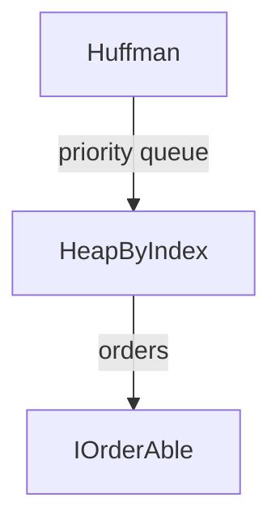

---
digest:
  local-classes:
    DeQueueInt:
      mtime: '2026-09-05T10:13:32Z'
      digest: c72a46d5b924aa488253548942aa303545c14f847bcc5c08d57e1cf545ecc98d
    EditMetric:
      mtime: '2026-09-05T10:41:10Z'
      digest: 73a6176a1f09330feff08b65a8291fbfc1423a9b5b4e1e7c8b6611869f444229
    Grammar:
      mtime: '2026-09-05T10:41:16Z'
      digest: a7b86e1595f96cb4f7b04c3343596dfe60cabbe468c381b0fcf22f10d2298ec3
    HeapByIndex:
      mtime: '2026-09-05T10:41:21Z'
      digest: 4b5e613bc794fbe14e9fcf6846cbaafaea1edff08d0ae45178a0d6b0118e420e
    Huffman:
      mtime: '2026-09-05T10:13:32Z'
      digest: 06b651cdbe76e91d15a0e7de45fb83e6732b5821e5654cf14207917e4de6ee27
    IStringValue:
      mtime: '2026-09-05T10:13:32Z'
      digest: 4d615cb9904baf4fb1ebd76bbd1ebd15221952fbed1f1185a28c7dd9cce0a7f2
    IndexIterator:
      mtime: '2026-09-05T10:43:17Z'
      digest: b94d9c967f1b160703cf1f03263cc6e2746ca2c5a3da1371b38ea05e9d96de3d
    ObjectIterator:
      mtime: '2026-09-05T10:43:17Z'
      digest: da0a62e9fc6bbc445d2525b858d9b2c7b7d30aa2f3788f1a21a97334e1c9ec69
    PatriciaIterator:
      mtime: '2026-09-05T10:43:17Z'
      digest: edbd0643a228658efb87f2054b133d1c5398e2895d31c3259e9440cd8cb940f8
    PatriciaNode:
      mtime: '2026-09-05T10:43:17Z'
      digest: 42bd4905599841631014af6d867ac28ef6658445212fe3f32b4458919f577ef6
    SentenceComparer:
      mtime: '2026-09-05T10:42:23Z'
      digest: e4c92677473dc1bf5c35c11e4099d924cfab11cfa915d69bf9e392f0bc2d7cff
    testString:
      mtime: '2026-09-05T10:13:32Z'
      digest: a32f6471d3d5bb15d4d766c6c05b666248b80f41d1ac54a3286cc6661af5543a
  folders:
    parser/:
      mtime: '2026-09-05T10:41:35Z'
      digest: ed1d2b7fd2290456a31a727399cd8452357a75383ec5508292e3e36d24184d96
    search/:
      mtime: '2026-09-05T10:41:54Z'
      digest: 91f72dc9e90306e243ebf3db75e1fd9a1f3a9a0d0fdbb96c0d283ada7d60572d
tags:
- code/string_algorithms
- code/heap_based_algorithm
- code/patricia_trie
concepts:
- String Utilities
facets:
  layer: utility
  status: legacy
  complexity: medium
description: 'A grab-bag of classic string- and sequence-processing algorithms from early-2000s coursework-style exploration: an approximate string-distance metric tuned for German keyboard typos (`EditMetric`), a Huffman coder (`Huffman`) built on a small index-based priority queue (`HeapByIndex`), a Patricia (radix) trie for unique string keys (`PatriciaNode` and its three Iterator helpers), an L-system string-rewriting engine (`Grammar`), a naive sentence-similarity comparer (`SentenceComparer`), and a fixed-capacity int deque (`DeQueueInt`) used as a building block elsewhere. The two subfolders extend this theme: `parser/` holds simple recursive-descent expression and structure parsers, and `search/` holds classic substring-search algorithms (Boyer-Moore, Rabin-Karp, Knuth-Morris-Pratt) plus a small regular-expression automaton. Most classes are standalone algorithm demonstrations with their own `testIt()`/`main()` methods rather than parts of one cohesive API - `testString` is a simple ad hoc driver exercising several of the `search` classes together.'
---

# stringOp

A grab-bag of classic string- and sequence-processing algorithms from early-2000s coursework-style
exploration: an approximate string-distance metric tuned for German keyboard typos (`EditMetric`),
a Huffman coder (`Huffman`) built on a small index-based priority queue (`HeapByIndex`), a
Patricia (radix) trie for unique string keys (`PatriciaNode` and its three Iterator helpers), an
L-system string-rewriting engine (`Grammar`), a naive sentence-similarity comparer
(`SentenceComparer`), and a fixed-capacity int deque (`DeQueueInt`) used as a building block
elsewhere. The two subfolders extend this theme: `parser/` holds simple recursive-descent
expression and structure parsers, and `search/` holds classic substring-search algorithms
(Boyer-Moore, Rabin-Karp, Knuth-Morris-Pratt) plus a small regular-expression automaton.
Most classes are standalone algorithm demonstrations with their own `testIt()`/`main()` methods
rather than parts of one cohesive API - `testString` is a simple ad hoc driver exercising several
of the `search` classes together.

## Architecture

`Huffman` builds its encoding trie by repeatedly extracting the two least-frequent symbols from a
`HeapByIndex` priority queue and merging them - the only real inter-class dependency in this folder:

`PatriciaNode`, `ObjectIterator`, `IndexIterator`, and `PatriciaIterator` (all in `PatriciaNode.java`)
form one cohesive Trie implementation and are covered together in the Classes table below; the
remaining classes (`DeQueueInt`, `EditMetric`, `Grammar`, `IStringValue`, `SentenceComparer`,
`testString`) are independent of each other.

## Entry Points

| Class.Method | Description |
|---|---|
| `EditMetric.dist(String, String)` | Computes the double-Levenshtein edit distance between two strings, tolerant of swaps, doubled characters, and (optionally) keyboard-adjacency typos. |
| `Huffman.Huffman(String, int, int)` | Builds a Huffman code from the character-frequency statistics of a sample string, ready for `enCode`/`deCode`. |
| `HeapByIndex.insert(IOrderAble, int)` | Inserts an element at an externally tracked array position k while maintaining the heap invariant - the basis for the priority queue used by `Huffman`. |
| `PatriciaNode.insert(Object)` / `PatriciaNode.search(Object)` | Inserts or looks up a unique string key in the Patricia trie rooted at this node. |

## Classes

| Class | Responsibility |
|---|---|
| [DeQueueInt](DeQueueInt.java) | Implementation of a DeQueue with Integers using an Array. |
| [EditMetric](EditMetric.java) | This Class encapsulates the Algorithm for calculating an Extension of the double Levenshtein (Edit-) distance between two given Strings. |
| [Grammar](Grammar.java) | Grammar.java Recursively applies Productions (Mappings) to a String. |
| [HeapByIndex](HeapByIndex.java) | Implements a Heap based on an Array of Indices to the actual Array of Elements, which is never changed. |
| [Huffman](Huffman.java) | Creates the Huffman Encoding for a List of Character Counts. |
| [IStringValue](IStringValue.java) | used with Patricia Tries to implement different unique Indices for the same Class. |
| [IndexIterator](PatriciaNode.java) | In-Order Patricia Index Iterator. |
| [ObjectIterator](PatriciaNode.java) | In-Order Patricia Object Iterator. |
| [PatriciaIterator](PatriciaNode.java) | In-Order Patricia Trie Iterator. |
| [PatriciaNode](PatriciaNode.java) | Represents a Patricia-Trie (Root with empty Constructor) Node. |
| [SentenceComparer](SentenceComparer.java) | This Class allows to compare Sentences for Similarity. |
| [testString](testString.java) | This class can take a variable number of parameters on the command line. |
