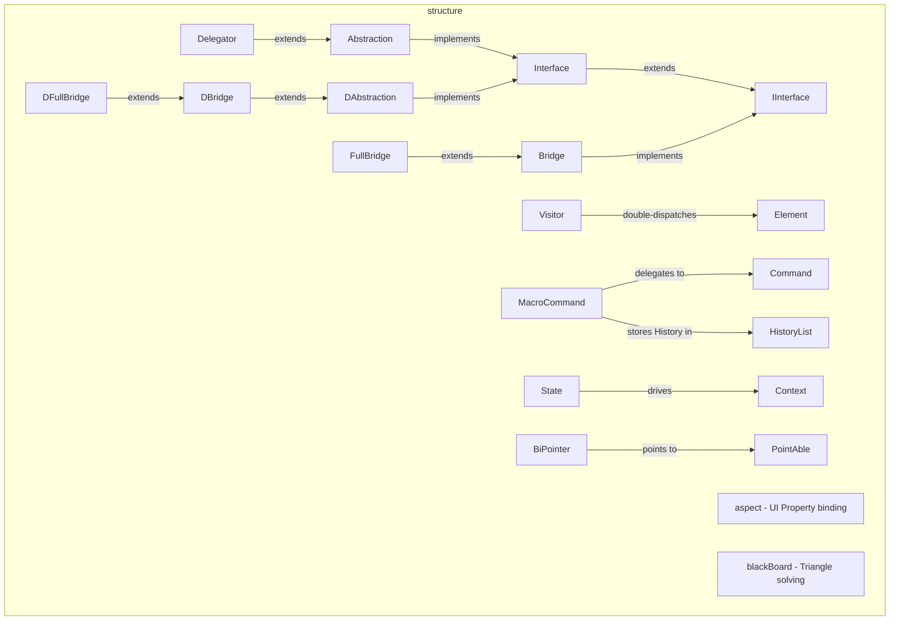

---
digest:
  local-classes:
    Abstraction:
      mtime: '2026-09-05T11:12:19Z'
      digest: c0a0ee0c564cb3bcba610709f22cb6722da70db6a325c8be25d0da0004a359b9
    BiPointer:
      mtime: '2026-09-05T11:12:30Z'
      digest: caef0fdb5d81d56ef1f75e5deb4578d6a6220a80d444d3463f6af59ebac7a859
    BiRef:
      mtime: '2026-09-05T11:12:43Z'
      digest: 6563cfc954b2b4671f436c228792a379c8995761effb4407fb72f3f183138a9f
    Bridge:
      mtime: '2026-09-05T11:12:49Z'
      digest: abfe0fd009b68b099341f71316a3e34ccf10dae1673f2d277ec0b4355a812825
    Circle:
      mtime: '2026-09-05T11:13:08Z'
      digest: 01d74033d90ae9ab6fd71b95f1c15674d0a5e99c31ac4bf9be91a6dfe67ddc75
    Command:
      mtime: '2026-09-05T11:13:42Z'
      digest: 55a6572503cedb832b59b23b9756589ebdbaf1e0f46ff76da8b0b5ca27cf99f5
    Context:
      mtime: '2026-09-05T11:13:56Z'
      digest: 9378a3afb375f35066c59a3b8039c965c9869fe3f4682418494c8f5e3f0c28a9
    DAbstraction:
      mtime: '2026-09-05T11:13:46Z'
      digest: bc8ca4029cac04647afdef77e76402e1aa446518ea5fff2d0094260789b26e3d
    DBridge:
      mtime: '2026-09-05T11:13:48Z'
      digest: e28bc098f2d6d1d15d7d66b33b0659b9ad4f485d85b21abb8478289c068fe0a7
    DFullBridge:
      mtime: '2026-09-05T11:13:50Z'
      digest: 5470ff84ad7bf1434ba402fb8c21c98ae003bbe4ed84f065d37d9b5c9439ea46
    Decorator:
      mtime: '2026-09-05T11:14:22Z'
      digest: be5580fb98950de37e5a051226a1bead89d5d7085f7e622a7a2bbac670615929
    Delegate:
      mtime: '2026-09-05T11:14:28Z'
      digest: 467e9378920da3e92bda20f0cf4a20ac99f072679345168643d93c60bbdb5ca5
    Delegator:
      mtime: '2026-09-05T11:14:30Z'
      digest: abfe0fd009b68b099341f71316a3e34ccf10dae1673f2d277ec0b4355a812825
    Element:
      mtime: '2026-09-05T11:14:32Z'
      digest: 6caba42c3d775598f95e0154955f1b69baf4e7641de4b670fbe9d226b94d62ab
    ElementA:
      mtime: '2026-09-05T11:14:33Z'
      digest: a3e81229be2d6a6e60373f6d65603e81f2e6586cdf6b161b19ba914b9e72fbac
    ElementB:
      mtime: '2026-09-05T11:14:35Z'
      digest: 6caba42c3d775598f95e0154955f1b69baf4e7641de4b670fbe9d226b94d62ab
    Ellipse:
      mtime: '2026-09-05T11:15:20Z'
      digest: 1bab36edace006b9651b8ada1f273e75d84ab61a9181ff77f058e46752511117
    Enum:
      mtime: '2026-09-05T11:15:26Z'
      digest: 33f3bbc0d268b4189cd1374577f022ca402a154b5d08c757191d4f131d35343b
    Figure2D:
      mtime: '2026-09-05T11:15:32Z'
      digest: 465d1a693d7720005205081c4f495382ab86ced3067fefb3d085ddf4bd87f910
    FullBridge:
      mtime: '2026-09-05T11:15:33Z'
      digest: 95b37f0727df1488799d5653ede7c6a8b290aaebcde6b09e011b204ea926c3a5
    HistoryList:
      mtime: '2026-09-05T11:16:22Z'
      digest: 542e058a03353762d869a7df350d9217a0ddd10028e09a4ab02aedd528ca26f6
    IInterface:
      mtime: '2026-09-05T11:16:30Z'
      digest: e9afd23044fad9d1b683b9e1697e36a7b8d3d9a0d095da868d4d3d965c8162ce
    IRegistry:
      mtime: '2026-09-05T11:16:32Z'
      digest: f6bd3ac81da0926a31a6874a5a764478f4b6690850c403913f69de4b946dba5d
    ITransaction:
      mtime: '2026-09-05T11:16:34Z'
      digest: cca28c40afaeb8bcb9c2e5c2b85de0b961b1682c0c70903d7216fc947e2c614f
    Interface:
      mtime: '2026-09-05T11:16:35Z'
      digest: bfe0792ea77b77a67b7ce9adf1110eb7f5b1dac58f2a34bdd0dd1e910d67f419
    MacroCommand:
      mtime: '2026-09-05T11:17:09Z'
      digest: e9394ff854848a9d6af6e6b284dfcdde7595f6abe313c6ad94eaf2c94c850d02
    PointAble:
      mtime: '2026-09-05T11:17:11Z'
      digest: ff9fb26746ae09b22535340bf88fac99d3622cb31de8e817efcf79b2a65aee41
    Publisher:
      mtime: '2026-09-05T11:17:13Z'
      digest: a0e315587e892f7e155237467fcc0f4bf97cd19cb40cf38719129243a6314bc3
    RefCounter:
      mtime: '2026-09-05T11:17:15Z'
      digest: fee2a848e30baf752a0c151789dcb11cce71290aa49ad2f26a25d1faafdc633e
    Singleton:
      mtime: '2026-09-05T11:17:16Z'
      digest: 39fced9bad0cc34957d22566dace4cb35a0c46ef5092ddacd69a74631b98239d
    State:
      mtime: '2026-09-05T11:17:49Z'
      digest: ddcb457ea27190da0679f6c109bf531241fd9d54079019a5992c4342da80b8b9
    Subscriber:
      mtime: '2026-09-05T11:17:50Z'
      digest: 4934c00d44e911a4b722756ba9061fde3c8fdd440adeac0a195763cf9c99a42d
    TemplateMethod:
      mtime: '2026-09-05T11:17:53Z'
      digest: 3b49c9d11c1f721bdf63aebbc8635ae682e34e7d9b6943434dfdd08889e2683a
    Ternary:
      mtime: '2026-09-05T11:15:26Z'
      digest: 2949df58732117d60d6680af6c58c138b39fb82d1e652b0cf73056b432fd54cd
    Transaction:
      mtime: '2026-09-05T11:17:54Z'
      digest: 05824266b17d339137aaa0ae5517165f6aca741898f1a8ae3e2a7df3b7eb4a74
    UndoAble:
      mtime: '2026-09-05T11:17:58Z'
      digest: f045299ac366c5ba9329db78b3a226eef680892e353d0ae215637eb15650981a
    VarEnum:
      mtime: '2026-09-05T11:15:26Z'
      digest: 5382b65cad5ba4788242aafdb29305cb76516a799117e5f7ada2c05f609e1b93
    Visitor:
      mtime: '2026-09-05T11:18:31Z'
      digest: 28c4c02f74c16fd2226ee5ab72fb050c3ba60b707f2b65292b1814c779d9cc26
    Visitor1:
      mtime: '2026-09-05T11:18:36Z'
      digest: 2cd8b139be0afc831dca4540592d903cc58cf39c7f7ec21f89eda3a4c28fe04d
    Visitor2:
      mtime: '2026-09-05T11:18:42Z'
      digest: 28c4c02f74c16fd2226ee5ab72fb050c3ba60b707f2b65292b1814c779d9cc26
  folders:
    aspect/:
      mtime: '2026-09-05T11:21:22Z'
      digest: 41476609c3032b3266cf33b8beae05306cd8edfdd8deb9654859fd1d366c11cd
    blackBoard/:
      mtime: '2026-09-05T11:22:29Z'
      digest: 93ffc3d5f9ea74d7c4cecaf62ef9fa5b645afcee4aa2917a1742afee8ba0e623
tags:
- code/design_patterns
concepts:
- Gang-of-Four Design Pattern Demos
facets:
  layer: utility
  status: legacy
  complexity: medium
description: 'Textbook demonstrations of the classic Gang-of-Four structural, behavioral and creational Design Patterns, each Pattern given a small, self-contained Family of Types rather than one shared Framework. Several Families deliberately re-implement the same Idea more than once to compare Variants side by side: `Abstraction`/`Delegator` inherit the complexOp Algorithm while `Bridge`/`FullBridge` hold the Implementor directly, and the `D`-prefixed Types (`DAbstraction`, `DBridge`, `DFullBridge`) repeat that comparison using Delegation instead of Inheritance for the primitive Operation. `Element`/`Visitor` demonstrate double dispatch; `Command`/`MacroCommand` compose an undoable Command History over a `HistoryList`; `Context`/`State` model a TCP/IP-like Connection; `BiPointer`/`BiRef` explore bidirectional References with automatic Consistency. Two Subsystems apply these ideas to concrete Domains: `aspect/` binds Properties for generic UI Forms, and `blackBoard/` solves Triangle Geometry via a rule-based Blackboard.'
---

# structure

Textbook demonstrations of the classic Gang-of-Four structural, behavioral and creational
Design Patterns, each Pattern given a small, self-contained Family of Types rather than one
shared Framework. Several Families deliberately re-implement the same Idea more than once to
compare Variants side by side: `Abstraction`/`Delegator` inherit the complexOp Algorithm while
`Bridge`/`FullBridge` hold the Implementor directly, and the `D`-prefixed Types (`DAbstraction`,
`DBridge`, `DFullBridge`) repeat that comparison using Delegation instead of Inheritance for the
primitive Operation. `Element`/`Visitor` demonstrate double dispatch; `Command`/`MacroCommand`
compose an undoable Command History over a `HistoryList`; `Context`/`State` model a TCP/IP-like
Connection; `BiPointer`/`BiRef` explore bidirectional References with automatic Consistency.
Two Subsystems apply these ideas to concrete Domains: `aspect/` binds Properties for generic UI
Forms, and `blackBoard/` solves Triangle Geometry via a rule-based Blackboard.

## Classes

| Class | Responsibility |
|---|---|
| [Abstraction](Abstraction.java) | Implements the common Interface#complexOp Algorithm by delegating to a still-abstract IInterface#simpleOp, leaving only the primitive Operation for Subclasses to define. |
| [BiPointer](BiPointer.java) | Attempts to define a bidirectional PointAble Pointer that automatically maintains its own Consistency, though disconnecting a Reference is left unfinished (see TODO below). |
| [BiRef](BiRef.java) | Defines a bidirectional Pointer between an arbitrary source Object and a target BiRef that automatically maintains Consistency and Reference-counts the source. |
| [Bridge](Bridge.java) | Bridges the minimum IInterface by delegating its single primitive Operation, at Runtime, to a swappable Implementor. |
| [Circle](Circle.java) | A Figure2D defined by a Radius, drawn as the mathematical special Case of an Ellipse where Rx equals Ry. |
| [Command](Command.java) | Binds an Invoker to a Runnable Receiver by delegating #run() to it, the minimal realization of the Command Pattern with no undo support. |
| [Context](Context.java) | Models a TCP/IP-like Connection whose Requests are all delegated to the current State, letting the State itself decide the Connection's Behavior and Successor State. |
| [DAbstraction](DAbstraction.java) | Implements the common Interface#complexOp Algorithm like Abstraction, but delegates the primitive Operation to a held IInterface Implementor rather than to itself, so an unrelated Base Class can still be extended. |
| [DBridge](DBridge.java) | Bridges the minimum IInterface like Bridge, but inherits from DAbstraction instead of holding the Implementor Reference itself. |
| [DFullBridge](DFullBridge.java) | Bridges the full Interface by extending DBridge and delegating #complexOp to its own separately held Implementor, overriding the inherited simpleOp()-only delegation. |
| [Decorator](Decorator.java) | Enhances a chained Decorator's #doSomething by wrapping the call, without changing its Interface. |
| [Delegate](Delegate.java) | Binds a target Object and a reflected Method into a callable, immutable Delegate, chained through a singly linked list so #raiseEvent can notify every Observer. |
| [Delegator](Delegator.java) | Bridges the minimum IInterface while also inheriting Abstraction's Interface#complexOp implementation, at the cost of a non-final delegation. |
| [Element](Element.java) | Declares the single #invite entry point through which a Visitor double- dispatches onto the concrete Element Type visiting it. |
| [ElementA](ElementA.java) | One concrete Element that dispatches Visitor#visit(ElementA) on itself. |
| [ElementB](ElementB.java) | The other concrete Element that dispatches Visitor#visit(ElementB) on itself. |
| [Ellipse](Ellipse.java) | A Figure2D defined by a Radius and Eccentricity, generalizing Circle to unequal Rx and Ry. |
| [Enum](Enum.java) | Demonstrates encoding an Enumeration of Elements as a bounded short Value, meant to be subclassed per Enum Type rather than instantiated on its own. |
| [Figure2D](Figure2D.java) | Holds a 2D Location shared by every geometric Figure Subclass, such as Circle. |
| [FullBridge](FullBridge.java) | Bridges the full Interface by casting Bridge's Implementor Reference back to Interface rather than holding a second Field for it. |
| [HistoryList](HistoryList.java) | Encapsulates a growable back/forward History List (a "NavStack") over an Object Array, indexed by a current Position that #nextItem()/#prevItem() move. |
| [IInterface](IInterface.java) | Declares the single primitive #simpleOp Operation a Class Hierarchy must implement, minimizing the Effort of mixing in new Implementations. |
| [IRegistry](IRegistry.java) | Declares a keyed Lookup Relation, typically implemented as a Singleton, mapping an arbitrary key Object to a registered value Object via #getAt/#setAt. |
| [ITransaction](ITransaction.java) | Declares the minimum Status Constants and #rollbackTx Operation a Transaction must support; Transaction adds the remaining lifecycle Methods. |
| [Interface](Interface.java) | Extends IInterface with the full #complexOp Operation, separating out an Interface so complex-Operation Optimizations remain possible without committing to a concrete Class. |
| [MacroCommand](MacroCommand.java) | Composes a HistoryList of Commands that can be run forward via #run()/#redo() or undone step by step via #undo(). |
| [PointAble](PointAble.java) | Declares the get/set Reference Contract a bidirectionally navigable Object must implement so a BiPointer can point to it consistently. |
| [Publisher](Publisher.java) | Declares the Observer-registration Contract of a Subject in the Observer Pattern, leaving State-carrying and Notification to the implementing Class. |
| [RefCounter](RefCounter.java) | Declares the increment/decrement Contract for tracking whether a valid Reference to an Object remains, used by BiRef. |
| [Singleton](Singleton.java) | Models the Singleton Pattern with a static #SINGLETON() Accessor, meant to be copied per concrete Singleton since the static Method itself cannot be declared in an Interface. |
| [State](State.java) | Declares the Connection-lifecycle Operations a Context delegates to, letting each concrete State decide the Behavior and Successor State for its own Requests. |
| [Subscriber](Subscriber.java) | Declares the push-Model #update Callback a Publisher invokes on every registered Observer, carrying both the Publisher and its new State. |
| [TemplateMethod](TemplateMethod.java) | Declares the single parameterless #run() Operation of the Template Method Pattern's Extreme, queued or scheduled rather than invoked with immediate Data. |
| [Ternary](Enum.java) | A three-valued Enum fixed to the #FALSE..#TRUE Range, used for ternary Logic Values. |
| [Transaction](Transaction.java) | Extends ITransaction with #getStatus, #startTx and #commitTx, the full lifecycle Interface for supporting Transactions. |
| [UndoAble](UndoAble.java) | Declares the #undo Operation inverse to Runnable#run(), implemented by anything that can reverse its own previously performed Effect. |
| [VarEnum](Enum.java) | Allows to change the Value within the given Bounds. |
| [Visitor](Visitor.java) | Declares one #visit Overload per fixed Element Type, letting an open Set of Visitors vary the Operation performed on a closed Set of Elements. |
| [Visitor1](Visitor1.java) | One concrete Visitor that delegates each visit back to the Element's own Element#invite, rather than implementing per-Element Behavior here. |
| [Visitor2](Visitor2.java) | A second concrete Visitor, identical in shape to Visitor1, that also delegates each visit back to the Element's own Element#invite. |

## Architecture

## Entry Points

| Class.Method | Description |
|---|---|
| [Interface.complexOp(Object)](Interface.java#L53) | The full Operation an Abstraction/Bridge/Delegator ultimately provides. |
| [IInterface.simpleOp(Object)](IInterface.java#L52) | The single primitive Operation every Variant must supply. |
| [Element.invite(Visitor)](Element.java#L39) | Entry point for double-dispatching an Element to a Visitor. |
| [Command.run()](Command.java#L142) | Runs a bound Command by delegating to its Receiver. |
| [MacroCommand.run()](MacroCommand.java#L86) | Runs every Command in the History forward. |
| [Context.activeOpen()](Context.java#L57) | Opens a Connection, delegating Behavior to the current State. |

## Subsystems

| Folder | Domain Role | Entry Point |
|---|---|---|
| `aspect/` | Models a bound-Property-plus-Validation abstraction ("Aspect") for driving generic UI Forms | `Aspect` |
| `blackBoard/` | Defines the generic Blackboard-pattern Contract (`IKnowledge`: `check()`/`update()`) that any | `IKnowledge` |
