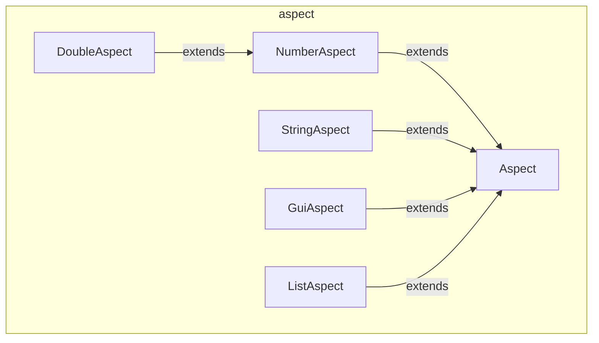

---
digest:
  local-classes:
    Aspect:
      mtime: '2026-09-05T11:19:33Z'
      digest: 554a32e82fa2855e9983d9e3a2d3219fc85c23e8a2603e34cc98a97e3347d676
    DoubleAspect:
      mtime: '2026-09-05T11:19:49Z'
      digest: 823c76cd0520c7fef7672bcc8d9c011d3bf5fd0560ce99849de5f6c9a44a0604
    GuiAspect:
      mtime: '2026-09-05T11:20:02Z'
      digest: b62a37085b77ab2cac561cf33e2b1deb087555e10528620277017361428eb72e
    ListAspect:
      mtime: '2026-09-05T11:21:22Z'
      digest: 8bb23d7809b3d70773b8c770833a64d71667efabc2865b4b0b73f1410970ecf1
    NumberAspect:
      mtime: '2026-09-05T11:20:11Z'
      digest: d2ae22028bcf946313e4b44c7f36aac38952b7a11435d500fff70034146f46ff
    StringAspect:
      mtime: '2026-09-05T11:20:34Z'
      digest: 3f5c148e278c77e3f740e3ef1a981bce96c614cb9e69c72ea93ee4f203266a37
  folders: {}
tags:
- code/property_binding
- code/data_validation
concepts:
- UI Data Binding Aspects
facets:
  layer: domain
  status: legacy
  complexity: medium
description: Models a bound-Property-plus-Validation abstraction ("Aspect") for driving generic UI Forms and Data-Entry Controls without a Class per Field. `Aspect` is the shared Base holding Name, Enabled/Required/Visible Flags and validation Status; `NumberAspect` and `StringAspect` add a numeric or Length Range respectively, with `DoubleAspect` the concrete numeric Implementation; `GuiAspect` adds Position/Size for a bound Control; `ListAspect` represents a selectable List of other Aspects.
---

# aspect

Models a bound-Property-plus-Validation abstraction ("Aspect") for driving generic UI Forms
and Data-Entry Controls without a Class per Field. `Aspect` is the shared Base holding Name,
Enabled/Required/Visible Flags and validation Status; `NumberAspect` and `StringAspect` add a
numeric or Length Range respectively, with `DoubleAspect` the concrete numeric Implementation;
`GuiAspect` adds Position/Size for a bound Control; `ListAspect` represents a selectable List
of other Aspects.

## Classes

| Class | Responsibility |
|---|---|
| [Aspect](Aspect.java) | Abstract Base Class for all Aspect Types, holding shared Name, Enabled/Required/Visible Flags and validation Status, with Value Access left to each Type-specific Subclass. |
| [DoubleAspect](DoubleAspect.java) | Extends NumberAspect to store and validate a double Value against the inherited Min/Max/Modulus Range, notifying Validators and Subscribers on every change. |
| [GuiAspect](GuiAspect.java) | Extends Aspect with the Position and Size Fields a bound GUI Control needs, with Value Access still left to a further Subclass. |
| [ListAspect](ListAspect.java) | Extends Aspect to represent a selectable List of other Aspects, e.g. for a Combo Box or DataGrid Binding. |
| [NumberAspect](NumberAspect.java) | Extends Aspect with a numeric Min/Max/Modulus Range shared by every numeric Aspect Subclass, e.g. DoubleAspect. |
| [StringAspect](StringAspect.java) | Extends Aspect to store and validate a String Value against a Min/Max Length Range, notifying Validators and Subscribers on every change. |

## Architecture

## Entry Points

| Class.Method | Description |
|---|---|
| [Aspect.getValue()](Aspect.java#L134) | Returns this Aspect's Value as its natural (boxed) Type. |
| [Aspect.setValue(Object)](Aspect.java#L149) | Sets this Aspect's Value from a boxed Object, validating it. |
| [Aspect.getString()](Aspect.java#L141) | Returns this Aspect's Value rendered as a String. |
