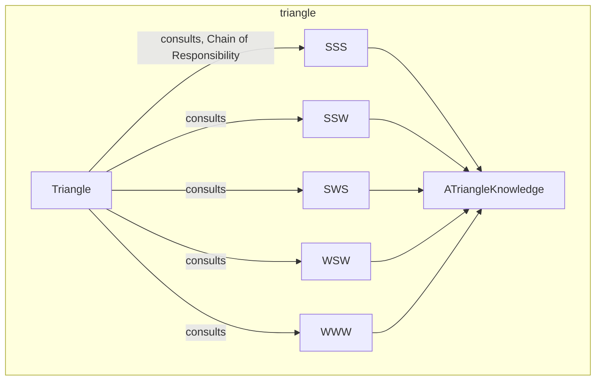

---
digest:
  local-classes:
    ATriangleKnowledge:
      mtime: '2026-09-05T10:13:32Z'
      digest: c1ea71741597aa519601cbbfd644809a11d0e9743c0d1592e4ee689a2495d016
    SSS:
      mtime: '2026-09-05T11:22:34Z'
      digest: 6d8dbb47da669ddb23af70a7f3d53ba4c1b3b001fbc971351ff149e16aef9b8f
    SSW:
      mtime: '2026-09-05T11:22:38Z'
      digest: 3e9fd6b74f6a293f6c079af02ba8b464eea743b6a37f3ba7b0741d05d8c147c5
    SWS:
      mtime: '2026-09-05T11:22:41Z'
      digest: 6cb4458886bdfc91ede42f91fb5cba51b037c9b809d00d43fc4a452d021837ad
    Triangle:
      mtime: '2026-09-05T11:23:47Z'
      digest: dd07e8419a13399553c3ee551dc3743a443d6ecffdc44194af88a9ab21f5c8dd
    WSW:
      mtime: '2026-09-05T11:22:45Z'
      digest: 9e4debc32845223e85b67365d60e21d223a76c652a56eab5386cfbc0ba4d2bc5
    WWW:
      mtime: '2026-09-05T11:22:48Z'
      digest: e62c6892336c5188c25f78108e83738f694fd36301d245ae7aaacb894fa8291e
  folders: {}
tags:
- code/blackboard_pattern
- code/rule_based_validation
- code/2d_geometry
concepts:
- Rule-Based Triangle Solver
facets:
  layer: domain
  status: legacy
  complexity: medium
description: 'Implements a Blackboard-pattern solver for `Triangle` geometry: `Triangle` holds up to six Side/Angle Values and repeatedly consults five `IKnowledge` Sources (`SSS`, `SSW`, `SWS`, `WSW`, `WWW`), each a Rule of classical Trigonometry (Law of Sines, Law of Cosines, Angle Sum) that fires only when its own preconditions on known Sides/Angles are met. `ATriangleKnowledge` is the shared Base Class caching the Triangle Reference each Rule works against.'
---

# triangle

Implements a Blackboard-pattern solver for `Triangle` geometry: `Triangle` holds up to six
Side/Angle Values and repeatedly consults five `IKnowledge` Sources (`SSS`, `SSW`, `SWS`,
`WSW`, `WWW`), each a Rule of classical Trigonometry (Law of Sines, Law of Cosines, Angle Sum)
that fires only when its own preconditions on known Sides/Angles are met. `ATriangleKnowledge`
is the shared Base Class caching the Triangle Reference each Rule works against.

## Classes

| Class | Responsibility |
|---|---|
| [ATriangleKnowledge](ATriangleKnowledge.java) | Title: ATriangleKnowledge Description: Abstract Base Class for all Knowledge Sources about Triangles Design Decisions / Implementation Details: Since all the State and Information about the Triangle is stored in itself, these Methods could have been made stateless, and static but that would defy the usual Situation with a BlackBoard where each Knowlegde Source has some internal Information cached that are related to the concrete Object being analyzed. |
| [SSS](SSS.java) | Calculates the remaining unknown Angle(s) of a Triangle once all three Sides are known. |
| [SSW](SSW.java) | Derives the two remaining unknown Angles of a Triangle from two known Sides and the Angle enclosed between them, flagging a possible second (ambiguous) Solution. |
| [SWS](SWS.java) | Derives an unknown Side of a Triangle from the two adjacent Sides and their enclosed Angle, via the Law of Cosines. |
| [Triangle](Triangle.java) | Blackboard Representation of a Triangle, holding up to six Side/Angle Values and dispatching to IKnowledge Solvers (SSS, SSW, SWS, WSW, WWW) to derive the unknown ones. |
| [WSW](WSW.java) | Derives the two unknown Sides adjacent to a known Side from the Triangle's known Angles, via the Law of Sines. |
| [WWW](WWW.java) | Derives the last unknown Angle of a Triangle from the other two known Angles, since all three must sum to Pi. |

## Architecture

## Entry Points

| Class.Method | Description |
|---|---|
| [Triangle.solveForSides()](Triangle.java#L319) | Tries to determine all three Sides via the Solver Chain, given at least one Side. |
| [Triangle.solveForAngles()](Triangle.java#L339) | Tries to determine all three Angles via the Solver Chain. |
| [Triangle.setSide(int, double)](Triangle.java#L252) | Records a known Side. |
| [Triangle.setAngle(int, double)](Triangle.java#L267) | Records a known Angle. |
