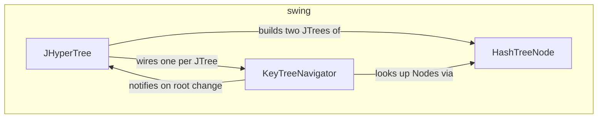

---
digest:
  local-classes:
    HashTreeNode:
      mtime: '2026-09-05T09:16:05Z'
      digest: 9ae681c5459c9c1117ae6dad5b46d8d87365915bfd5c368294fa5763222e001f
    JHyperTree:
      mtime: '2026-09-05T09:16:10Z'
      digest: ecd5d90c6abefd2f8d4bf6b212201fc48fa5514e999c5f06539dad7304a2c07b
    KeyTreeNavigator:
      mtime: '2026-09-05T09:16:33Z'
      digest: 7bf5ba03e9e1be881394a10623aa59053ae28d09e14f6ec6e7febd3d80e722a5
  folders: {}
tags:
- code/tree_node
- code/tree_data_structure
- code/keyboard_navigation
- code/hash_equality
concepts:
- Tree Visualization
- Graph Model
facets:
  layer: infrastructure
  status: broken
  complexity: high
description: 'Displays an arbitrary Graph, including one with diamonds (Nodes reachable through more than one Parent), as one or two `JTree` views. `HashTreeNode` is the model-level building block: a `DefaultMutableTreeNode` hashed and compared by its UserObject and registered under a named Tree so Nodes can be found again by ID. `JHyperTree` composes two such Trees into a mirrored, common-root view, and `KeyTreeNavigator` lets the user drive both by keyboard - re-rooting on the selected Node''s Main Representative, or jumping focus to it.'
---

# swing

Displays an arbitrary Graph, including one with diamonds (Nodes reachable through more
than one Parent), as one or two `JTree` views. `HashTreeNode` is the model-level building
block: a `DefaultMutableTreeNode` hashed and compared by its UserObject and registered
under a named Tree so Nodes can be found again by ID. `JHyperTree` composes two such Trees
into a mirrored, common-root view, and `KeyTreeNavigator` lets the user drive both by
keyboard - re-rooting on the selected Node's Main Representative, or jumping focus to it.

**Known defect** (see `## Bugs Found` in the repository root `HANDOFF.md`):
`HashTreeNode.equals(Object)` can throw `NullPointerException` for a Node built with the
Empty Constructor (`userObject == null`) when compared against an unrelated non-null
Object.

## Classes

| Class | Responsibility |
|---|---|
| [HashTreeNode](HashTreeNode.java) | A DefaultMutableTreeNode hashed and compared by its UserObject rather than by reference, backed by a process-wide registry of named Trees (#treeList) so Nodes can be looked up, and diamonds (Nodes with more than one Parent) can be represented, by ID across an arbitrary Graph. |
| [JHyperTree](JHyperTree.java) | A Tree Implementation to display Networks as HyperGraphs with the current Node as the common Root of two mirroring TreeViews. |
| [KeyTreeNavigator](KeyTreeNavigator.java) | Helper Class to catch Keys pressed on a JTree and react accordingly: 'R' changes the Root of the Tree to the selected Node 'F' changes the Focus of the Tree to the selected Node Representative |

## Architecture

## Entry Points

| Class.Method | Description |
|---|---|
| [HashTreeNode.getTree(Object)](HashTreeNode.java#L95) | Looks up the named Tree's node container, creating it on first use. |
| [HashTreeNode.wrapObjects(Object[], Object)](HashTreeNode.java#L212) | Wraps each given Object in its own parentless HashTreeNode, added to the given Tree. |
| [JHyperTree.JHyperTree(HashContainer, HashContainer, Object)](JHyperTree.java#L81) | Creates a mirrored two-Tree view over the given left and right Graph Models. |
| [KeyTreeNavigator.keyTyped(KeyEvent)](KeyTreeNavigator.java#L62) | Re-roots or refocuses the watched JTree in response to 'R' or 'F'. |
