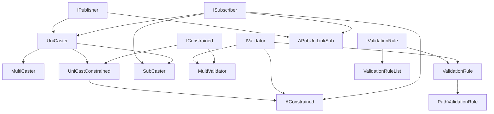

---
digest:
  local-classes:
    ACachedProperty:
      mtime: '2026-09-05T10:13:32Z'
      digest: ade88e75b70b80cb9aa48bbeb2e1d1dff8cf515f033445aa3488e91054b55439
    AConstrained:
      mtime: '2026-09-05T10:42:20Z'
      digest: 48c17a4495dc84c18992e882f1097c178f516a480ae5943d170f8cae692dc4b2
    APubUniLinkSub:
      mtime: '2026-09-05T10:44:17Z'
      digest: 55923b0a3167ebfe54ca1f0608abea4c024d38e2e157d3278e2efa875bbd0ff2
    IConstrained:
      mtime: '2026-09-05T10:42:49Z'
      digest: fabfc9655373b0fae1aa6e28139dd0b09ad00d6aa8d4011d2e61c6deb8b3f981
    IPublisher:
      mtime: '2026-09-05T10:42:50Z'
      digest: 005a8d570c73cfb913e2251cfa9fc6ea8051fb9d424f590e3565f5c6b208acc3
    ISubscriber:
      mtime: '2026-09-05T10:13:32Z'
      digest: 36346ed69046f3ccb9ecc0cf7c611e6abaae5c7376e960e594f622ea2c95d13f
    IValidation:
      mtime: '2026-09-05T10:13:32Z'
      digest: b2dc7deaa6ec21d73e59dc2c1f893c7f0e039b13682343c191eaa6a2f2c0339b
    IValidationRule:
      mtime: '2026-09-05T10:13:32Z'
      digest: 4be99b8d89ed6e05c11f124739cbe1c63bc7fcbf50b5eb6486cd85ffb0a3b1c8
    IValidator:
      mtime: '2026-09-05T10:13:32Z'
      digest: f3418635f5abda6f8b2d856548267459c0f3439c28137fb15989820f007a7eff
    InvalidError:
      mtime: '2026-09-05T10:13:32Z'
      digest: 678715e69a95b83dea200923d97d55f23f71cee4620cf64dcf0f4d7e3b3f0492
    InvalidException:
      mtime: '2026-09-05T10:42:54Z'
      digest: 7337da69386514a9fa210d06a96d88cea0756ca371e4d4677ce2743b72aaae78
    MultiCaster:
      mtime: '2026-09-05T10:13:32Z'
      digest: 8646c5b6266d949d9dfe14662a61954889628d8730fbb9e75754135eed4b5a5c
    MultiValidator:
      mtime: '2026-09-05T10:13:32Z'
      digest: f55d467177c579d9ef2f0d57975c2807140f727dfbd798b8cace41ea5aab9230
    PathValidationRule:
      mtime: '2026-09-05T10:13:32Z'
      digest: ab2dc44c2af6ee88cc8281a526f3b240cffb3602226a379a27d3876f3dcd908d
    PropDouble:
      mtime: '2026-09-05T10:43:52Z'
      digest: 5c4b8f3cb4e44a03996692b7023049f684025ed392ba200f04568ddea5af005b
    StateMachine:
      mtime: '2026-09-05T10:43:46Z'
      digest: 9b480f1388104ffdca881f49e56a5277e7cdcd0be751aea00bf65fd4dc8fc501
    SubCaster:
      mtime: '2026-09-05T10:13:32Z'
      digest: 9d929a7ca10fdfd4b64e642d174af2d4659cfaadff5eb251631fa672d21b9e01
    TooManySubscribersException:
      mtime: '2026-09-05T10:42:55Z'
      digest: e96af8ac37329fecdbde95fcab0e7ddf2602eae0ef57a9d3be4369b688d4412b
    UniCastConstrained:
      mtime: '2026-09-05T10:44:01Z'
      digest: 3fd2ba89fb83bb77f4a410e754f3507c22081290b404ce632e2330b6132181f4
    UniCaster:
      mtime: '2026-09-05T10:13:32Z'
      digest: f911df095d6cb9c5f15a0ffc33d13ac369768f067b13c63f69d82dcb5d751a04
    ValidationRule:
      mtime: '2026-09-05T10:13:32Z'
      digest: 0a7fae7a24b505732bc3cda77331fc4131c56566ede349f8ad4738400c5f6bb0
    ValidationRuleList:
      mtime: '2026-09-05T10:44:11Z'
      digest: 28aa68ace32a2808169134b57d4eb62d571706190454b6874547d82ff3493aa9
    writeOnceProperty:
      mtime: '2026-09-05T10:13:32Z'
      digest: b707374ecf2f406fbf08166b7eda3291c0426b7b2dc5722e82627d04fa0388b0
  folders:
    aspect/:
      mtime: '2026-09-05T10:42:37Z'
      digest: f515a0a9ead7829bb43add0abb3fb4895258ba68e162291f12fe113473ddfb15
    property/:
      mtime: '2026-09-05T10:42:44Z'
      digest: 6823a4f31ce4c1a6963469c64ecfc02f363c08be64fb6205891e92619d359706
tags:
- code/publish_subscribe
- code/validation
- code/observer_pattern
concepts:
- Publish-Subscribe and Validation
facets:
  layer: infrastructure
  status: legacy
  complexity: medium
description: 'A hand-rolled publish/subscribe and validation framework, predating `java.util.Observer`-style libraries in this codebase. Two roles are deliberately kept separate: a `Publisher`/`Subscriber` pair for reacting to a Value change after the fact (`IPublisher`, `ISubscriber`, `UniCaster`, `MultiCaster`, `SubCaster`, `APubUniLinkSub`), and a `Validator`/`ValidationRule` pair for vetoing a change beforehand by throwing `InvalidException` (`IValidator`, `IValidationRule`, `ValidationRule`, `ValidationRuleList`, `PathValidationRule`, `MultiValidator`). `AConstrained`, `IConstrained` and `UniCastConstrained` combine both roles: a single validator slot that is transparently upgraded to a `MultiValidator` composite the moment a second validator is registered, mirroring how `UniCaster` upgrades its single subscriber to a `MultiCaster`. `ACachedProperty` and `writeOnceProperty` are two small, mutually-exclusive-by-design observable property wrappers (lazy-recalculated vs. set-once), and `PropDouble` is a boxed-double holder with an (unused, see its Javadoc) subscriber field. `StateMachine` is an unrelated, self-contained matrix-based finite state machine. Two subsystem folders build on the same base classes: `aspect/` (an older attribute framework built on `AConstrained`) and `property/` (further property-wrapper variants).'
---

# synch

A hand-rolled publish/subscribe and validation framework, predating `java.util.Observer`-style
libraries in this codebase. Two roles are deliberately kept separate: a `Publisher`/`Subscriber`
pair for reacting to a Value change after the fact (`IPublisher`, `ISubscriber`, `UniCaster`,
`MultiCaster`, `SubCaster`, `APubUniLinkSub`), and a `Validator`/`ValidationRule` pair for vetoing
a change beforehand by throwing `InvalidException` (`IValidator`, `IValidationRule`,
`ValidationRule`, `ValidationRuleList`, `PathValidationRule`, `MultiValidator`). `AConstrained`,
`IConstrained` and `UniCastConstrained` combine both roles: a single validator slot that is
transparently upgraded to a `MultiValidator` composite the moment a second validator is registered,
mirroring how `UniCaster` upgrades its single subscriber to a `MultiCaster`. `ACachedProperty` and
`writeOnceProperty` are two small, mutually-exclusive-by-design observable property wrappers
(lazy-recalculated vs. set-once), and `PropDouble` is a boxed-double holder with an (unused, see
its Javadoc) subscriber field. `StateMachine` is an unrelated, self-contained matrix-based finite
state machine. Two subsystem folders build on the same base classes: `aspect/` (an older attribute
framework built on `AConstrained`) and `property/` (further property-wrapper variants).

## Architecture

## Entry Points

| Class.Method | Description |
|---|---|
| `UniCaster.addSubscriber(ISubscriber)` | Registers a Subscriber, transparently upgrading to a `MultiCaster` on the second call. |
| `UniCastConstrained.addValidator(IValidator)` | Registers a Validator before publication (see flagged bug in this method). |
| `ValidationRule.validate(Object)` | Invokes the configured static validation Method by reflection, raising `InvalidException` on failure. |
| `MultiCaster.update(Object, Object, Object)` | Fan-out entry point that notifies every registered Subscriber, optionally on a timed worker Thread. |

## Classes

| Class | Responsibility |
|---|---|
| [ACachedProperty](ACachedProperty.java) | A class that represents a cached Property. |
| [AConstrained](AConstrained.java) | Title: AConstrained Description: Abstract base class that combines the single-subscriber publish/subscribe mechanism of UniCastConstrained with the IValidator and ISubscriber roles, so a subclass can both veto and react to a Value change through the same Object. |
| [APubUniLinkSub](APubUniLinkSub.java) | Title: APubUniLinkSub Description: Allows to chain Subscribers! Can subscribe to a single Publisher only. |
| [IConstrained](IConstrained.java) | Title: Constrained AKA: Subject in the Observer Pattern Description: Defines the Interface for Constrained Objects of Information / State and to maintain a (List of) Observer(s). |
| [IPublisher](IPublisher.java) | Interface for a Publisher There are two Models in this Interaction: The Publisher notifies the Subscribers automatically or it carries a Dirty Flag that can be queried by the Subscribers, but not cleared by any single Subscriber. |
| [ISubscriber](ISubscriber.java) | This is the Interface for a Subscriber. |
| [IValidation](IValidation.java) | Title: IValidation Description: Defines the Interface for Validators to be parameterized by ValidationRule Objects. |
| [IValidationRule](IValidationRule.java) | Title: IValidationRule Description: Defines the Interface for a Validation Rule that validates the given Object and throws a ValidationException when the Value was not valid. |
| [IValidator](IValidator.java) | Title: IValidator Description: Defines the Interface for a Subscriber that can veto the Change by throwing an Exception. |
| [InvalidError](InvalidError.java) | This Exception Type is a Wrapper to InvalidException Used in Design Decisions: |
| [InvalidException](InvalidException.java) | This Exception Type is thrown when a structurally modifying Operation is applied to a read only Object. |
| [MultiCaster](MultiCaster.java) | Uses a Vector to add and remove Observers. |
| [MultiValidator](MultiValidator.java) | Title: MultiValidator Description: Purpose: Implements the Interface for a Validator, but forwards Validation to multiple Validators. |
| [PathValidationRule](PathValidationRule.java) | Title: PathValidationRule Description: Purpose: Encapsulates a Path together with the Rule. |
| [PropDouble](PropDouble.java) | This class is for transporting a double back from a method call and for observing it's Value. |
| [StateMachine](StateMachine.java) | Matrix Representation of a finite State Machine. |
| [SubCaster](SubCaster.java) | This is a very low Overhead Class for Publish/Subscribe Mechanisms. |
| [TooManySubscribersException](TooManySubscribersException.java) | Thrown by IPublisher#addSubscriber (or IConstrained#addValidator) when a caster that only supports a single Subscriber/Validator is asked to add another one instead of being transparently upgraded to a MultiCaster/MultiValidator. |
| [UniCastConstrained](UniCastConstrained.java) | Title: UniCastConstrained Description: Extends UniCaster with a single IValidator slot, transparently upgraded to a MultiValidator on a second registration, so new Values can be validated (and vetoed via InvalidException) before they are published. |
| [UniCaster](UniCaster.java) | This is a very low Overhead Class for Publish/Subscribe Mechanisms it can hold a single Subscriber. |
| [ValidationRule](ValidationRule.java) | Title: ValidationRule Description: Purpose: Describes a parameterized Rule and allows to invoke it. |
| [ValidationRuleList](ValidationRuleList.java) | Title: ValidationRuleList Description: Purpose: Composite Container Pattern for a List of IValidationRule Objects. |
| [writeOnceProperty](writeOnceProperty.java) | Read only Property that can be changed only once. |
