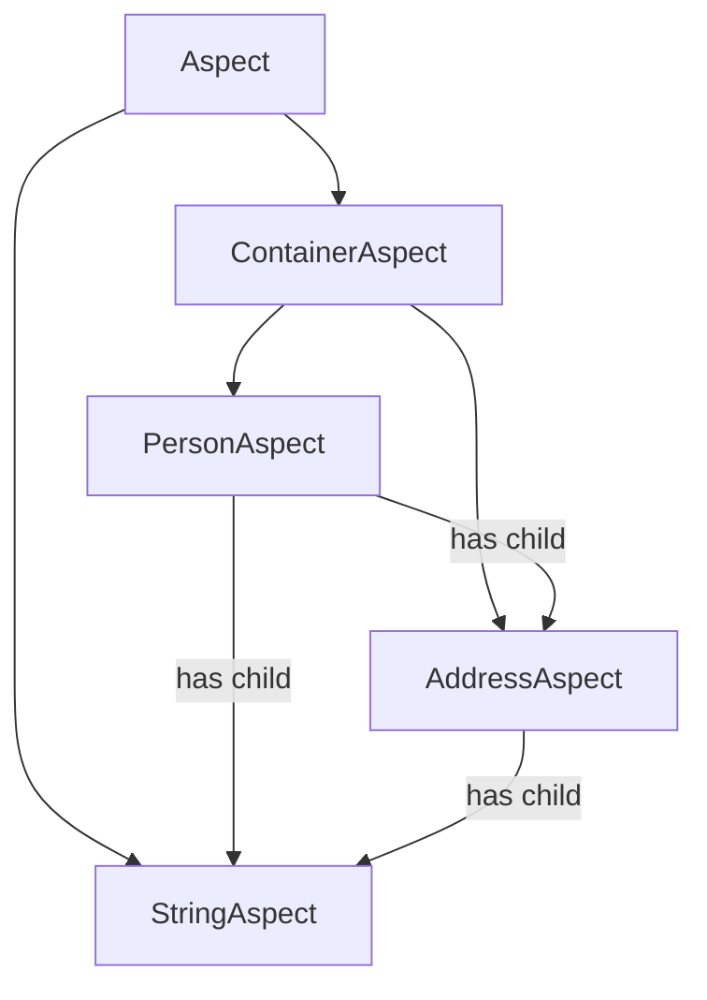

---
digest:
  local-classes:
    AddressAspect:
      mtime: '2026-09-05T10:42:30Z'
      digest: 51cf0ab196e32ef1e7a9a78b2443b26b1a50c2304d4ac31af8b59cf8444635d6
    Aspect:
      mtime: '2026-09-05T10:13:32Z'
      digest: 8f4679221faf8627b06a28be9329ba4de2e3e84068623bf972909d5fa034db6b
    ContainerAspect:
      mtime: '2026-09-05T10:13:32Z'
      digest: f6e02744f2eaf091e2740752c3061a073e8d6c4abd07d5ec9824049450320610
    PersonAspect:
      mtime: '2026-09-05T10:42:34Z'
      digest: 7748fa43ead03f212becdeed8d0ad0135fbf93b9b06f0813a627abec8aa5cb6b
    StringAspect:
      mtime: '2026-09-05T10:42:37Z'
      digest: a7c3eb09fd43cfeac800b6c9d2875c7ccfb9bd804aac2ab2c62be3a24abf5ae5
  folders: {}
tags:
- code/observer_pattern
- code/attached_property
concepts:
- Composite Value Object Tree
facets:
  layer: domain
  status: legacy
  complexity: medium
description: 'An older, self-contained attribute/property framework built directly on `synch.AConstrained`. An `Aspect` is a named, cloneable Value Object arranged in a tree: leaf Aspects (`StringAspect`) hold a single value with its own validation (min/max length), while `ContainerAspect` subclasses (`PersonAspect`, `AddressAspect`) hold no value of their own but expose public final child-Aspect fields discovered via reflection. Setting a leaf''s Value calls `validateParent()`/`updateParent()` to propagate validation and change notification up through every ancestor Container, and `clone()` performs a full recursive deep copy across the whole child-field tree. This is a separate, older implementation from `synch.property` and the top-level `aspect/` folder documented elsewhere in this codebase — none of the three share code.'
---

# aspect

An older, self-contained attribute/property framework built directly on `synch.AConstrained`.
An `Aspect` is a named, cloneable Value Object arranged in a tree: leaf Aspects (`StringAspect`)
hold a single value with its own validation (min/max length), while `ContainerAspect` subclasses
(`PersonAspect`, `AddressAspect`) hold no value of their own but expose public final child-Aspect
fields discovered via reflection. Setting a leaf's Value calls `validateParent()`/`updateParent()`
to propagate validation and change notification up through every ancestor Container, and `clone()`
performs a full recursive deep copy across the whole child-field tree. This is a separate, older
implementation from `synch.property` and the top-level `aspect/` folder documented elsewhere in
this codebase — none of the three share code.

## Architecture

## Entry Points

| Class.Method | Description |
|---|---|
| `Aspect.setVal(Object)` | Sets the Aspect's Value, converting any `InvalidException` from validation into an unchecked `IllegalArgumentException`. |
| `StringAspect.setValue(Object)` | Coerces the given Value to a String and propagates validation/update to the Parent if it actually changed. |
| `Aspect.clone()` | Produces a deep copy of this Aspect and its entire child-field tree. |
| `Aspect.update(Object, Object, Object)` | Callback that copies an incoming Value onto the matching-named Aspect and recurses into child Aspects. |

## Classes

| Class | Responsibility |
|---|---|
| [AddressAspect](AddressAspect.java) | Title: AddressAspect Description: Example ContainerAspect bundling a postal address (street/number, zip, city) as three child StringAspect fields, each keyed under this Aspect's Name using the Aspect#SEP separator. |
| [Aspect](Aspect.java) | The Instances of this Class have a name, so it can serialize and deserialize itself into e.g. a Properties File or a HashMap or a SessionContext. |
| [ContainerAspect](ContainerAspect.java) | ContainerAspect A ContainerAspect contains Fields of other Aspect Types and knows their Names by Reflection! Since the Container knows its Name, it can detect whether a given Name,Value Pair is relevant! |
| [PersonAspect](PersonAspect.java) | Title: PersonAspect Description: Example ContainerAspect describing a natural person: first name, last name and a nested AddressAspect, each a child field keyed under this Aspect's Name. |
| [StringAspect](StringAspect.java) | Title: StringAspect Description: Leaf Aspect holding a single String Value, with an enforced MinLength/ MaxLength range checked in #myValidate. |
