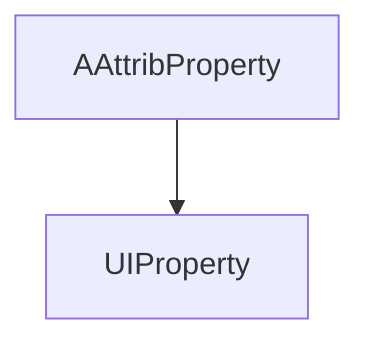

---
digest:
  local-classes:
    AAttribProperty:
      mtime: '2026-09-05T10:13:32Z'
      digest: 46a9f2894a68f00f66baccab74ebc1cc60fa87f048b00ad504695bfd00c1fe18
    PropString:
      mtime: '2026-09-05T10:42:44Z'
      digest: e3b0c44298fc1c149afbf4c8996fb92427ae41e4649b934ca495991b7852b855
    UIProperty:
      mtime: '2026-09-05T10:13:32Z'
      digest: 194a7fb7a74a9f512a2f8458cfa93554bec7e580c9511ac3c8b035bd6fa839d8
    testProperty:
      mtime: '2026-09-05T10:13:32Z'
      digest: a32f6471d3d5bb15d4d766c6c05b666248b80f41d1ac54a3286cc6661af5543a
  folders: {}
tags:
- code/attached_property
concepts:
- GUI Property Metadata
facets:
  layer: utility
  status: unfinished
  complexity: low
description: A small set of GUI-oriented property-wrapper variants, distinct from the `synch.aspect` subsystem. `AAttribProperty` extends `structure.aspect.Aspect` (a different, external Aspect base class, not `synch.aspect.Aspect`) and adds the generic 1-field attributes a GUI control needs — enabled, visible, locked, mandatory, min/max length, tooltip, help context — meant to be serialized as XML element attributes. `UIProperty` extends it with screen-position/size fields (Top, Left, Height, Width) for a bound GUI control. `PropString` is an unimplemented empty stub, and `testProperty` is a standalone `main()`-only scratch class unrelated to the other three, not itself a property type.
---

# property

A small set of GUI-oriented property-wrapper variants, distinct from the `synch.aspect` subsystem.
`AAttribProperty` extends `structure.aspect.Aspect` (a different, external Aspect base class, not
`synch.aspect.Aspect`) and adds the generic 1-field attributes a GUI control needs — enabled,
visible, locked, mandatory, min/max length, tooltip, help context — meant to be serialized as XML
element attributes. `UIProperty` extends it with screen-position/size fields (Top, Left, Height,
Width) for a bound GUI control. `PropString` is an unimplemented empty stub, and `testProperty` is
a standalone `main()`-only scratch class unrelated to the other three, not itself a property type.

## Architecture

## Entry Points

| Class.Method | Description |
|---|---|
| `AAttribProperty.AAttribProperty(String)` | Constructs a named attribute-bearing property, initializing the base `Aspect`. |
| `UIProperty.UIProperty(String)` | Constructs a named UI-bound property with screen position/size fields. |

## Classes

| Class | Responsibility |
|---|---|
| [AAttribProperty](AAttribProperty.java) | This Class has a name and the most generic 1-Field Attributes, so it can serialize and deserialize itself and directly correspond to a GUI Item. |
| [PropString](PropString.java) | Empty stub. |
| [UIProperty](UIProperty.java) | This Class has a name and more 1 Field Attributes, so it can serialize and deserialize itself and directly correspond to a GUI Item. |
| [testProperty](testProperty.java) | This class can take a variable number of parameters on the command line. |
