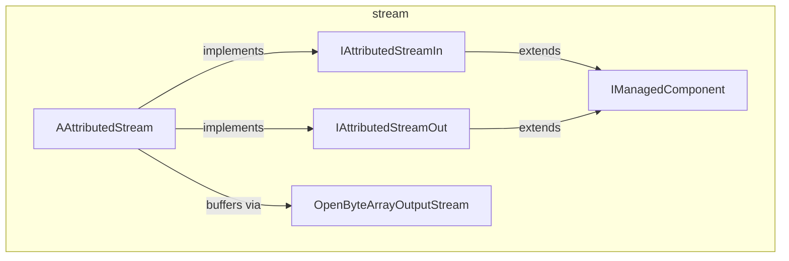

---
digest:
  local-classes:
    AAttributedStream:
      mtime: '2026-09-05T11:11:37Z'
      digest: 9c5ae480c54352d78c61f5cce8c76c5abddc429bc76375c11e03077368c05dbc
    IAttributedStreamIn:
      mtime: '2026-09-05T11:11:48Z'
      digest: 0b8b488aebfd15c4cab93f70fccc38cbefc3625e13cf77cd01ba895fa48bac17
    IAttributedStreamOut:
      mtime: '2026-09-05T11:11:50Z'
      digest: 0b8b488aebfd15c4cab93f70fccc38cbefc3625e13cf77cd01ba895fa48bac17
    IManagedComponent:
      mtime: '2026-09-05T11:11:52Z'
      digest: c5210c389a6f84f606f05407fe9a1c4b8b26280c5536dd57ab9dd6be604b5040
    InitializationException:
      mtime: '2026-09-05T11:12:05Z'
      digest: 266ca5ce053d190ac02c622f854223ee2a41ecc0f42528ea9018e90b11c5f35d
    OpenByteArrayOutputStream:
      mtime: '2026-09-05T11:11:57Z'
      digest: d923490d98af945a850b43c0f65d19b2693434a304294f3091c8cea4d156e7fd
    ProcessingException:
      mtime: '2026-09-05T11:12:09Z'
      digest: 266ca5ce053d190ac02c622f854223ee2a41ecc0f42528ea9018e90b11c5f35d
  folders: {}
tags:
- code/stream_adapter
concepts:
- Attributed Stream Processing
facets:
  layer: infrastructure
  status: legacy
  complexity: medium
description: A small framework for passing an `InputStream` plus a `Map` of attributes along a processing line that bridges asynchronous and synchronous protocols (HTTP, JMS, DB, etc.). Either side of `AAttributedStream` can be implemented and the other is derived automatically; components participating in the chain implement the `IManagedComponent` lifecycle contract, and `OpenByteArrayOutputStream` avoids buffer copies when adapting between stream styles.
---

# stream

A small framework for passing an `InputStream` plus a `Map` of attributes along a processing
line that bridges asynchronous and synchronous protocols (HTTP, JMS, DB, etc.). Either side of
`AAttributedStream` can be implemented and the other is derived automatically; components
participating in the chain implement the `IManagedComponent` lifecycle contract, and
`OpenByteArrayOutputStream` avoids buffer copies when adapting between stream styles.

## Classes

| Class | Responsibility |
|---|---|
| [AAttributedStream](AAttributedStream.java) | Provides mutually-derived default implementations of IAttributedStreamIn#process and IAttributedStreamOut#process, so a subclass need only override whichever one best fits its own processing model. |
| [IAttributedStreamIn](IAttributedStreamIn.java) | Defines the on-demand side of an attributed stream processing chain: handing over an InputStream plus a Map of Attributes between asynchronous and synchronous protocols and technologies like HTTP, JMS, DB etc. Design Decisions / Implementation Details: Using Streams is for once adequate for simple HTTP Requests and Responses and can always be aggregated / broken up into Strings. |
| [IAttributedStreamOut](IAttributedStreamOut.java) | Defines the eager, fully-written side of an attributed stream processing chain: handing over an InputStream plus a Map of Attributes between asynchronous and synchronous protocols and technologies like HTTP, JMS, DB etc. Design Decisions / Implementation Details: Using Streams is for once adequate for simple HTTP Requests and Responses and can always be aggregated / broken up into Strings. |
| [IManagedComponent](IManagedComponent.java) | Defines the lifecycle contract (init/exit/debug state) for a managed component or resource, plus the JNDI environment-lookup names its adapters share. |
| [InitializationException](InitializationException.java) | Signals that an IManagedComponent could not be initialized, e.g. due to missing parameters. |
| [OpenByteArrayOutputStream](OpenByteArrayOutputStream.java) | Exposes ByteArrayOutputStream's internal buffer directly, to avoid copying it, and adds static helpers for chunked stream copying. |
| [ProcessingException](ProcessingException.java) | Signals that an attributed stream's process(...) step could not process the given data. |

## Architecture

