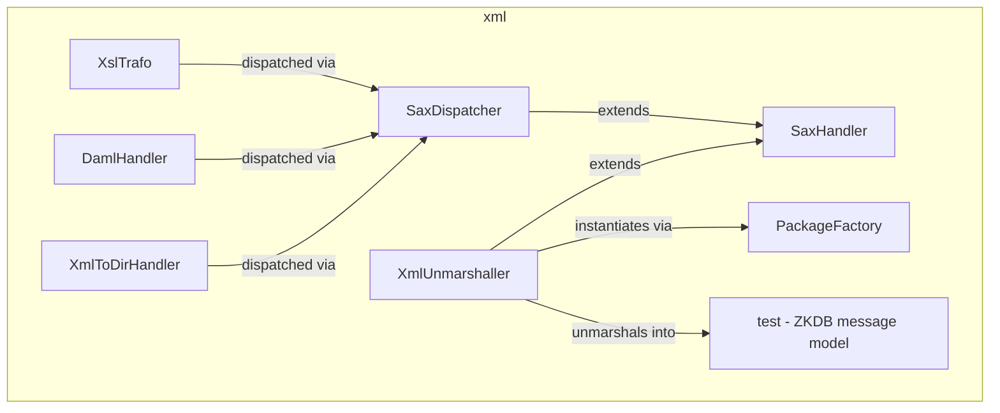

---
digest:
  local-classes:
    DamlHandler:
      mtime: '2026-09-05T11:12:43Z'
      digest: 2ed9658a226692b52907ec8182940a00d5762604729c1d00833e035a20628583
    DomDemo:
      mtime: '2026-09-05T11:12:52Z'
      digest: 4173c457ab550b0b15d50206d5c2a76444e000d60231212fb663e9de6b7f40f9
    PackageFactory:
      mtime: '2026-09-05T11:15:36Z'
      digest: aeb32e1b8a8c689738c9c9750d68bc586403e4bfa0d47517cb6ff1e2dd47f33d
    ResultSetToAttributes:
      mtime: '2026-09-05T11:13:22Z'
      digest: adc43502fc17895de46aeeae0a9c3b8a21cda4a164956e2bd3653984a27a6d5b
    SaxClientXmlWriter:
      mtime: '2026-09-05T11:13:53Z'
      digest: e3c0775ac98e121d4d2e572c3f67c59dec4844c25811de66fa2ed8c0c17351db
    SaxDispatcher:
      mtime: '2026-09-05T11:14:09Z'
      digest: 5acbf086ba95b1ebfc0ff6fa9349f47a9510dbccee3662810426cbaa3ab882fe
    SaxHandler:
      mtime: '2026-09-05T11:14:21Z'
      digest: 67e4bd82b426fdd97a7e73925044b17cb6a65d7779538063a861c94b6b306e1f
    XmlHandler:
      mtime: '2026-09-05T11:14:37Z'
      digest: fdad091f5029218e2ce72185ce8af80cf4e9061a77730ab49055318e429925d4
    XmlToDirHandler:
      mtime: '2026-09-05T11:14:56Z'
      digest: 4b8ed08424b156d5292bc68b540ff21478811b05b2f88f5875de625363c5c613
    XmlUnmarshaller:
      mtime: '2026-09-05T11:15:36Z'
      digest: 1f8617c789746218e8c139f985a8e4b6d1975507d0fd03454bb14c95279e8b25
    XslTrafo:
      mtime: '2026-09-05T11:16:37Z'
      digest: 5d05d51a6985d686518446f2c30fb9cc663037dbf2d83c3526f558ea21e135f2
  folders:
    test/:
      mtime: '2026-09-05T10:13:32Z'
      digest: 2a1facf8aef27e59cbf2ea35703f03ef25be8c93d6c07a057418a8e9c22a33d4
tags:
- code/sax_parsing
- code/xml_parsing
- code/xslt_transformation
concepts:
- XML Processing
facets:
  layer: infrastructure
  status: legacy
  complexity: medium
description: 'A collection of SAX/DOM/XSLT tools built around a reflection-based dispatch pattern: `SaxDispatcher`/`SaxHandler` route each SAX Element event to a same-named method of an arbitrary target object, which `XslTrafo` uses to interpret a custom XTL pipeline-description language, `DamlHandler` uses to flatten DAML assertions into relational tables, and `XmlToDirHandler` uses to materialize an XML file/directory description onto the file system. `XmlUnmarshaller` takes a related but distinct approach, matching Element/Attribute names directly to member variables to unmarshal XML into the `test/` package''s Castor-generated object graph. `ResultSetToAttributes` and `SaxClientXmlWriter` bridge to JDBC and back to textual XML respectively, and `XmlHandler` offers a chainable SAX-filter base for building smaller, composable handlers.'
---

# xml

A collection of SAX/DOM/XSLT tools built around a reflection-based dispatch pattern:
`SaxDispatcher`/`SaxHandler` route each SAX Element event to a same-named method of an
arbitrary target object, which `XslTrafo` uses to interpret a custom XTL pipeline-description
language, `DamlHandler` uses to flatten DAML assertions into relational tables, and
`XmlToDirHandler` uses to materialize an XML file/directory description onto the file system.
`XmlUnmarshaller` takes a related but distinct approach, matching Element/Attribute names
directly to member variables to unmarshal XML into the `test/` package's Castor-generated
object graph. `ResultSetToAttributes` and `SaxClientXmlWriter` bridge to JDBC and back to
textual XML respectively, and `XmlHandler` offers a chainable SAX-filter base for building
smaller, composable handlers.

## Classes

| Class | Responsibility |
|---|---|
| [DamlHandler](DamlHandler.java) | Handles DAML syntax reflectively dispatched from a SAX reader and writes out relational (entity, triple and relation) tab-separated data files. |
| [DomDemo](DomDemo.java) | Demonstrates building and reading a DOM: parsing it from a file, constructing one in code, and transforming it with XSLT. |
| [PackageFactory](XmlUnmarshaller.java) | Creates a new instance of the class named packageName + "." + arg by reflection, used by XmlUnmarshaller to instantiate sub-objects from Element names. |
| [ResultSetToAttributes](ResultSetToAttributes.java) | Represents the fields/columns of a JDBC ResultSet's current row as a SAX XML Attributes object. |
| [SaxClientXmlWriter](SaxClientXmlWriter.java) | Formats SAX-style ContentHandler events back into an XML stream, similar to org.apache.xalan.serialize.SerializerToXML. |
| [SaxDispatcher](SaxDispatcher.java) | A SAX handler that dispatches each Element event by reflection to a method of an arbitrary target object, passing the Attributes object as its single parameter. |
| [SaxHandler](SaxHandler.java) | Collects common functionality for most SAX parsers: lazy parser creation, parsing from a URI/File/InputStream/InputSource, and locator tracking with a location-annotated error. |
| [XmlHandler](XmlHandler.java) | Provides a documented, chainable default implementation of the SAX handler interfaces by making each public callback final and delegating to an overridable, boolean- returning _-suffixed method that decides whether to propagate the event further down the filter chain. |
| [XmlToDirHandler](XmlToDirHandler.java) | Reflection-dispatched SaxDispatcher handler that converts an XML file/directory description into a matching file system directory structure. |
| [XmlUnmarshaller](XmlUnmarshaller.java) | Unmarshals XML into an object graph by reflection, matching Element and Attribute names directly to member variable names of the respective objects. |
| [XslTrafo](XslTrafo.java) | Implements an XSL trafo pipeline architecture, reflectively dispatched from an XTL script document, where different XML sources (documents, separated or fixed-length tables) are loaded into DOMs and can be transformed and merged into higher-level DOMs kept in RAM. |

## Architecture

## Entry Points

| Class.Method | Description |
|---|---|
| [XslTrafo.main(String[])](XslTrafo.java#L933) | Runs an XSLT trafo chain or a single input/trafo/output transformation from the command line. |
| [DamlHandler.main(String[])](DamlHandler.java#L343) | Parses a DAML file into entity/triple/relation tab-separated files. |
| [XmlToDirHandler.main(String[])](XmlToDirHandler.java#L200) | Materializes an XML file/directory description onto the file system. |
| [XmlUnmarshaller.main(String[])](XmlUnmarshaller.java#L383) | Unmarshals a sample ZKDB message XML file into the test/ object graph. |
| [DomDemo.main(String[])](DomDemo.java#L50) | Demonstrates parsing, building and XSLT-transforming a DOM. |
| [SaxClientXmlWriter.main(String[])](SaxClientXmlWriter.java#L169) | Parses an XML file and re-serializes it via SaxClientXmlWriter. |

## Subsystems

| Folder | Domain Role | Entry Point |
|---|---|---|
| `test/` | Castor-generated data model for the ZKDB ("Zentrale Kundendatenbank") message exchange format: | `Adresse` |
