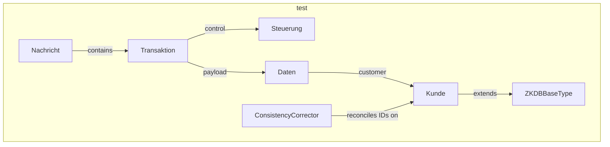

---
digest:
  local-classes:
    Adresse:
      mtime: '2026-09-05T10:13:32Z'
      digest: fc02235315d187d260313dc80497c304ee15a1ada73c542da18f4bd1129b4140
    Bankverbindung:
      mtime: '2026-09-05T10:13:32Z'
      digest: d8314bb8e2130fcf2930e9c01811dcfb00b67d522417daf4f0e38b04cde5e7b5
    Benutzererkennung:
      mtime: '2026-09-05T10:13:32Z'
      digest: 64e663e0990affe6c5335fd12a8079d173017fda6b49073ff3d26bf6f53b1bda
    ConsistencyCorrector:
      mtime: '2026-09-05T10:13:32Z'
      digest: d1bbe940fa7247fa6935860c9d7fd6b2a25f4ea7602a23c2af01d22ebc49fd1f
    Daten:
      mtime: '2026-09-05T10:13:32Z'
      digest: 5ebbe934eeaef67014bdda0f8981a4e4da9caec13f0dbab8b07313c6aca6d0fd
    Kommunikation:
      mtime: '2026-09-05T10:13:32Z'
      digest: 3617429d44ff7604594bf052d7535f6a407b078e52851a1577093ad3f515f1a8
    Kreditkarte:
      mtime: '2026-09-05T10:13:32Z'
      digest: 5f497b7926effc28ccaddf1c0737c75a7097369767351cdc80208dc3d923dfe3
    Kunde:
      mtime: '2026-09-05T10:13:32Z'
      digest: 94ffef6168f0c7a307319877809de5c57fe02ccaf986b7625b4b5fb722e1d152
    KundeInSystem:
      mtime: '2026-09-05T10:13:32Z'
      digest: dc0b17ab239375509d0e55d7c9c35667ba77ed1dd8d3dca43090512ee493a666
    Kundenbeziehung:
      mtime: '2026-09-05T10:13:32Z'
      digest: f10c975b2919e1a13f614998a6f86a6a54626a500398952abb952746a0c84a1a
    Kundenkarte:
      mtime: '2026-09-05T10:13:32Z'
      digest: 039f63b61bc1c9f389683ba7e7f0cc46e335771333ac9cf3fe1d8add38dc4572
    Kundenmerkmal:
      mtime: '2026-09-05T10:13:32Z'
      digest: bd309d298e1a928a774ca440b403b8b0efa6dab7fb4194de56bd564a2be7c213
    Nachricht:
      mtime: '2026-09-05T10:13:32Z'
      digest: 2bd48b5d684f1bd43be25bebc29833be2bc1af033f2125f1b3304e53e2636fd6
    Operation:
      mtime: '2026-09-05T10:13:32Z'
      digest: 897aa8bc4d355c10a02576020a4095ca1ef3ed576a392afd47229134baba282c
    Rolle:
      mtime: '2026-09-05T10:13:32Z'
      digest: f12a68c1f5d5ef96113ec78d7ef937f87d6b8571ce357a3febb6d3e76b065e7a
    StatusValue:
      mtime: '2026-09-05T10:13:32Z'
      digest: 61b78b2060a4ab039b8cfccf0a6c86ef77edc5969f573f2d67eae414d4f767a3
    Steuerung:
      mtime: '2026-09-05T10:13:32Z'
      digest: 8381843c6de4c424c86c243810c3534a71573733bbbeb916996452acf10f4ff9
    Transaktion:
      mtime: '2026-09-05T10:13:32Z'
      digest: d9528e86954b8504b3ffbc5393db38f47b3a1e466c2ceb5c75ae6a3cfdd7b447
    ZKDBBaseType:
      mtime: '2026-09-05T10:13:32Z'
      digest: 054c92bf4e88b9e2ff34e994923ac483b6da1adcf657ccc83ffc5beba8de9d4d
  folders: {}
tags:
- code/data_transfer_object
- code/xml_deserialization
concepts:
- Castor-Generated Data Model
facets:
  layer: domain
  status: legacy
  complexity: medium
description: 'Castor-generated data model for the ZKDB ("Zentrale Kundendatenbank") message exchange format: one root `Nachricht` carrying a list of `Transaktion` elements, each pairing a `Steuerung` control section with a `Daten` payload of customer master data (`Kunde`, `Adresse`, `Bankverbindung`, `Kreditkarte`, etc.), plus `ConsistencyCorrector` for reconciling two redundant customer identifiers (EKP number and Rise ID) kept in sync across systems. Every value-typed field is wrapped in `ZKDBBaseType`, which additionally carries a `StatusValue` (changed/deleted/unchanged/error) so the BusinessLayer can tell which fields actually changed between two versions of the same message.'
---

# test

Castor-generated data model for the ZKDB ("Zentrale Kundendatenbank") message exchange format:
one root `Nachricht` carrying a list of `Transaktion` elements, each pairing a `Steuerung`
control section with a `Daten` payload of customer master data (`Kunde`, `Adresse`,
`Bankverbindung`, `Kreditkarte`, etc.), plus `ConsistencyCorrector` for reconciling two
redundant customer identifiers (EKP number and Rise ID) kept in sync across systems. Every
value-typed field is wrapped in `ZKDBBaseType`, which additionally carries a `StatusValue`
(changed/deleted/unchanged/error) so the BusinessLayer can tell which fields actually changed
between two versions of the same message.

## Classes

| Class | Responsibility |
|---|---|
| [Adresse](Adresse.java) | Castor-generated value object for the ZKDB "Adresse" (address) XML type. |
| [Bankverbindung](Bankverbindung.java) | Castor-generated value object for the ZKDB "Bankverbindung" (bank account) XML type. |
| [Benutzererkennung](Benutzererkennung.java) | Castor-generated value object for the ZKDB "Benutzererkennung" (user credential) XML type. |
| [ConsistencyCorrector](ConsistencyCorrector.java) | Vergleicht zwei IDs mit jeweiligem Status auf Konsistenz und updated ggf. die �ltere. |
| [Daten](Daten.java) | Castor-generated value object for the ZKDB "Daten" (data) XML type: holds the Kunde plus all business-relevant collections (Adresse, Bankverbindung, etc.) for a Transaktion. |
| [Kommunikation](Kommunikation.java) | Castor-generated value object for the ZKDB "Kommunikation" (contact channel) XML type. |
| [Kreditkarte](Kreditkarte.java) | Castor-generated value object for the ZKDB "Kreditkarte" (credit card) XML type. |
| [Kunde](Kunde.java) | Castor-generated value object for the ZKDB "Kunde" (customer) XML type. |
| [KundeInSystem](KundeInSystem.java) | Castor-generated value object for the ZKDB "KundeInSystem" (customer-per-system) XML type. |
| [Kundenbeziehung](Kundenbeziehung.java) | Castor-generated value object for the ZKDB "Kundenbeziehung" (customer relationship) XML type. |
| [Kundenkarte](Kundenkarte.java) | Castor-generated value object for the ZKDB "Kundenkarte" (customer card) XML type. |
| [Kundenmerkmal](Kundenmerkmal.java) | Castor-generated value object for the ZKDB "Kundenmerkmal" (customer attribute) XML type. |
| [Nachricht](Nachricht.java) | Castor-generated root value object for the ZKDB "Nachricht" (message) XML type, holding the list of Transaktion elements it contains. |
| [Operation](Operation.java) | Castor-generated typesafe enumeration for the ZKDB "Operation" XML type: marks a Transaktion as C(reate), D(elete), S, E, or the uninitialized-message marker X. |
| [Rolle](Rolle.java) | Castor-generated value object for the ZKDB "Rolle" (role) XML type. |
| [StatusValue](StatusValue.java) | Castor-generated typesafe enumeration for the ZKDB "StatusValue" XML type, the base type for the frequently-recurring status attributes (CHANGED, DELETED, UNCHANGED, ERROR). |
| [Steuerung](Steuerung.java) | Castor-generated value object for the ZKDB "Steuerung" (control section) XML type: holds the Trafo-layer control data for a Transaktion, not validated by the BusinessLayer. |
| [Transaktion](Transaktion.java) | Castor-generated value object for the ZKDB "Transaktion" (transaction) XML type, pairing a Steuerung control section with its Daten payload. |
| [ZKDBBaseType](ZKDBBaseType.java) | Castor-generated base value object for every ZKDB XML element carrying a content string, status and modification time (a "Delta-Attribute" element). |

## Architecture

## Entry Points

| Class.Method | Description |
|---|---|
| [ConsistencyCorrector.areIdsConsistent(Kunde, IInvertAble)](ConsistencyCorrector.java#L223) | Checks/corrects consistency between a customer's ZKDB ID and its mapped EKP number. |
