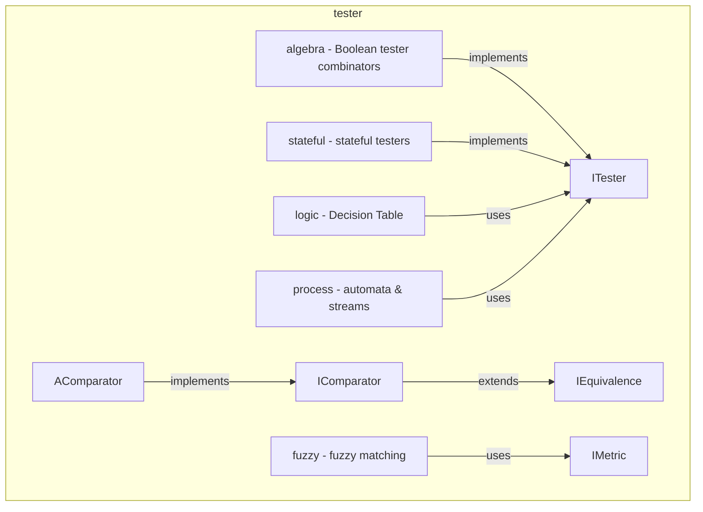

---
digest:
  local-classes:
    AComparator:
      mtime: '2026-09-05T11:09:08Z'
      digest: 186e48e9a81445093f8705e9cc61a84a78ed7b3f2729a9a292c5f41c06dc1d10
    Discrete:
      mtime: '2026-09-05T10:13:32Z'
      digest: 87dd36b89597ebcdb023ae90d1074275408f88821284f60589b6692e5112d001
    EquivalenceIdentity:
      mtime: '2026-09-05T11:09:25Z'
      digest: 8b916896f7cbabe0136d260831c65d8024118dacc3a37fb213d149b1d0963c5b
    FilterTestWaiter:
      mtime: '2026-09-05T11:09:34Z'
      digest: 25723c64d152ea1fa7c5c513c936f4836116589e879dedd795ed62e48aec7f74
    IComparator:
      mtime: '2026-09-05T10:13:32Z'
      digest: e3b0c44298fc1c149afbf4c8996fb92427ae41e4649b934ca495991b7852b855
    IDoubleMetric:
      mtime: '2026-09-05T10:13:32Z'
      digest: 4419daa6f591811f27ec954b15c9ed2a16b528946acdad47923cc2e43411ddc0
    IEquivalence:
      mtime: '2026-09-05T10:13:32Z'
      digest: 38ee796ffa24a75cf6836fe30dcd92b99facaf277192705bd45f8bd7d65c8728
    IMetric:
      mtime: '2026-09-05T10:13:32Z'
      digest: fc08e1a28b5a135a83f6094c994f84f25d368be5fd2dd524881192294c120847
    IOrderator:
      mtime: '2026-09-05T10:13:32Z'
      digest: 249092fc1be8f510f5ab83ddae3fcf335c863eb5aa43a7c129a755ddcdc62f02
    IScalarMetric:
      mtime: '2026-09-05T10:13:33Z'
      digest: e3b0c44298fc1c149afbf4c8996fb92427ae41e4649b934ca495991b7852b855
    ITestAble:
      mtime: '2026-09-05T10:13:33Z'
      digest: 7901ced6ce1aad7575a54020337161b24b05cf719d1e91460528f72bc9b16d19
    ITester:
      mtime: '2026-09-05T10:13:33Z'
      digest: 65a4caef85d3b4e1b0b917c9a637629949b21586d03fec9fe6eb150c1c6290b8
    MetricByHash:
      mtime: '2026-09-05T11:09:48Z'
      digest: 21d8ade175d985ac68e2db544035e5d5cf0cc9111b67c933ae00e5ba8f6a0203
    MetricMeasurAble:
      mtime: '2026-09-05T11:10:01Z'
      digest: 6e4e0034229206e573e3f42b103e3a271d4c59872a2fc6f57e0a40c42468867e
    OrderatorComparable:
      mtime: '2026-09-05T11:10:08Z'
      digest: 6ef4ed43681d352b5addfd986da1edae8b29665b88b0f24c88f95da7d91bc615
    OrderatorOrderable:
      mtime: '2026-09-05T11:10:12Z'
      digest: 9092e07eee4624b63817847c0bc75de049256dec9e938a1dd93ab7eefc627dcd
    TesterContains:
      mtime: '2026-09-05T11:10:22Z'
      digest: 5bcb84fe5fc624e364d300e0b25c8f7bbac52039ef929b485ce85cde23dd1a12
    TesterEquals:
      mtime: '2026-09-05T10:13:33Z'
      digest: 40192c10850fb7887e7b8226e795cd20dda8c3c4b27310c7927030b863a21df1
    TesterEquivalence:
      mtime: '2026-09-05T10:13:33Z'
      digest: a554886b5515d9fdd94ccf7a2f77b737e065331b3005ee42c64ce6828f2a8eaf
  folders:
    algebra/:
      mtime: '2026-09-05T11:10:56Z'
      digest: b04ffbb73b417e6d001600551b86a3e8db261637382593a8df7c354e70f49ac9
    fuzzy/:
      mtime: '2026-09-05T11:12:00Z'
      digest: 087ad856eee417bf8a3a081b735b1fc9aed0b00d8448123b75a1b87d727c4692
    logic/:
      mtime: '2026-09-05T11:12:21Z'
      digest: 3a380fbc4c5b40f499eee910cf3252f37b7517d784f078bce97219cc50de8824
    process/:
      mtime: '2026-09-05T11:13:41Z'
      digest: 060e1ee616ed3ef64663c40a3c2567c3002e20db5cf32fe283df62eaea208188
    stateful/:
      mtime: '2026-09-05T11:14:33Z'
      digest: b488bf63194fdc2820693ca05bb46decfd9edfc79937d9be31184fbe50f60821
tags:
- code/comparator
- code/metric_interface
- code/predicate_logic
concepts:
- Testing Abstractions
facets:
  layer: utility
  status: legacy
  complexity: medium
description: 'Core library of small, composable abstractions for testing, comparing and processing objects: unary predicates (`ITester`), equivalence relations (`IEquivalence`), order relations (`IComparator`/`IOrderator`) and metrics (`IMetric`/`IDoubleMetric`), plus a handful of stock implementations (`Discrete`, `MetricByHash`, `MetricMeasurAble`, `OrderatorComparable`, `OrderatorOrderable`) that adapt these interfaces to hash codes, `Comparable` or a custom `IMeasurAble`/`IIOrderAble` contract. `AComparator` supplies shared default behaviour that concrete comparators build on. The sub-folders apply these abstractions to specific domains: `algebra/` combines `ITester` predicates with Boolean operators, `stateful/` adds testers whose result depends on prior calls, `fuzzy/` builds approximate string/set matching on top of `IMetric`, `logic/` implements a Decision Table evaluator, and `process/` models finite-state automata and stream processing.'
---

# tester

Core library of small, composable abstractions for testing, comparing and processing
objects: unary predicates (`ITester`), equivalence relations (`IEquivalence`), order
relations (`IComparator`/`IOrderator`) and metrics (`IMetric`/`IDoubleMetric`), plus a
handful of stock implementations (`Discrete`, `MetricByHash`, `MetricMeasurAble`,
`OrderatorComparable`, `OrderatorOrderable`) that adapt these interfaces to hash codes,
`Comparable` or a custom `IMeasurAble`/`IIOrderAble` contract. `AComparator` supplies shared
default behaviour that concrete comparators build on. The sub-folders apply these
abstractions to specific domains: `algebra/` combines `ITester` predicates with Boolean
operators, `stateful/` adds testers whose result depends on prior calls, `fuzzy/` builds
approximate string/set matching on top of `IMetric`, `logic/` implements a Decision Table
evaluator, and `process/` models finite-state automata and stream processing.

## Classes

| Class | Responsibility |
|---|---|
| [AComparator](AComparator.java) | Provides default equals, hash-code, less and compare implementations that concrete IComparator subclasses inherit rather than reimplement. |
| [Discrete](Discrete.java) | Implements the discrete Topology with identityHashCode() and == for equals(). |
| [EquivalenceIdentity](EquivalenceIdentity.java) | Title: EquivalenceIdentity Description: Purpose: Implements the Equivalence by testing for Identity or Equivalence with a given Object Design Decisions / Implementation Details: If similar Classes exist (e.g. Polymorphism), characterize the specific Differences to compare these. |
| [FilterTestWaiter](FilterTestWaiter.java) | FilterTestWaiter Wraps an ITester Object in Filter Manner. |
| [IComparator](IComparator.java) | Interface defining an Equivalence Relation and an according HashCode Function because both must always be associated to work with Hash based Containers i.e. equals(A,B) == true => HashCode(A) == HashCode(B) This Interface defines a still discrete Topology, because the Return Type of 'int' prevents infinite "Closeness" Related Interfaces: |
| [IDoubleMetric](IDoubleMetric.java) | defines a scalar Metric between Scalars, i.e. a Function R*R->R This Interface defines a continuous Topology, because the Return Type of 'float' allows infinite "Closeness" It also defines the discrete Topologies of the Superclasses. |
| [IEquivalence](IEquivalence.java) | Interface defining an Equivalence Relation and an according HashCode Function because both must always be associated to work with Hash based Containers i.e. equals(A,B) == true => HashCode(A) == HashCode(B) This Interface defines a discrete Topology, because there is no Concept of "Closeness", only "Equality". |
| [IMetric](IMetric.java) | Title: Description: Purpose: defines a (scalar) Metric between Objects, i.e. a Function O*O->R+ The Metric is a binary, symmetric and positive definite Function: m(a,b) = m(b,a) >= 0 m(a,a) = 0 If it is not positive definite, it must be antisymmetric and describes a scalar Metric consistent with an Order Relation: m(a,b) =-m(b,a) m(a,a) = 0 This Interface defines a continuous Topology, because the Return Type of 'double' allows infinite "Closeness" It also defines the discrete Topologies of the Superclasses. |
| [IOrderator](IOrderator.java) | minimum Interface for most Sorting Applications. |
| [IScalarMetric](IScalarMetric.java) | Title: Description: Purpose: Defines a scalar Metric between Objects, i.e. a Function O*O->R It is not positive definite, it must be antisymmetric and describes a scalar Metric consistent with an Order Relation: m(a,b) =-m(b,a) m(a,a) = 0 This Interface defines a continuous Topology, because the Return Type of 'float' allows infinite "Closeness" It also defines the discrete Topologies of the Superclasses. |
| [ITestAble](ITestAble.java) | Example Interface for a unary Test Function with 'this' as the only argument. |
| [ITester](ITester.java) | Interface for a unary Test Function working on arg resp. an Event happening on arg. |
| [MetricByHash](MetricByHash.java) | Metric which uses the HashCode Method exclusively. |
| [MetricMeasurAble](MetricMeasurAble.java) | Metric which reflects the Methods back to the given Objects, which must implement IMeasurAble, IOrderAble, OrderAble or Comparable respectively. |
| [OrderatorComparable](OrderatorComparable.java) | Orderator that reflects back on the Comparable Interface of the Argument Objects. |
| [OrderatorOrderable](OrderatorOrderable.java) | Orderator which relies on the Objects to implement IOrderAble It is advantageous to use Comparators in all sorted Containers, even when the Default Comparator just reflects back to the Objects "compare()" Method. |
| [TesterContains](TesterContains.java) | Title: Description: Purpose: Implements a Test for Containment of a Character in a String. |
| [TesterEquals](TesterEquals.java) | This is a Helper ITester Class to find an Object that equals a given one. |
| [TesterEquivalence](TesterEquivalence.java) | This is a Helper ITester Implementation to find an Object that is equivalent to a given one according to a certain Equivalence Relation. |

## Subsystems

| Folder | Domain Role | Entry Point |
|---|---|---|
| `algebra/` | Provides a small Boolean algebra over `tester.ITester` predicates: `TesterAND`, `TesterOR` | `TesterAND` |
| `fuzzy/` | Implements approximate ("fuzzy") text matching on top of the `tester.IMetric` abstraction. | `FuzzyDictionary` |
| `logic/` | Implements a classic Decision Table: a tabular alternative to deeply nested if/then/else | `ConditionTable` |
| `process/` | Models finite-state automata and their surrounding I/O plumbing. | `AddInt` |
| `stateful/` | Collects `tester.ITester` implementations whose result depends on prior calls rather than | `Flipper` |

## Architecture

## Entry Points

| Class.Method | Description |
|---|---|
| [AComparator.compare(Object, Object)](AComparator.java#L52) | Default order comparison built on {@link #less}. |
| [ITester.test(Object)](ITester.java#L36) | The single unary predicate operation this whole package composes over. |
| [IMetric.dist(Object, Object)](IMetric.java#L56) | The scalar distance operation `fuzzy/` and the metric-based comparators build on. |
