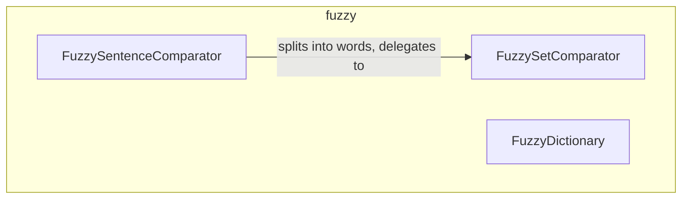

---
digest:
  local-classes:
    FuzzyDictionary:
      mtime: '2026-09-05T11:11:44Z'
      digest: 97861fb6fb0dd1caccade0ad3603c86eed1ab278be8311828e69abca9e57789d
    FuzzySentenceComparator:
      mtime: '2026-09-05T11:12:00Z'
      digest: 59b92329d7d7ef7362b0c662fdb4ae7c0212a545c7fc61e28aa731693777499b
    FuzzySetComparator:
      mtime: '2026-09-05T10:13:33Z'
      digest: c53ec825e1e8bb7e44485065a0796c0334943bd6a38124d2b3953a5e61868216
  folders: {}
tags:
- code/fuzzy_search
- code/string_similarity
concepts:
- Approximate Matching
facets:
  layer: utility
  status: legacy
  complexity: medium
description: Implements approximate ("fuzzy") text matching on top of the `tester.IMetric` abstraction. `FuzzySetComparator` compares arrays of word-like objects for similarity by summing the minimum or maximum pairwise distance under a given metric; `FuzzySentenceComparator` builds on it by first splitting raw strings into normalized words (case-folding, separator splitting, substitution tables) and delegating the actual comparison to a `FuzzySetComparator`; `FuzzyDictionary` maintains a growing set of previously seen items and finds the one closest to a new item under a metric, for incremental normalization tasks.
---

# fuzzy

Implements approximate ("fuzzy") text matching on top of the `tester.IMetric` abstraction.
`FuzzySetComparator` compares arrays of word-like objects for similarity by summing the
minimum or maximum pairwise distance under a given metric; `FuzzySentenceComparator` builds
on it by first splitting raw strings into normalized words (case-folding, separator
splitting, substitution tables) and delegating the actual comparison to a
`FuzzySetComparator`; `FuzzyDictionary` maintains a growing set of previously seen items and
finds the one closest to a new item under a metric, for incremental normalization tasks.

## Classes

| Class | Responsibility |
|---|---|
| [FuzzyDictionary](FuzzyDictionary.java) | Title: Description: Purpose: Implements a String Dictionary with a fuzzy Match Algorithm. |
| [FuzzySentenceComparator](FuzzySentenceComparator.java) | Title: Description: Purpose: Parses given Strings into Sets of Words and compares these against other Strings. |
| [FuzzySetComparator](FuzzySetComparator.java) | Title: Description: Purpose: This Class allows to compare Sets (here: Arrays) of Words for Similarity. |

## Architecture

## Entry Points

| Class.Method | Description |
|---|---|
| [FuzzySentenceComparator.getMostSimilar_Sentence(String)](FuzzySentenceComparator.java#L177) | Finds the closest previously added sentence to the given one. |
| [FuzzySentenceComparator.getMostKeyWordsSentence(String, double, double[])](FuzzySentenceComparator.java#L165) | Finds the sentence containing most of the given keywords. |
| [FuzzySetComparator.getMostSimilarSet(Object[])](FuzzySetComparator.java#L237) | Finds the closest previously added or tested set of objects. |
| [FuzzyDictionary.getMostSimilarItem(Object)](FuzzyDictionary.java#L91) | Finds the dictionary entry closest to the given object. |
