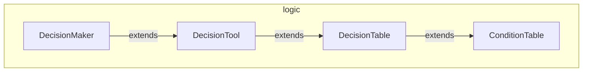

---
digest:
  local-classes:
    ConditionTable:
      mtime: '2026-09-05T11:12:21Z'
      digest: cbce57b7a6e1915143f07f462ed22113818318c3676d8fb9f927149bea77f730
    DecisionMaker:
      mtime: '2026-09-05T10:13:33Z'
      digest: ee5a4ed5af8e0d641de170a8fd6bbf47e8231925fadce3b6bf372e5c2fec110c
    DecisionTable:
      mtime: '2026-09-05T10:13:33Z'
      digest: fdfcd35c4bdb58be842f3bb057ee5bb9089836f2eea069c1891b217b0e84ceae
    DecisionTool:
      mtime: '2026-09-05T10:13:33Z'
      digest: 3e14555052e3104625d4f319da2fd671fdd585a09d23b9c652c2c535804209ef
  folders: {}
tags:
- code/decision_tree
- code/rule_engine
concepts:
- Business Rule Tables
facets:
  layer: utility
  status: legacy
  complexity: medium
description: 'Implements a classic Decision Table: a tabular alternative to deeply nested if/then/else chains, built up through a small inheritance chain. `ConditionTable` matches a boolean value vector against rows of conditions; `DecisionTable` adds a matching Actions matrix on top of it; `DecisionTool` adds a set of `Runnable` Operators that fire when a row''s conditions are met; and `DecisionMaker` ties this to `tester.ITestAble` predicates so the whole evaluation, from testing conditions to running the matching operators, can be driven from one call.'
---

# logic

Implements a classic Decision Table: a tabular alternative to deeply nested if/then/else
chains, built up through a small inheritance chain. `ConditionTable` matches a boolean value
vector against rows of conditions; `DecisionTable` adds a matching Actions matrix on top of
it; `DecisionTool` adds a set of `Runnable` Operators that fire when a row's conditions are
met; and `DecisionMaker` ties this to `tester.ITestAble` predicates so the whole evaluation,
from testing conditions to running the matching operators, can be driven from one call.

## Classes

| Class | Responsibility |
|---|---|
| [ConditionTable](ConditionTable.java) | Title: ConditionTable.java Description: TODO: Describes the Purpose / Responsibilities of this Class, not it's Implementation. |
| [DecisionMaker](DecisionMaker.java) | Title: DecisionMaker.java Description: Self-reliant Evaluator for the ITester Functions and the Operations. |
| [DecisionTable](DecisionTable.java) | Title: DecisionTable.java Description: Implements a Decision Table. |
| [DecisionTool](DecisionTool.java) | Title: DecisionTool.java Description: TODO: Describes the Purpose / Responsibilities of this Class, not it's Implementation. |

## Architecture

## Entry Points

| Class.Method | Description |
|---|---|
| [ConditionTable.evaluate(boolean[], int)](ConditionTable.java#L56) | Finds the first matching Condition row for the given Values, resuming from Start. |
| [DecisionMaker.evaluate()](DecisionMaker.java#L59) | Tests all ITestAble predicates, then runs every matching row's Operators in turn. |
