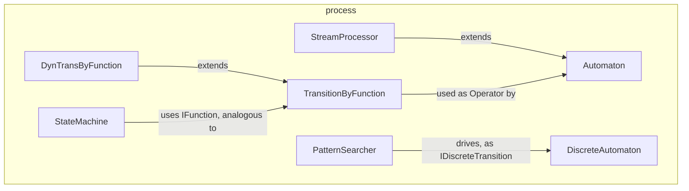

---
digest:
  local-classes:
    AddInt:
      mtime: '2026-09-05T10:13:33Z'
      digest: e7260ed1e430ff62c5171647f749ab92e2e0ce39bdadd8a110433e8f9a8a4ccb
    Automaton:
      mtime: '2026-09-05T11:12:34Z'
      digest: c7c658bc57c6faebb7a7d8922cd32e12992b4549748913a7823a2080a53f0d68
    DiscreteAutomaton:
      mtime: '2026-09-05T10:13:33Z'
      digest: 8cd086a89cf59c944a160a594e7957cf3ce7d066af995a9fe16dbfaa209c6270
    DiscreteFnByHash:
      mtime: '2026-09-05T10:13:33Z'
      digest: b6daa9c7d5fad692b549f33b204f5c49fafef1e95541684a9ddd18e458079a3d
    DivInt:
      mtime: '2026-09-05T10:13:33Z'
      digest: e7260ed1e430ff62c5171647f749ab92e2e0ce39bdadd8a110433e8f9a8a4ccb
    DynTransByFunction:
      mtime: '2026-09-05T10:13:33Z'
      digest: 7efe181257f829b4cf1000a61eac2adaf41cd02dc5cdd14b34c99118ac2bcc24
    IDiscreteTransition:
      mtime: '2026-09-05T10:13:33Z'
      digest: e7260ed1e430ff62c5171647f749ab92e2e0ce39bdadd8a110433e8f9a8a4ccb
    IDynTransition:
      mtime: '2026-09-05T10:13:33Z'
      digest: 01f11b8650e668f2f747afd80a452f4f239735fa5f7e120863388ebc3da88fac
    IDynamicTransition:
      mtime: '2026-09-05T10:13:33Z'
      digest: 01f11b8650e668f2f747afd80a452f4f239735fa5f7e120863388ebc3da88fac
    IOEProcess:
      mtime: '2026-09-05T11:12:45Z'
      digest: 9d041bb97c49f3497178f32608b1950b10b2f21fcb42ca36186d2be990105253
    MatrixAutomaton:
      mtime: '2026-09-05T10:13:33Z'
      digest: 92fde1b8f384f539451319f23fdbbcd409a5b765ae76e2d1d4b799dfca7b7fb5
    MulInt:
      mtime: '2026-09-05T10:13:33Z'
      digest: e7260ed1e430ff62c5171647f749ab92e2e0ce39bdadd8a110433e8f9a8a4ccb
    Operator:
      mtime: '2026-09-05T10:13:33Z'
      digest: 0aeb8ce88482fc73c1aa1e271457496f1231e0fb1b4fd8d31659037e26d26be8
    PatternSearcher:
      mtime: '2026-09-05T11:13:23Z'
      digest: f6d1b225fa9c4b117bdfcaa0d77883cc8aae728e4284ccf3c31c6499d544db97
    StateMachine:
      mtime: '2026-09-05T11:13:18Z'
      digest: 7ea861cdbfc75d6064c70f9087d9236de59435300fd35ae11304ba9e13f7ae1a
    StreamProcessor:
      mtime: '2026-09-05T11:13:35Z'
      digest: 540d180068ab69a650bf277237285722b149903ef1055fca7d7c45be9f789e5b
    SubtInt:
      mtime: '2026-09-05T10:13:33Z'
      digest: e7260ed1e430ff62c5171647f749ab92e2e0ce39bdadd8a110433e8f9a8a4ccb
    TransitionByFunction:
      mtime: '2026-09-05T10:13:33Z'
      digest: 52edd83f2b287448f9a76fe663b726fac6fce6bc3c9e25103680c6549070e52c
    testProcess:
      mtime: '2026-09-05T11:13:41Z'
      digest: 5b372aa3f3514d62662fed9c5b93d97a09ed9cca8faa6d579637af2945e4cd3f
  folders: {}
tags:
- code/state_machine
- code/stream_processing
concepts:
- Automata and Stream Processing
facets:
  layer: utility
  status: legacy
  complexity: medium
description: 'Models finite-state automata and their surrounding I/O plumbing. `Automaton` is the generic, object-based state machine (state-change function Lambda plus optional output function Beta); `DiscreteAutomaton` and `MatrixAutomaton` specialize this to integer-indexed states for performance, either via hash-based transitions (`IDiscreteTransition`/ `IDynamicTransition` implementors) or a dense transition matrix; `StateMachine` and `TransitionByFunction`/`DynTransByFunction` provide an object-keyed alternative built on `function.IFunction`. `PatternSearcher` demonstrates a concrete use: a Knuth-Morris-Pratt string search expressed as a discrete transition function driving a `DiscreteAutomaton`. `StreamProcessor` wraps an `Automaton` around an input/output stream pair so a single `run()` call drains the whole input through the automaton. `IOEProcess` and `testProcess` are unrelated demo entry points for OS-level inter-process communication via `Runtime.exec()`, kept here as a "process" in the operating-system sense rather than the automaton sense above.'
---

# process

Models finite-state automata and their surrounding I/O plumbing. `Automaton` is the generic,
object-based state machine (state-change function Lambda plus optional output function
Beta); `DiscreteAutomaton` and `MatrixAutomaton` specialize this to integer-indexed states
for performance, either via hash-based transitions (`IDiscreteTransition`/
`IDynamicTransition` implementors) or a dense transition matrix; `StateMachine` and
`TransitionByFunction`/`DynTransByFunction` provide an object-keyed alternative built on
`function.IFunction`. `PatternSearcher` demonstrates a concrete use: a Knuth-Morris-Pratt
string search expressed as a discrete transition function driving a `DiscreteAutomaton`.
`StreamProcessor` wraps an `Automaton` around an input/output stream pair so a single
`run()` call drains the whole input through the automaton. `IOEProcess` and `testProcess`
are unrelated demo entry points for OS-level inter-process communication via
`Runtime.exec()`, kept here as a "process" in the operating-system sense rather than the
automaton sense above.

## Classes

| Class | Responsibility |
|---|---|
| [AddInt](DiscreteAutomaton.java) | Example Class for a simple discrete Automaton with calculated Output. |
| [Automaton](Automaton.java) | Complete Implementation of an Automaton: a[x][q] -> q The InPut x, States q and OutPut Q are generic Objects. |
| [DiscreteAutomaton](DiscreteAutomaton.java) | DiscreteAutomaton.java Complete Implementation of an Automaton: a[x][q] -> q The InPut is a generic Object, the States is an Integer. |
| [DiscreteFnByHash](DiscreteFnByHash.java) | DiscreteFnByHash.java HashTable Representation of an Automaton: a[x][q] -> q The States Q are mapped to the Integer Numbers 0..q. The Value of the Coefficients a[x,q] represents the next State They represent the State Change Function Lambda. |
| [DivInt](DiscreteAutomaton.java) | Example Class for a simple discrete Automaton with calculated Output. |
| [DynTransByFunction](DynTransByFunction.java) | DynTransByFunction.java State Transition Function for an Automaton which can be defined dynamically, by adding Productions using 'add()'. |
| [IDiscreteTransition](IDiscreteTransition.java) | IDiscreteTransition.java Interface for the Transition between discrete States in a State Machine. |
| [IDynTransition](IDynTransition.java) | IDynAutomaton.java Created on 20. Mai 2001, 10:18 Matrix Representation of an Automaton Function: a[x][q] -> q The States Q are mapped to the Integer Numbers 0..q. The Value of the Coefficients a[x,q] represents the next State They represent the State Change Function Lambda. |
| [IDynamicTransition](IDynamicTransition.java) | IDynamicTransition.java Exposes a Method to add new Transitions ("Productions") Created on 25. Mai 2001, 10:06 |
| [IOEProcess](IOEProcess.java) | IOEProcess.java Demonstrates Inter- Process Communication via Input-, Output- and Error- Streams which is faster than named Pipes, Sockets or shared Files. |
| [MatrixAutomaton](MatrixAutomaton.java) | Matrix Representation of a discrete Automaton: a[x][q] -> q The States Q are mapped to the Integer Numbers 0..q. The Inputs X are mapped to the Integer Numbers 0..x. The Value of the Coefficients a[x,q] represent the next State They represent the State Change Function Lambda. |
| [MulInt](DiscreteAutomaton.java) | Example Class for a simple discrete Automaton with calculated Output. |
| [Operator](Operator.java) | Interface of a binary Operator resp. an Automaton State Change Function Lambda: a[x][q] -> q The States Q are generic Objects. |
| [PatternSearcher](PatternSearcher.java) | PatternSearcher Searches any String for a Character Pattern. |
| [StateMachine](StateMachine.java) | Title: StateMachine Description: Purpose: State Machine to execute the TransitionByFunction Design Decisions / Implementation Details: |
| [StreamProcessor](StreamProcessor.java) | StreamProcessor.java Processes an Input Object streamIO and writes it to an Output Object streamIO. |
| [SubtInt](DiscreteAutomaton.java) | Example Class for a simple discrete Automaton with calculated Output. |
| [TransitionByFunction](TransitionByFunction.java) | Function Representation of an Automaton State Transition Function: a[x][q] -> q The States Q are Objects The Value of the Coefficients a[x,q] represents the next State They represent the State Change Function Lambda. |
| [testProcess](testProcess.java) | testProcess.java Created on 21. Februar 2001, 10:33 |

## Architecture

## Entry Points

| Class.Method | Description |
|---|---|
| [Automaton.Map(Object)](Automaton.java#L107) | Advances one step, updating state and returning the output (or the new state itself). |
| [StreamProcessor.run()](StreamProcessor.java#L113) | Drains the whole input stream through the automaton into the output stream. |
| [PatternSearcher.indexOf(IIStreamIn)](PatternSearcher.java#L102) | Searches a stream for this instance's pattern via Knuth-Morris-Pratt. |
| [StateMachine.MapAt(Object)](StateMachine.java#L88) | Advances the machine to its next state for the given input. |
| [IOEProcess.testIt()](IOEProcess.java#L70) | Demo: pipes typed input through a spawned child process and prints its echo. |
