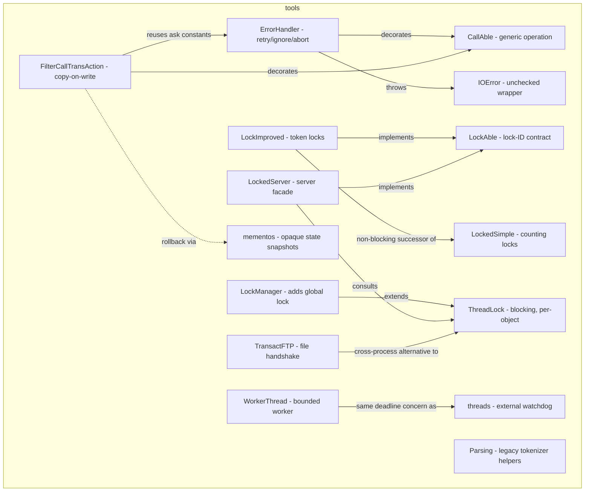

---
digest:
  local-classes:
    CallAble:
      mtime: '2026-09-04T16:35:46Z'
      digest: be38cf2148451f456f3f524d2431d414c0f12d2e4b0f830ac0ace189e10386f2
    ErrorHandler:
      mtime: '2026-09-04T16:35:47Z'
      digest: 3196360d8e83e0b43c3a8ec16164af7ead6da84ff7f2933038029c58199b3b5b
    FilterCallTransAction:
      mtime: '2026-09-04T16:35:47Z'
      digest: 40ed294b938ad0fa8b822f7f158d112a17acae3d1f35c8235823f726db5d228d
    IOError:
      mtime: '2026-09-04T16:35:47Z'
      digest: f667d180315172ddfb147afacef7da21d36565d20b00d3b62f0546e48dd041d9
    LockAble:
      mtime: '2026-09-04T16:35:47Z'
      digest: 6766c96ec19e37bb231427110229f55fbe0332af8008893a4382afe1529389f5
    LockImproved:
      mtime: '2026-09-04T16:35:47Z'
      digest: 63e8f740337bd665f16f0f1f47193e3da21b866f84ad3e18cf073776b9981543
    LockManager:
      mtime: '2026-09-04T16:35:47Z'
      digest: b6cf8ae03ead577f575bf7804b19ee2850e947f026103c3907495910bb91190b
    LockTester:
      mtime: '2026-09-04T16:35:47Z'
      digest: b1e7b5030c1e9c3203fa2a17aa606851c34b8eb7a145ede462342e80554c06f6
    LockedServer:
      mtime: '2026-09-04T16:35:47Z'
      digest: 00453e436f482459403cbf1eb732b1800389ad0f44b6f5b37b48fe5d6ece4f20
    LockedSimple:
      mtime: '2026-09-04T16:35:47Z'
      digest: bf5ce80fb5da03de8d39f8cf92cc492fb76fbc322829c912e7a41e679ecb871c
    Monitor:
      mtime: '2026-09-04T16:35:47Z'
      digest: baf135b4448d65fb02fbde8d2d307ac937af6f59162de3cc8447bd996d337047
    Parsing:
      mtime: '2026-09-04T16:35:47Z'
      digest: beb87e0522d3c95f516e7faa317ce447b20dc561af6abe11efc3952fc6588479
    ThreadLock:
      mtime: '2026-09-04T16:35:47Z'
      digest: 315276aff7ef4bdf961874d499b22e694647fbd899358180a05ffefc40dc726c
    ThreadLockTester:
      mtime: '2026-09-04T16:35:47Z'
      digest: a6270f791ff6ac126251f21602260e2b3033eae015dd2d38109924509cc60d5b
    TransactFTP:
      mtime: '2026-09-04T16:35:47Z'
      digest: 990a990957c885ea92580f7dc43ad12220b1907b26365313fa4d54c51e087ba2
    WorkerThread:
      mtime: '2026-09-04T16:35:47Z'
      digest: 13fcbe3eaa38951d9c734a4e9b57b7575185443d87fecc5e36f3857127c4f484
  folders:
    mementos/:
      mtime: '2026-09-04T16:35:47Z'
      digest: 06e3f231babf685e1b24f8eac6e45fdd09137700c0a86a758d1f16056bcedd36
    threads/:
      mtime: '2026-09-04T16:35:47Z'
      digest: 81ddcb7b1eb4832b7f3dd9b92f07047b1181564ca0285ba1314b814364e42b53
---

# tools

Reusable concurrency and call-wrapping primitives, written as a study of how to coordinate
access to shared resources in plain Java without a framework.

Two independent themes run through the folder.
The first is **locking**: a family of read/write locks that differ deliberately in one axis
each, so the trade-offs are visible side by side. `LockedSimple` counts locks but cannot
tell holders apart; `LockImproved` fixes that by issuing numbered tokens; `ThreadLock`
gives up non-blocking behaviour in exchange for real mutual exclusion on arbitrary objects,
using each object's own monitor rather than one global lock; `LockManager` layers a global
lock over that; and `LockedServer` sketches how a server object would expose the
`LockAble` contract to clients.

The second is **call wrapping**: `CallAble` reduces any operation to one
object-to-object call that may throw anything, and `ErrorHandler` and
`FilterCallTransAction` decorate such a call with error handling and with
copy-on-write transaction semantics respectively. Because the signature is maximally
generic, a decorator never needs to know what it wraps.

Around these sit three utilities that share the theme without belonging to either family:
`WorkerThread` and `threads/TimeOuter` for bounding how long work may take, `TransactFTP`
for handing files between processes using a flag file as the only cross-process primitive,
and `Parsing` as an acknowledged legacy helper superseded by the `streamIO` package.

This is exploratory code, and the documentation pass found it accordingly: 22 defects are
tabulated in the repository's `HANDOFF.md`, several severe enough that the class in
question cannot work at all. Read the `TODO: LOGIC` markers before reusing anything here.

## Classes

| Class | Responsibility |
|---|---|
| [CallAble](CallAble.java) | Encapsulates an arbitrary Operation as a single Object-to-Object Call that may throw anything. |
| [ErrorHandler](ErrorHandler.java) | Decorates a CallAble with generic Exception Handling and optional bounding Operations. |
| [FilterCallTransAction](FilterCallTransAction.java) | Applies a CallAble to a copied Subject, keeping the Copy only if the Call succeeds. |
| [IOError](IOError.java) | Unchecked Wrapper around an IOException, so I/O Failures need not be declared. |
| [LockAble](LockAble.java) | Contract for a Component whose Readers and Writers coordinate through explicit Lock IDs. |
| [LockImproved](LockImproved.java) | Non-blocking LockAble that hands out numbered Read Locks and one exclusive Write Lock. |
| [LockManager](LockManager.java) | Adds a global Lock over every managed Resource to ThreadLock's per-Resource Locks. |
| [LockTester](LockedSimple.java) | Holds a LockedSimple's Write Lock for five Seconds from its own Thread. |
| [LockedServer](LockedServer.java) | Unfinished Example of a Server Object exposing LockAble on top of a LockManager. |
| [LockedSimple](LockedSimple.java) | Counting, non-blocking Read/Write Lock that trusts its Clients to unlock exactly once. |
| [Monitor](ThreadLock.java) | Mutable int Holder serving as one Item's Waiter Count and as the Monitor Threads block on. |
| [Parsing](Parsing.java) | Static Helpers for reading Separator-delimited Structures and Numbers off a Tokenizer. |
| [ThreadLock](ThreadLock.java) | Serializes write Access to arbitrary Objects across several Calls, by their own Monitors. |
| [ThreadLockTester](ThreadLock.java) | Holds one ThreadLock Lock for five Seconds from its own Thread, printing each Step. |
| [TransactFTP](TransactFTP.java) | Hands Files between Producer and Consumer, using a second Flag File as the Handshake. |
| [WorkerThread](WorkerThread.java) | Thread Base Class that exchanges its Parameters and Results through one shared Object Array. |

## Subsystems

| Folder | Domain Role | Entry Point |
|---|---|---|
| `mementos/` | A two-interface expression of the Memento pattern, kept deliberately minimal: | `Memento` |
| `threads/` | A single watchdog: given a thread that is already running, interrupt it once its time is up. | `TimeOuter` |

## Architecture

## Entry Points

| Class.Method | Description |
|---|---|
| [CallAble.call(Object)](CallAble.java#L52) | The single generic operation every decorator in this folder wraps. |
| [ErrorHandler.call(Object)](ErrorHandler.java#L119) | Runs the delegate between the bounding operations, handling any exception. |
| [FilterCallTransAction.call(Object)](FilterCallTransAction.java#L124) | Applies an operation to a copy of the subject, committing only on success. |
| [LockAble.getLock(boolean)](LockAble.java#L77) | Acquires a read or write lock and returns the ID identifying it. |
| [LockAble.setLock(boolean, int)](LockAble.java#L95) | Releases or changes the lock previously acquired under that ID. |
| [LockImproved.lockRead2write(boolean, int)](LockImproved.java#L234) | Converts a held read lock into the write lock, or back. |
| [ThreadLock.lock(Object)](ThreadLock.java#L253) | Blocks until this thread holds the exclusive lock on one object. |
| [ThreadLock.unlock(Object)](ThreadLock.java#L286) | Releases that lock and wakes exactly one queued thread. |
| [LockManager.lock()](LockManager.java#L217) | Acquires the global lock over every managed resource. |
| [WorkerThread.startWithTimeOut(long)](WorkerThread.java#L102) | Starts the worker and escalates from interrupt to kill on timeout. |
| [TransactFTP.sendFile(File, long)](TransactFTP.java#L116) | Moves a file into the transacted location and raises the flag file. |
| [TransactFTP.receiveFile(File, long)](TransactFTP.java#L155) | Claims the transacted file and clears the flag. |
