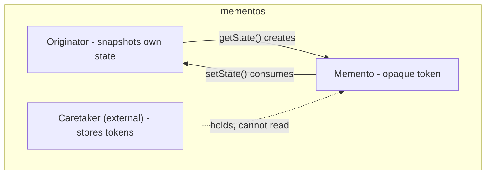

---
digest:
  local-classes:
    Memento:
      mtime: '2026-09-04T16:35:47Z'
      digest: e3b0c44298fc1c149afbf4c8996fb92427ae41e4649b934ca495991b7852b855
    Originator:
      mtime: '2026-09-04T16:35:47Z'
      digest: c02e6618cf7aea70cfe5b8ccaa564438d0dfa633b2e08d3540be19c46ec8ea77
  folders: {}
---

# mementos

A two-interface expression of the Memento pattern, kept deliberately minimal:
an object that can snapshot and restore its own state, and an opaque token standing for
one such snapshot.

The point of the pair is access control rather than data transfer.
`Memento` declares no members at all, so a caretaker holding one can pass it around and
hand it back but cannot read or forge its contents; only the originator that produced it
knows the concrete type and can unpack it.
Java's one-public-type-per-file rule is why the two live in separate files despite being a
single concept — a constraint the source comments call out explicitly.

Nothing in `tools/` implements these interfaces yet; they exist as the reusable contract
for classes elsewhere that need rollback without exposing their internals.

## Classes

| Class | Responsibility |
|---|---|
| [Memento](Memento.java) | Marker Interface identifying an opaque Snapshot of an Originator's internal State. |
| [Originator](Originator.java) | Defines the Interface for capturing and restoring an Object's own State via a Memento. |

## Architecture

## Entry Points

| Class.Method | Description |
|---|---|
| [Originator.getState()](Originator.java#L38) | Captures the current internal state into a fresh Memento. |
| [Originator.setState(Memento)](Originator.java#L45) | Restores the state captured in a Memento this same Originator produced. |
